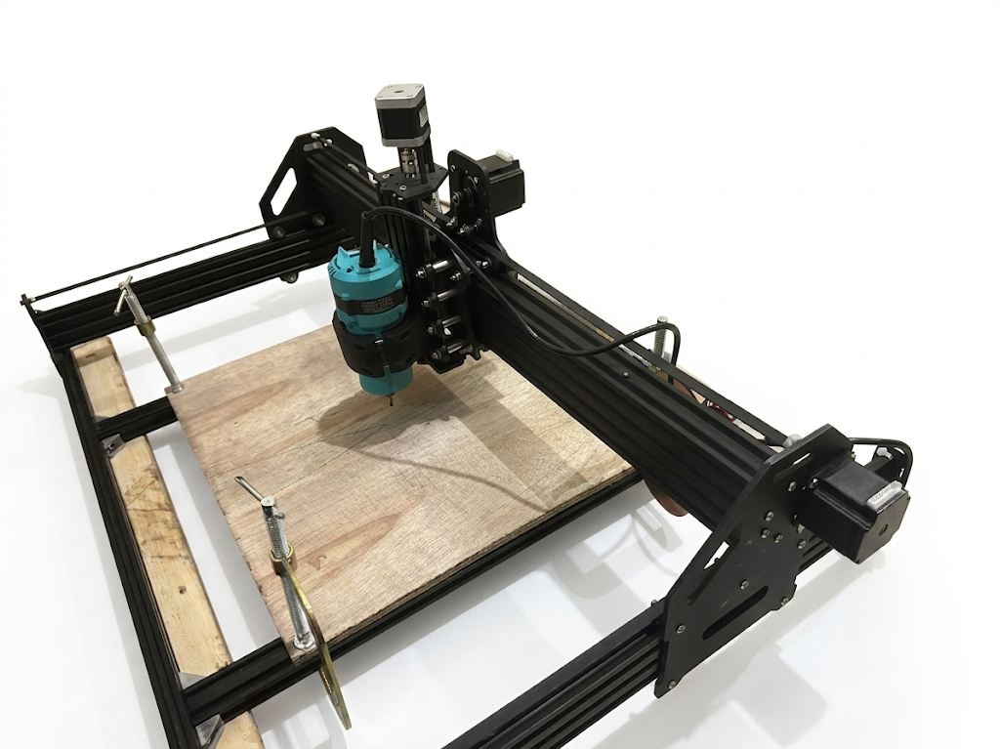
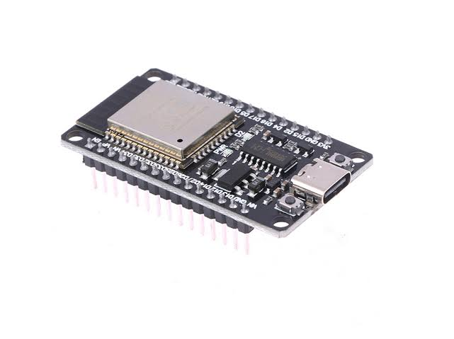
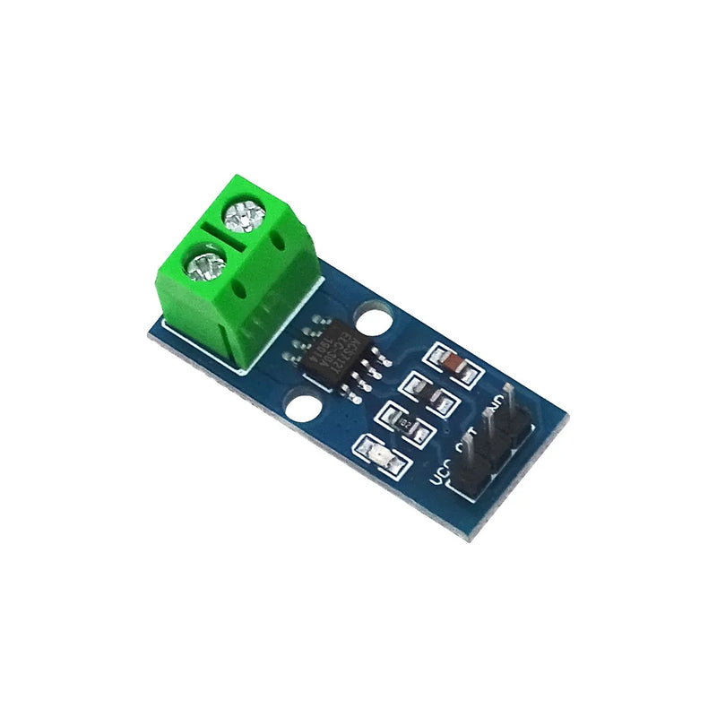
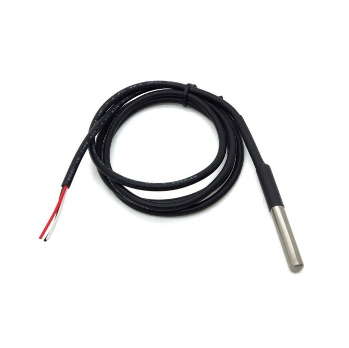
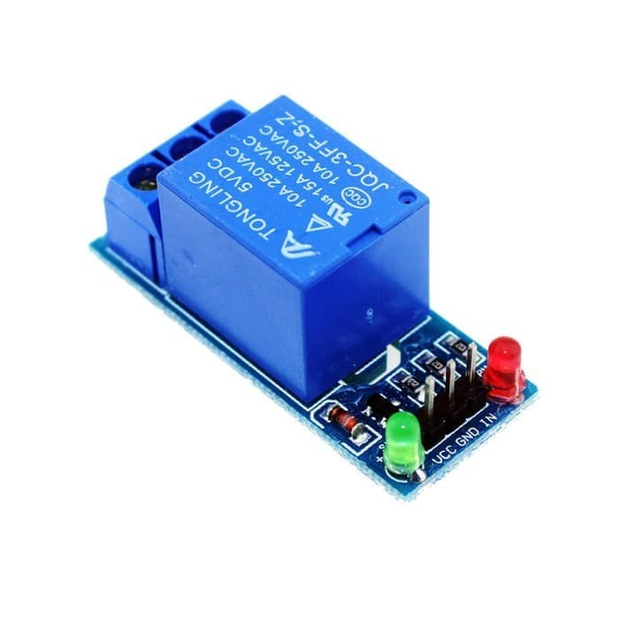
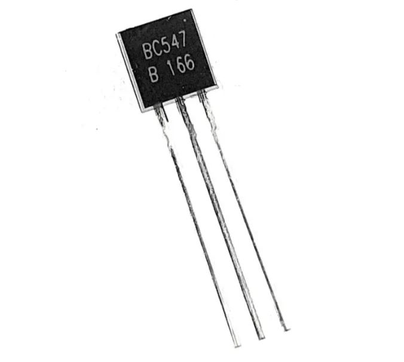

#  TINJAUAN PUSTAKA

## Internet of Things (IoT)

*Internet of Things* (IoT) merujuk pada jaringan objek fisik yang dilengkapi sensor, perangkat lunak, dan konektivitas jaringan, sehingga objek tersebut dapat mengumpulkan dan bertukar data tanpa campur tangan manusia secara langsung [@dauda2024]. Perkembangan IoT memunculkan beragam arsitektur penerapan yang disesuaikan dengan kebutuhan penyebaran, operasi, dan pemeliharaan sistem, mulai dari pemrosesan data terpusat di *cloud* sampai pemrosesan yang didekatkan ke perangkat melalui pendekatan *edge* dan *fog computing* [@dauda2024]. Ketiga pendekatan ini menawarkan keseimbangan berbeda antara skalabilitas, latensi, dan efisiensi sumber daya, tergantung seberapa dekat pemrosesan data dilakukan terhadap sumbernya. Prinsip dasar yang sama, yaitu objek fisik yang membaca kondisi lingkungannya lalu mengirim data melalui jaringan, berlaku di berbagai bidang penerapan, termasuk pemantauan proses industri.

Penerapan IoT pada sektor manufaktur mendorong terbentuknya *smart factory*, tempat data dari sensor yang terpasang pada mesin dipakai untuk memantau kondisi operasional secara berkelanjutan [@soori2023]. Sensor pada konteks ini berperan sebagai pembaca parameter kerja mesin, seperti suhu dan arus listrik, yang kemudian dipakai untuk menilai kondisi peralatan tanpa operator harus mengamati mesin secara fisik [@javaid2021]. Pendekatan ini menggeser pengawasan dari yang sebelumnya bergantung pada kehadiran manusia, menjadi pengawasan yang berjalan secara terus-menerus selama sensor dan jaringan tetap berfungsi. Prinsip inilah yang mendasari arsitektur sistem pengawasan mesin CNC pada penelitian ini.

## Mesin CNC (Computer Numerical Control)

Mesin CNC *(Computer Numerical Control)* adalah mesin perkakas yang gerakannya dikendalikan oleh komputer melalui program numerik, sehingga proses pemesinan seperti pemotongan, pengeboran, atau pengukiran berlangsung otomatis dengan ketelitian yang sulit dicapai secara manual [@altintas2012]. Program yang mengatur gerakan ini umumnya ditulis dalam format G-code, sekumpulan instruksi standar yang menentukan posisi, kecepatan, dan jenis gerakan mata pahat pada tiap sumbu mesin. Ketelitian tinggi yang dihasilkan mesin CNC berasal dari kemampuan komputer mengendalikan gerakan pada resolusi yang jauh lebih halus dibanding kendali manual, sekaligus menjaga konsistensi hasil pemesinan antar-satu benda kerja dengan benda kerja berikutnya. Prinsip kendali inilah yang membedakan mesin CNC dari mesin perkakas konvensional yang gerakannya sepenuhnya bergantung pada operator.

{#fig:mesin-cnc width="3.9043667979002623in"}

Dua komponen mesin CNC yang bekerja paling keras selama pemesinan berlangsung adalah Spindle dan motor stepper. Ilustrasi umum bagian-bagian mesin CNC ditunjukkan pada [@fig:mesin-cnc]. Spindle berfungsi memutar mata pahat pada kecepatan tinggi untuk memotong benda kerja, sementara motor stepper menggerakkan mata pahat pada sumbu X, Y, dan Z sesuai instruksi G-code yang sedang dijalankan. Pergerakan pada tiap sumbu dikendalikan oleh firmware yang menerjemahkan G-code menjadi sinyal langkah dan arah untuk tiap motor stepper, salah satu yang banyak dipakai pada mesin CNC skala kecil adalah GRBL, firmware sumber terbuka yang berjalan pada mikrokontroler Arduino [@grblcontributors]. GRBL menerima G-code, menghitung lintasan gerak yang diperlukan, dan mengirim sinyal kendali ke *driver* motor stepper secara presisi dan waktu nyata.

Selama proses pemesinan desain benda kerja terlebih dahulu diubah menjadi G-code, kemudian dikirim ke pengendali mesin untuk diterjemahkan menjadi gerakan pada setiap motor stepper. Motor stepper menggerakkan sumbu X, Y, dan Z sesuai lintasan yang telah ditentukan, sedangkan Spindle memutar mata pahat untuk melakukan proses pemotongan atau pengukiran, ketika proses tersebut berlangsung Spindle dan motor stepper bekerja secara terus-menerus sehingga menghasilkan perubahan beban kerja yang diikuti perubahan arus listrik dan suhu. Kedua parameter tersebut yang digunakan pada penelitian ini sebagai indikator untuk memantau kondisi mesin selama proses pemesinan berlangsung.

## Standar Keselamatan Kelistrikan Mesin

IEC 60204-1 adalah standar internasional yang mengatur persyaratan keselamatan kelistrikan pada peralatan mesin, mencakup aspek proteksi arus lebih, pembumian, hingga fungsi penghentian darurat [@internationalelectrotechnicalcommission2021]. ISO 13850 melengkapi standar tersebut dengan mengatur secara khusus prinsip perancangan fungsi *emergency stop*, termasuk syarat bahwa mesin harus tetap dalam kondisi berhenti sampai direset melalui tindakan operator yang disengaja [@internationalorganizationforstandardization2015]. Kedua standar ini menjadi acuan umum dalam perancangan sistem keselamatan pada peralatan mesin yang dikendalikan otomatis, dan tetap relevan diterapkan pada sistem pengawasan berbasis mikrokontroler, karena prinsip proteksi arus lebih dan penghentian darurat tidak terikat pada skala atau jenis pengendali yang dipakai.

## Mikrokontroler, Sensor, dan Aktuator untuk Pemantauan

### ESP32

{#fig:esp32-devkit width="2.45in"}

Mikrokontroler adalah sebuah chip komputer kecil yang dirancang untuk menjalankan tugas kendali tertentu, dilengkapi prosesor, memori, dan sejumlah pin masukan/keluaran dalam satu paket terpadu. ESP32 adalah salah satu mikrokontroler yang banyak dipakai untuk aplikasi IoT karena sudah dilengkapi modul WiFi bawaan, sehingga tidak memerlukan modul komunikasi tambahan untuk terhubung ke jaringan. Secara spesifikasi, ESP32 memakai prosesor Xtensa dua inti 32-bit yang dapat berjalan hingga 240 MHz, serta menyediakan *Analog-to-Digital Converter* (ADC) 12-bit pada sampai 18 kanal untuk membaca sinyal analog dari sensor [@espressifsystems2024]. Bentuk fisik ESP32 DevKit yang umum dipakai ditunjukkan pada [@fig:esp32-devkit]. Kombinasi konektivitas nirkabel dan jumlah kanal ADC yang memadai membuat ESP32 cocok dipakai sebagai pusat kendali pada sistem yang perlu membaca banyak sensor sekaligus mengirim data melalui jaringan, seperti pada penelitian ini.

### Sensor Arus ACS712

{#fig:acs712 width="2.2528707349081363in"}

Sensor arus adalah komponen yang membaca besar arus listrik yang mengalir pada suatu penghantar, umumnya dipakai untuk memantau beban kerja motor atau perangkat listrik lain. ACS712 adalah sensor arus berbasis prinsip *Hall-effect*, yaitu sensor yang mendeteksi medan magnet yang timbul di sekitar penghantar berarus, lalu mengubahnya menjadi tegangan keluaran yang sebanding dengan besar arus tersebut [@allegromicrosystems2024]. Bentuk fisik modul ACS712 ditunjukkan pada [@fig:acs712]. Prinsip *Hall-effect* ini membuat ACS712 bersifat non-invasif, artinya pembacaan arus dilakukan tanpa memutus atau menyisipkan komponen langsung pada jalur kabel yang diukur. Sensor ini tersedia dalam beberapa varian dengan rentang arus dan sensitivitas berbeda, dirangkum pada [@tbl:varian-acs712]. Tabel tersebut menunjukkan hubungan berbanding terbalik antara rentang arus dan sensitivitas: varian dengan rentang arus lebih besar punya sensitivitas lebih rendah, karena tegangan keluaran per satuan ampere terbagi ke rentang yang lebih lebar.

  -----------------------------------------------------------------------
  **Varian**                 **Rentang Arus**        **Sensitivitas**
  ----------------------- ----------------------- -----------------------
  ACS712-05B                       ±5 A                  185 mV/A

  ACS712-20A                       ±20 A                 100 mV/A

  ACS712-30A                       ±30 A                  66 mV/A
  -----------------------------------------------------------------------

  : Varian Sensor ACS712 {#tbl:varian-acs712}

(Sumber: Diolah oleh Penulis)

### Sensor Suhu DS18B20

{#fig:ds18b20 width="3.1666666666666665in"}

Sensor suhu digital adalah komponen yang mengubah besaran suhu menjadi data digital yang dapat langsung dibaca mikrokontroler, tanpa memerlukan rangkaian pengondisian sinyal analog tambahan. DS18B20 adalah sensor suhu digital yang berkomunikasi melalui protokol 1-Wire, yaitu protokol komunikasi yang hanya memerlukan satu jalur data untuk bertukar informasi dengan mikrokontroler [@analogdevices2019]. Bentuk fisik sensor DS18B20 ditunjukkan pada [@fig:ds18b20]. Tiap DS18B20 memiliki kode identitas 64-bit unik dari pabrik, sehingga beberapa sensor dapat berbagi satu jalur data yang sama tanpa saling bertabrakan, cukup dibedakan melalui kode identitasnya masing-masing. Sensor ini mampu membaca suhu pada rentang -55°C hingga 125°C dengan akurasi ±0,5°C pada rentang -10°C hingga 85°C, sehingga sesuai dipakai untuk memantau suhu komponen mesin yang bekerja pada rentang tersebut.

### Relay

{#fig:relay width="2.7243832020997374in"}

Relay adalah saklar elektromekanis yang dikendalikan oleh sinyal listrik bertegangan rendah, dipakai untuk menghubungkan atau memutuskan rangkaian bertegangan lebih tinggi tanpa kontak langsung antara pengendali dan beban yang dikendalikan. Prinsip kerjanya memanfaatkan kumparan elektromagnetik: ketika arus mengalir pada kumparan, medan magnet yang timbul menarik lengan logam sehingga posisi kontak berubah, membuka atau menutup jalur listrik yang terhubung padanya. Modul relay yang umum dipakai pada proyek berbasis mikrokontroler, seperti pada [@fig:relay], biasanya dilengkapi optocoupler sebagai isolator, yang memisahkan rangkaian sinyal kendali bertegangan rendah dari rangkaian beban bertegangan tinggi, sehingga mikrokontroler terlindung dari kemungkinan lonjakan tegangan pada sisi beban [@ningbosonglerelaycoltd]. Relay tersedia dalam beberapa konfigurasi kontak, salah satunya *Single Pole Double Throw* (SPDT), yang punya dua jenis kontak sekaligus, yaitu *Normally Open* (NO) yang dalam kondisi diam berada pada posisi terbuka, dan *Normally Close* (NC) yang dalam kondisi diam berada pada posisi tertutup [@ningbosonglerelaycoltd]. Pemilihan jenis kontak yang dipakai menentukan bagaimana relay bersikap ketika sinyal kendali tidak aktif, sehingga relevan untuk rancangan sistem yang perlu bersikap aman ketika terjadi kegagalan kendali.

### Transistor BC547

{#fig:bc547 width="2.5in"}

Transistor adalah komponen semikonduktor yang dapat berfungsi sebagai saklar elektronik, menghubungkan atau memutus arus pada rangkaian berdasarkan sinyal kendali bertegangan kecil yang diberikan pada salah satu kakinya. BC547 adalah transistor jenis NPN dengan kemasan TO-92, bentuk fisiknya ditunjukkan pada [@fig:bc547], umum dipakai sebagai saklar sinyal berarus kecil pada rangkaian berbasis mikrokontroler [@onsemiconductor2012]. Ketika arus kecil dialirkan menuju kaki basis, transistor berpindah ke kondisi jenuh *(saturation)* dan menghubungkan jalur antara kaki kolektor dan emitor, sehingga sinyal bertegangan rendah dari mikrokontroler dapat mengendalikan jalur lain tanpa terhubung langsung secara elektrik.

## Histeresis pada Kendali Ambang Batas

Histeresis adalah selisih yang sengaja diterapkan antara nilai ambang yang memicu suatu aksi kendali dan nilai ambang yang mengizinkan aksi tersebut kembali ke kondisi semula, dipakai pada sistem kendali berbasis ambang untuk mencegah perubahan status yang berulang-ulang dalam waktu singkat [@sachdev2021]. Tanpa histeresis, nilai terukur yang berosilasi kecil di sekitar satu titik ambang tunggal dapat memicu aksi kendali menyala dan mati secara bergantian pada rentang waktu yang sangat pendek, kondisi yang dikenal sebagai *chattering* [@sachdev2021]. Penerapan histeresis membuat aksi kendali baru kembali ke kondisi semula setelah nilai terukur melewati jarak aman tertentu dari titik ambang awal, sehingga osilasi kecil akibat noise atau fluktuasi beban tidak langsung memicu perubahan status berulang.

## Komunikasi Data MQTT

MQTT *(Message Queuing Telemetry Transport)* adalah protokol pesan berbasis pola *publish-subscribe* yang dirancang ringan, sederhana, dan mudah diimplementasikan, sehingga cocok dipakai pada lingkungan dengan keterbatasan daya komputasi dan bandwidth jaringan seperti *Machine-to-Machine* (M2M) dan IoT [@anon2019]. Protokol ini berjalan di atas TCP/IP dan melibatkan tiga pihak utama: publisher (pengirim data), subscriber (penerima data), dan broker (perantara yang mengatur distribusi pesan) [@anon2019]. Publisher dan subscriber tidak perlu mengetahui alamat satu sama lain secara langsung karena seluruh komunikasi difasilitasi oleh broker. Pola ini dikenal sebagai *decoupling* komunikasi antara pengirim dan penerima pesan, dan membuat penambahan atau pengurangan perangkat pada sistem tidak memerlukan konfigurasi ulang pada perangkat lain yang sudah terhubung.

Setiap pesan pada MQTT dikirim menuju alamat bernama *topic*, berupa string berjenjang yang dipisahkan tanda garis miring, misalnya cnc/+/telemetry. Publisher mengirim *(publish)* pesan ke *topic* tertentu, sementara subscriber mendaftar *(subscribe)* pada *topic* yang sama untuk menerima pesan tersebut, tanpa perlu tahu siapa publisher-nya. Struktur *topic* yang berjenjang memungkinkan satu broker melayani banyak jenis data sekaligus dari banyak perangkat berbeda. Perbedaan tiap perangkat dan jenis data cukup ditandai melalui penamaan *topic*-nya, model pertukaran data semacam ini sesuai dengan kebutuhan sistem pengawasan yang mengirim data sensor secara berkala dari perangkat lapangan ke server, sebagaimana diterapkan pada penelitian ini.

  --------------------------------------------------------------------------------------------------
   **QoS**  **Nama**          **Jaminan Pengiriman**
  --------- ----------------- ----------------------------------------------------------------------
      0     *At most once*    Pesan dikirim sekali tanpa konfirmasi, berpotensi hilang

      1     *At least once*   Pesan dijamin sampai, berpotensi terkirim ganda

      2     *Exactly once*    Pesan dijamin sampai tepat sekali, overhead komunikasi paling tinggi
  --------------------------------------------------------------------------------------------------

  : Tingkat Quality of Service (QoS) pada MQTT {#tbl:qos-mqtt}

(Sumber: Diolah oleh Penulis)

[@tbl:qos-mqtt] menunjukkan tiga tingkat QoS pada MQTT, dibedakan dari jaminan pengiriman pesan yang diberikan [@anon2019]. QoS 0 tidak melakukan konfirmasi penerimaan sama sekali, sehingga overhead komunikasi paling rendah namun pesan berisiko hilang jika koneksi terputus saat pengiriman berlangsung. QoS 1 menambahkan mekanisme *acknowledgment* agar pesan dijamin sampai, dengan konsekuensi pesan yang sama berpotensi diterima lebih dari sekali oleh subscriber. QoS 2 menambahkan proses konfirmasi dua arah sehingga pesan dijamin sampai tepat satu kali, meski menimbulkan overhead komunikasi paling besar di antara ketiga tingkat tersebut. Pemilihan tingkat QoS yang dipakai pada tiap *topic* di penelitian ini disesuaikan dengan karakteristik data yang dikirim.

Selain *topic* dan QoS, MQTT menyediakan dua mekanisme tambahan yang relevan untuk memantau ketersediaan perangkat, yaitu *retained message* dan *Last Will and Testament* (LWT) [@anon2019]. Retained message adalah pesan terakhir pada suatu *topic* yang disimpan oleh broker, sehingga subscriber baru yang mendaftar pada *topic* tersebut langsung menerima nilai terbaru tanpa harus menunggu publisher mengirim pesan berikutnya. LWT adalah pesan yang didaftarkan publisher ke broker saat pertama kali terhubung, lalu otomatis dipublikasikan oleh broker apabila koneksi publisher terputus secara tidak wajar, misalnya karena kehilangan daya atau jaringan. Kombinasi retained message dan LWT memungkinkan server memantau status *online* atau *offline* suatu perangkat secara langsung, tanpa harus mengirim permintaan status secara berkala. Mekanisme inilah yang mendasari pemantauan status koneksi perangkat pada sistem pengawasan penelitian ini.

## Arsitektur Client-Server untuk Sistem Pemantauan

Sistem pemantauan yang mengandalkan aplikasi web umumnya memakai arsitektur client-server, dua peran yang bekerja terpisah namun saling terhubung melalui jaringan. Client meminta atau menampilkan data, sementara server memproses permintaan tersebut dan menyediakan data dari sumber yang dikelolanya. Pemisahan peran ini memungkinkan client dan server dikembangkan serta diperbarui secara independen, selama format komunikasi antar-keduanya tetap konsisten. Pada sistem pemantauan berbasis dashboard web, arsitektur ini diwujudkan melalui kombinasi beberapa mekanisme komunikasi yang saling melengkapi, dijelaskan pada tiga sub-bagian berikut.

### REST API

REST *(Representational State Transfer)* adalah gaya arsitektur perangkat lunak berbasis jaringan yang memandang tiap sumber daya sebagai entitas dapat diakses melalui alamat unik, dioperasikan melalui metode standar seperti pengambilan, penambahan, atau penghapusan data [@fielding2000]. Komunikasi pada gaya arsitektur ini bersifat *stateless*, artinya tiap permintaan dari client membawa seluruh informasi yang diperlukan server untuk memprosesnya, tanpa bergantung pada konteks permintaan sebelumnya. Sifat ini membuat server lebih mudah diskalakan karena tidak perlu menyimpan status percakapan tiap client secara berkelanjutan. Pada praktiknya, REST API banyak diterapkan melalui protokol HTTP, memakai metode seperti GET untuk mengambil data dan POST untuk mengirim data atau perintah.

### WebSocket

WebSocket adalah protokol komunikasi yang menyediakan saluran dua arah dan persisten antara client dan server dalam satu koneksi TCP, berbeda dari pola permintaan-tanggapan pada REST API yang terputus setelah tiap pertukaran data selesai [@fette2011]. Koneksi WebSocket dimulai melalui proses *handshake* berbasis HTTP, kemudian ditingkatkan *(upgrade)* menjadi saluran WebSocket begitu server menyetujuinya. Setelah saluran terbentuk, baik client maupun server dapat mengirim pesan kapan saja tanpa perlu memulai permintaan baru tiap kali ada data baru, cocok dipakai untuk kebutuhan pembaruan data secara langsung. Karakteristik ini menjadikan WebSocket pilihan yang sesuai untuk mengirim data sensor secara berkala dari server ke dashboard pada penelitian ini, karena data perlu tampil segera setelah diterima server tanpa menunggu client meminta secara aktif.

### Database

Database adalah kumpulan data terstruktur yang disimpan secara sistematis sehingga dapat diakses, dikelola, dan diperbarui secara efisien melalui perangkat lunak pengelola database. Salah satu jenis perangkat lunak pengelola database yang dipakai pada sistem berskala kecil adalah SQLite, mesin database SQL yang bersifat *self-contained*, *serverless*, dan tidak memerlukan konfigurasi tambahan sebelum dipakai [@sqliteconsortium]. Seluruh data pada SQLite tersimpan dalam satu berkas tunggal di disk, berbeda dari sistem database lain yang umumnya memerlukan proses server terpisah untuk melayani permintaan baca-tulis. Sifat *serverless* ini membuat SQLite mudah disematkan langsung ke dalam aplikasi backend tanpa proses instalasi dan pengelolaan server database tersendiri, karakteristik yang sesuai dengan kebutuhan penyimpanan data telemetri pada penelitian ini.
