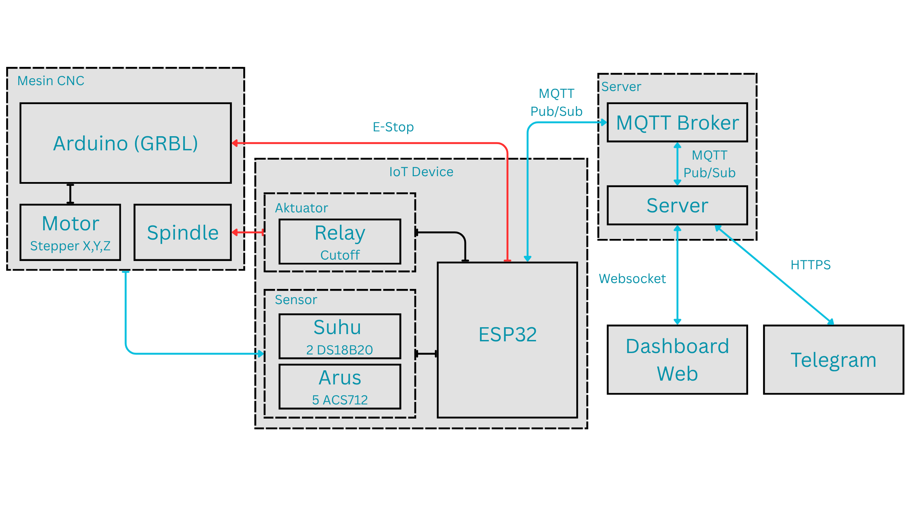
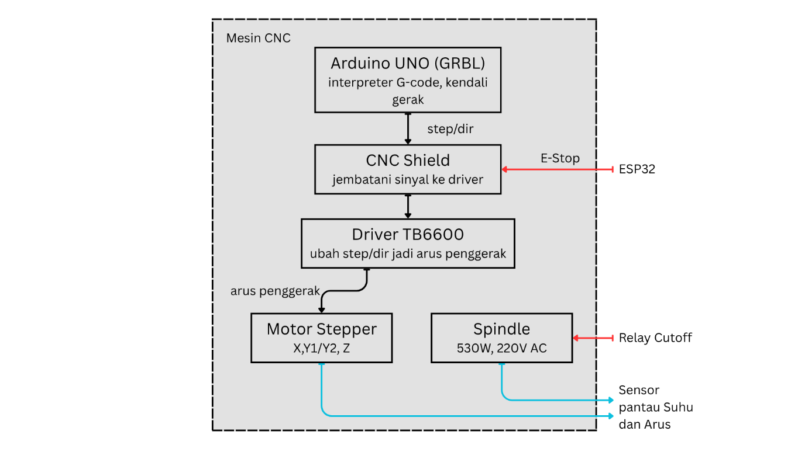
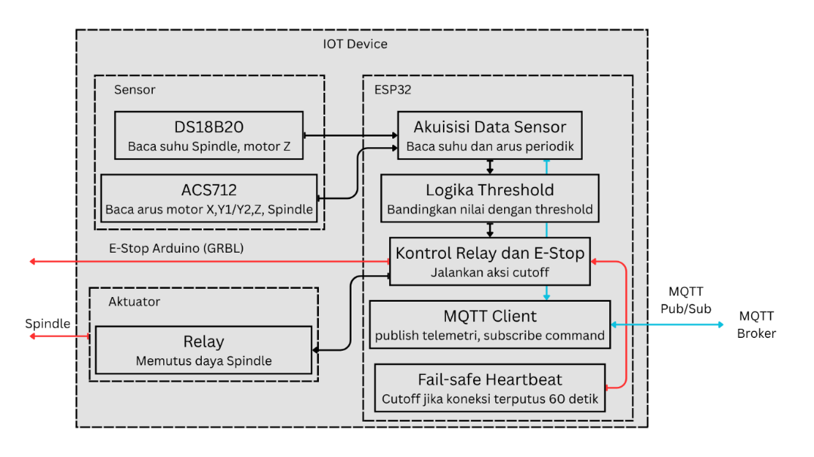
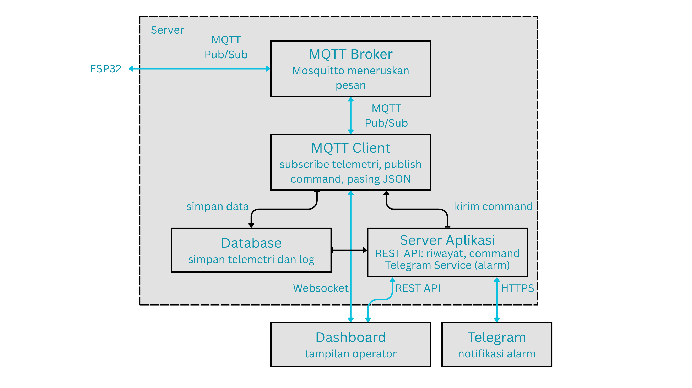
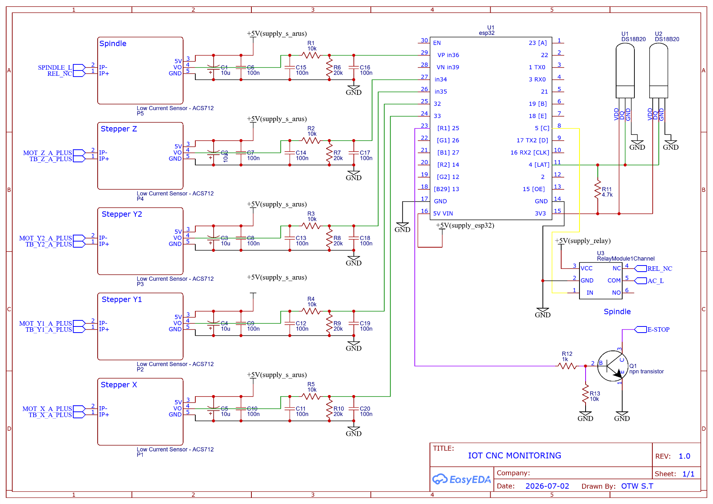

#  SPESIFIKASI DAN DESAIN SISTEM

<!-- AUDIT: gambar assets/media/image2.emf awalnya nyempil di heading ini (kemungkinan artifact numbering/field Word, bukan konten). Format .emf juga tidak umum didukung di luar Word — perlu dicek isinya dan diputuskan: hapus atau pindahkan sebagai figure biasa. -->

## Spesifikasi Sistem

Spesifikasi sistem pengawasan mesin CNC pada penelitian ini disusun dari tiga dasar acuan yang mewakili dimensi berbeda: standar keselamatan kelistrikan mesin, spesifikasi komponen yang dipantau, dan praktik pemantauan kondisi mesin berbasis *Internet of Things* (IoT). Ketiga dasar ini dipakai bersama supaya spesifikasi yang dihasilkan bersifat fungsional, menyatakan kebutuhan yang harus dipenuhi tanpa terikat pada merek atau teknologi komponen tertentu, sehingga tahap penetapan kebutuhan terpisah dari tahap pemilihan solusi teknis. Pemisahan ini membuat spesifikasi tetap relevan meski komponen atau teknologi yang dipakai berubah di kemudian hari. Tiga dasar tersebut dijabarkan berikut ini, sebelum spesifikasi lengkap dirangkum pada [@tbl:spesifikasi-sistem].

| **No** | **Parameter** | **Batasan** | **Deskripsi Spesifikasi** | **Sumber Acuan** |
|:---|:---|:---|:---|:---|
| 1 | Pemantauan Suhu | Membaca suhu titik kerja rawan panas, error maksimal 2°C | Suhu jadi indikator panas berlebih pada motor & Spindle | IEC 60204-1:2021 (4.4) [@internationalelectrotechnicalcommission2021]; datasheet sensor suhu [@analogdevices2019] |
| 2 | Pemantauan Arus | Membaca arus seluruh motor penggerak & Spindle terus-menerus, termasuk lonjakan saat start | Arus jadi indikator beban kerja, dibaca sebagai nilai mutlak | IEC 60204-1:2021 (7.2) [@internationalelectrotechnicalcommission2021]; datasheet sensor arus [@allegromicrosystems2024] |
| 3 | Ambang Proteksi Arus | Memutus daya saat arus melampaui ambang di atas arus kerja normal. Nilai final: 3,0 A (sumbu X, Y1, Y2), 2,0 A (sumbu Z), 3,0 A (Spindle) | Mengikuti arus pengenal motor (2,8 A NEMA 23; 1,7 A NEMA 17) dan arus nominal Spindle (\~2,4 A) | IEC 60204-1:2021 (7.2) [@internationalelectrotechnicalcommission2021]; datasheet 23HS5628 [@kat] & 17HS8401 [@ningboleisonmotorcoltd] |
| 4 | Ambang Proteksi Suhu | Memutus daya saat suhu melampaui ambang aman. Nilai final: 60°C (Spindle), 55°C (motor sumbu Z) | Di bawah batas yang dapat merusak lilitan motor/memperpendek umur Spindle | IEC 60204-1:2021 (4.4) [@internationalelectrotechnicalcommission2021] |
| 5 | Waktu Pemutusan (*Cutoff*) | Menghentikan mesin segera setelah ambang terlampaui, memutus daya langsung | Setara stop kategori 0 pada standar keselamatan mesin | IEC 60204-1:2021 (9.2.3.4.2) [@internationalelectrotechnicalcommission2021]; ISO 13850 [@internationalorganizationforstandardization2015] |
| 6 | Penahanan sampai Reset | Mesin tidak menyala kembali sendiri; hanya melalui tindakan operator yang disengaja | Mencegah mesin beroperasi kembali sebelum kondisi diperiksa | ISO 13850 (4.1.1.2) [@internationalorganizationforstandardization2015] |
| 7 | Periode Pemantauan | Data diperbarui maksimal tiap 2 detik | Selang singkat agar perubahan terpantau mendekati waktu nyata | Soori dkk. [@soori2023]; Javaid dkk. [@javaid2021] |
| 8 | Respons Fail-safe | Mesin mati otomatis bila komunikasi terputus \>60 detik | Mesin tidak dibiarkan beroperasi tanpa pengawasan saat data terputus | IEC 60204-1:2021 (9.2.3.4.2) [@internationalelectrotechnicalcommission2021] |
| 9 | Dashboard Pemantauan | Tampilan data suhu & arus beserta riwayat, plus kendali hidup/mati jarak jauh | Operator dapat memantau & mengendalikan tanpa berada di sisi mesin | Soori dkk. [@soori2023] |
| 10 | Keterjangkauan Biaya | Komponen umum tersedia di pasaran lokal | Menghindari ketergantungan pada perangkat pengawasan kelas industri yang mahal | Li dkk. [@li2022] |
| 11 | Notifikasi Jarak Jauh | Mengirim pesan peringatan otomatis ke Telegram operator saat alarm terdeteksi atau koneksi terputus | Operator menerima pemberitahuan instan di ponsel tanpa bergantung pada tampilan dashboard | Soori dkk. [@soori2023] |

Table: Spesifikasi Sistem Pengawasan Mesin CNC {#tbl:spesifikasi-sistem}

(Sumber: Diolah oleh Penulis)

Dasar pertama adalah standar keselamatan kelistrikan mesin. IEC 60204-1 mengatur proteksi arus lebih pada pasal 7.2 dan fungsi penghentian darurat pada pasal 9.2.3.4.2, yang diklasifikasikan sebagai stop kategori 0, yaitu penghentian dengan memutus daya secara langsung [@internationalelectrotechnicalcommission2021]. ISO 13850 merinci prinsip penghentian darurat, termasuk syarat mesin tetap berhenti sampai direset melalui tindakan operator yang disengaja [@internationalorganizationforstandardization2015]. Kedua standar ini menjadi acuan spesifikasi mekanisme *cutoff* dan respons *fail-safe* pada sistem yang dirancang.

Dasar kedua adalah spesifikasi komponen yang dipantau. Spindle NRT-Pro 3709 HD berdaya 530 W pada tegangan 220 V bekerja pada arus normal sekitar 2,4 A. Motor stepper NEMA 23 (23HS5628) yang menggerakkan sumbu X dan Y memiliki arus pengenal 2,8 A per fase [@kat], sedangkan motor stepper NEMA 17 (17HS8401) pada sumbu Z memiliki arus pengenal 1,7 A per fase [@ningboleisonmotorcoltd]. Angka-angka ini menjadi acuan penetapan ambang arus, supaya ambang berada sedikit di atas arus kerja normal tiap motor, cukup lebar untuk menghindari alarm palsu namun tetap sensitif menangkap kondisi tidak wajar.

Dasar ketiga adalah praktik pemantauan kondisi mesin berbasis IoT. Pemakaian suhu dan arus sebagai parameter kondisi mesin sejalan dengan penerapan IoT pada *smart factory* [@soori2023], sedangkan pengiriman data secara berkala melalui jaringan sejalan dengan peran sensor sebagai pembaca parameter kerja perangkat pada Industry 4.0 [@javaid2021]. Dari praktik ini, periode pemantauan yang memadai berada pada rentang detik, supaya anomali pada mesin tidak terlambat tertangkap oleh sistem.

Spesifikasi waktu pemutusan dan penahanan sampai reset pada [@tbl:spesifikasi-sistem] langsung mengacu pada klasifikasi stop kategori 0 IEC 60204-1 dan prinsip penahanan ISO 13850, sehingga begitu ambang terlampaui, sistem memutus daya seketika dan tetap menahan mesin dalam kondisi mati sampai operator secara sadar mengirim perintah menyalakan ulang. Respons *fail-safe* menambahkan lapisan keselamatan lain, mesin dimatikan otomatis apabila jalur komunikasi terputus lebih dari 60 detik, sehingga mesin tidak dibiarkan beroperasi tanpa pengawasan saat data berhenti mengalir. Spesifikasi keterjangkauan biaya membatasi pemilihan komponen pada perangkat yang tersedia di pasaran lokal, menghindari ketergantungan pada perangkat pengawasan kelas industri yang harganya jauh lebih mahal. Pembacaan arus pada sistem memerlukan kalibrasi lebih dulu sebelum diverifikasi, karena keluaran sensor arus peka terhadap pergeseran titik nol yang dapat berbeda antar-unit sensor.

## Desain Sistem

Arsitektur sistem pada penelitian ini dirancang dengan dua jalur kerja yang terpisah namun terhubung pada satu titik pertemuan. Jalur gerak menangani pergerakan fisik mesin, terdiri dari Arduino UNO dengan CNC shield dan firmware GRBL yang menggerakkan motor stepper pada sumbu X, Y, dan Z. Jalur pengawasan berjalan independen dari jalur gerak, memakai ESP32 sebagai pusat kendali yang membaca sensor, memeriksa kondisi mesin, mengendalikan relay, dan mengirim data ke server. Pemisahan dua jalur ini memastikan pengawasan tetap berjalan meski jalur gerak sedang memproses G-code, dan sebaliknya perintah pemutusan dari jalur pengawasan tetap bisa dieksekusi tanpa harus menunggu jalur gerak selesai bekerja.

{#fig:arsitektur-sistem width="6.169444444444444in"}

[@fig:arsitektur-sistem] menunjukkan lima bagian utama yang saling terhubung membentuk alur kerja sistem. Mesin CNC, terdiri dari Arduino/GRBL, motor stepper X/Y/Z, dan Spindle, menjadi objek yang dipantau sekaligus dikendalikan. IoT Device, berisi sensor (dua unit DS18B20 untuk suhu, lima unit ACS712 untuk arus), aktuator relay, dan ESP32 sebagai pusat kendali, membaca kondisi Mesin CNC dan mengirim data ke Server. Server, yang menjalankan MQTT Broker dan aplikasi server, menerima data dari IoT Device, meneruskannya ke Dashboard Web melalui WebSocket, serta mengirim notifikasi ke Telegram melalui protokol HTTPS saat ambang batas terlampaui. Seluruh bagian ini terhubung melalui jalur dengan fungsi berbeda yang dibedakan lewat kode warna pada diagram.

Kode warna pada [@fig:arsitektur-sistem] membedakan tiga jenis jalur berdasarkan fungsinya. Garis biru menandai aliran data telemetri dan komunikasi jaringan, mencakup pembacaan fisik oleh sensor, pertukaran data MQTT Pub/Sub antara ESP32, MQTT Broker, dan Server, komunikasi WebSocket dengan Dashboard Web, serta pengiriman pesan HTTPS ke aplikasi Telegram. Garis merah menandai jalur pemutusan daya darurat, yaitu sinyal E-Stop dari ESP32 ke Arduino dan pemutusan daya Spindle oleh relay. Garis hitam menandai sinyal kendali internal dan hubungan fisik antar-komponen lokal pada Mesin CNC maupun IoT Device.

### Arsitektur Sistem

Tiap blok pada [@fig:arsitektur-sistem] memiliki susunan internal yang lebih rinci, dijabarkan dalam tiga diagram terpisah untuk blok Mesin CNC, IoT Device, dan Server. Blok Mesin CNC ditunjukkan pada [@fig:blok-mesin-cnc]. Arduino UNO yang menjalankan firmware GRBL berperan sebagai penerjemah G-code, mengirim sinyal step dan direction menuju CNC Shield. CNC Shield ini juga menjadi titik masuk sinyal *E-Stop* dari ESP32, sehingga penghentian darurat dapat memutus program gerak yang sedang berjalan. Sinyal dari CNC Shield diteruskan ke driver TB6600 yang menggerakkan motor stepper pada sumbu X, Y1, Y2, dan Z.

{#fig:blok-mesin-cnc width="5.15in"}

[@fig:blok-mesin-cnc] menunjukkan bahwa Spindle berdiri terpisah dari jalur step dan direction yang mengendalikan motor stepper. Spindle menerima sinyal *cutoff* langsung dari relay, tanpa melampaui CNC Shield atau firmware GRBL. Susunan ini memastikan pemutusan daya Spindle tetap dapat dieksekusi meski Arduino sedang sibuk memproses program gerak, karena keputusan *cutoff* tidak bergantung pada ketersediaan sumber daya pemrosesan Arduino pada saat itu.

Blok IoT Device ditunjukkan pada [@fig:blok-iot-device]. Sensor DS18B20 dan ACS712 mengirim hasil pembacaan ke tahap akuisisi data sensor pada ESP32. Hasil akuisisi ini bercabang ke dua arah: cabang pertama menuju logika ambang yang menentukan perlu tidaknya kontrol relay dan *E-Stop* diaktifkan, cabang kedua menuju MQTT Client untuk dikirim sebagai data telemetri, terlepas dari apakah nilai yang dibaca melampaui ambang atau tidak. Fungsi *fail-safe heartbeat* berjalan berdampingan dengan kedua cabang ini, dan dapat memicu kontrol relay serta *E-Stop* secara langsung apabila koneksi ke server terputus.

{#fig:blok-iot-device width="5.959101049868766in"}

[@fig:blok-iot-device] menegaskan bahwa data telemetri tetap terkirim ke server secara berkelanjutan, tidak hanya pada saat kondisi mesin melampaui ambang aman. Pemisahan cabang logika ambang dari cabang pengiriman data ini membuat server selalu memperoleh gambaran kondisi mesin secara utuh, sementara keputusan *cutoff* tetap dapat diambil secara lokal oleh ESP32 tanpa menunggu konfirmasi dari server terlebih dahulu.

Blok Server ditunjukkan pada [@fig:blok-server]. MQTT Broker meneruskan pesan antara ESP32 dan MQTT Client pada sisi server. MQTT Client bertugas menerima data telemetri, meneruskan perintah dari operator, dan mengurai data JSON yang diterima. Data yang sudah diurai disimpan ke Database, sementara Server Aplikasi mengelola REST API untuk riwayat data serta menjalankan Telegram Service untuk mengirimkan notifikasi peringatan.

{#fig:blok-server width="5.865395888013999in"}

[@fig:blok-server] menunjukkan alur kerja internal pada blok Server. MQTT Client menyimpan data telemetri ke Database dan memeriksa status ambang batas. Saat terjadi kondisi tidak normal atau terputusnya komunikasi, Server Aplikasi memicu Telegram Service untuk mengirim pesan peringatan ke aplikasi Telegram melalui protokol HTTPS. Dashboard Web terhubung ke Server melalui dua jenis jalur: WebSocket untuk menerima pembaruan data waktu nyata dan REST API untuk mengakses riwayat data serta mengirim perintah kendali manual.

### Perangkat Keras

Enam kelompok komponen ditambahkan ke mesin CNC yang sudah ada, tanpa mengubah jalur kendali gerak yang sudah berjalan sebelumnya. Rincian tiap kelompok dirangkum pada [@tbl:spesifikasi-perangkat-keras].

  ------------------------------------------------------------------------------------------------------------------------------------------------------------------------------------------------------------------------------------------
   **No**  **Kelompok**                   **Jumlah**                       **Spesifikasi Kunci**                                                                                      **Fungsi**
  -------- ------------------------------ -------------------------------- ---------------------------------------------------------------------------------------------------------- ------------------------------------------------------
     1     ESP32 DevKit                   1 unit                           WiFi bawaan, ADC 12-bit, 9 pin GPIO dipakai [@espressifsystems2024]                                                         Pusat kendali seluruh logika pengawasan

     2     Sensor Arus ACS712             5 unit (X, Y1, Y2, Z, Spindle)   Kapasitas 20 A, sensitivitas 100 mV/A, prinsip *Hall-effect* [@allegromicrosystems2024]                                          Membaca arus tiap motor & Spindle secara non-invasif

     3     Sensor Suhu DS18B20            2 unit (Spindle, Stepper Z)      Protokol 1-Wire, error maksimal 2°C [@analogdevices2019]                                                                 Membaca suhu titik kerja paling rawan panas

     4     Modul Relay                    1 unit                           Tipe *normally close*, isolasi optocoupler, kendali 3,3V/beban 220V AC [@ningboleisonmotorcoltd]                                Memutus daya Spindle

     5     Komponen Pendukung             Sesuai kebutuhan                 Resistor 10kΩ/20kΩ (pembagi tegangan), 4,7kΩ (*pull-up*), kapasitor 100nF/10µF (filter noise), PCB, jumper   Menunjang kerja sensor & merakit rangkaian

     6     Mesin CNC (objek pengawasan)   1 unit                           Arduino UNO/GRBL, CNC shield, 3× driver TB6600 (24V DC), Spindle NRT-Pro 3709 HD 530W [@grblcontributors]               Objek yang dipantau dan dikendalikan
  ------------------------------------------------------------------------------------------------------------------------------------------------------------------------------------------------------------------------------------------

  : Spesifikasi Perangkat Keras {#tbl:spesifikasi-perangkat-keras}

(Sumber: Diolah oleh Penulis)

Pemilihan tiap komponen pada [@tbl:spesifikasi-perangkat-keras] mengikuti kebutuhan spesifik yang sudah ditetapkan pada [@tbl:spesifikasi-sistem]. Kapasitas 20 A pada ACS712 dipilih untuk memberi ruang aman di atas arus kerja normal tiap motor, yang berada di kisaran 1,7-2,8 A menurut datasheet NEMA 23 dan NEMA 17 [@sqliteconsortium], [@kat], serta arus nominal Spindle sekitar 2,4 A. Modul relay dipilih bertipe *normally close* dengan isolasi optocoupler, memisahkan rangkaian logika 3,3V milik ESP32 dari rangkaian daya AC 220V yang diputus relay, sehingga risiko kerusakan pada ESP32 akibat gangguan di sisi daya dapat ditekan. Tiga jalur suplai daya (ESP32, sensor arus, relay) dipisah dari sumber USB yang berbeda, karena lonjakan arus pada satu jalur, terutama saat kumparan relay bekerja, berpotensi mengganggu pembacaan sensor bila berbagi jalur suplai yang sama.

Spindle NRT-Pro 3709 HD dikendalikan terpisah dari ketiga jalur motor stepper pada mesin CNC, sehingga pemutusan daya Spindle melalui relay tidak memerlukan koordinasi dengan driver TB6600 atau firmware GRBL. Driver TB6600 disuplai tegangan 24V DC dari jalur terpisah dengan sistem pengawasan, mencegah arus tinggi pada motor stepper menyusup ke jalur elektronik sistem pengawasan yang bekerja pada tegangan jauh lebih rendah. Pemisahan pada tingkat kelistrikan maupun logika kendali ini konsisten dengan prinsip arsitektur dua jalur yang dijelaskan pada bagian sebelumnya, jalur gerak dan jalur pengawasan tetap independen satu sama lain baik dari sisi sinyal maupun dari sisi catu daya.

  -------------------------------------------------------------------------------------------
   **GPIO**  **Fungsi**      **Komponen**                    **Jenis Sinyal**
  ---------- --------------- ------------------------------- --------------------------------
      33     Baca arus       ACS712 (Stepper X)              Analog (ADC)

      32     Baca arus       ACS712 (Stepper Y1)             Analog (ADC)

      35     Baca arus       ACS712 (Stepper Y2)             Analog (ADC)

      34     Baca arus       ACS712 (Stepper Z)              Analog (ADC)

      36     Baca arus       ACS712 (Spindle)                Analog (ADC)

      4      Baca suhu       DS18B20 (Spindle & Stepper Z)   Digital (1-Wire)

      5      Kontrol relay   Modul Relay                     Digital (output), aktif rendah

      25     Sinyal E-Stop   CNC Shield                      Digital (output), aktif tinggi
  -------------------------------------------------------------------------------------------

  : Pinout ESP32 {#tbl:pinout-esp32}

(Sumber: Diolah oleh Penulis)

Tiga dari sembilan pin pada [@tbl:pinout-esp32] (GPIO 34, 35, 36) bersifat *input only* pada chip ESP32, hanya dapat menerima sinyal dan tidak dapat difungsikan sebagai output. Ketiga pin ini dialokasikan khusus untuk pembacaan sensor arus, yang memang hanya memerlukan fungsi input analog, sehingga keterbatasan ini tidak mengganggu perancangan. Pin kendali relay dan sinyal E-Stop memakai logika yang berbeda, relay aktif rendah sedangkan E-Stop aktif tinggi, perbedaan ini konsisten dengan kebutuhan gagal-aman pada tiap komponen yang dipasang.

### Skema Rangkain Elektronik

Rangkaian elektronik pada sistem ini terdiri atas empat bagian yang saling melengkapi: pengondisian sinyal sensor arus, sensor suhu pada bus 1-Wire, rangkaian aktuator relay dan saklar transistor untuk *E-Stop*, serta pengaturan catu daya dan penyatuan ground. Skema rangkaian lengkap ditunjukkan pada [@fig:skema-rangkaian].

{#fig:skema-rangkaian width="8.456126421697288in"}

#### Rangkaian Pengkondisian Sinyal Sensor Arus

{#fig:rangkaian-sensor-arus width="5.992870734908136in"}

Keluaran ACS712 mengacu pada tegangan suplai 5V, dengan titik tengah sekitar 2,5V ketika tidak ada arus yang mengalir. ESP32 hanya aman menerima tegangan masukan ADC sampai sekitar 3,3V, sehingga keluaran sensor perlu diturunkan lebih dulu memakai rangkaian pembagi tegangan sebelum masuk ke pin ADC. Dengan rangkaian skema pada [@fig:rangkaian-sensor-arus]. Hubungan antara tegangan sensor dan tegangan yang sampai ke ADC dirumuskan pada Persamaan [@eq:vadc]

+------------------------------------------------------------------------+------------------------+
| $$V_{ADC} = \frac{V_{sensor} \times R_{6}}{R_{1} + R_{6}}$$ {#eq:vadc} | [@eq:vadc]             |
+========================================================================+========================+
| Keterangan:                                                            |                        |
|                                                                        |                        |
| - $V_{ADC}$ = tegangan masuk ke pin ADC ESP32 (V)                      |                        |
|                                                                        |                        |
| - $V_{sensor}$ = tegangan keluaran sensor ACS712 pada kaki VO (V)      |                        |
|                                                                        |                        |
| - $R_{1}$ = resistor seri, 10 kΩ                                       |                        |
|                                                                        |                        |
| - $R_{6}$ = resistor menuju ground, 20 kΩ                              |                        |
+------------------------------------------------------------------------+------------------------+

Faktor pembagi yang dihasilkan kedua resistor ini adalah $k = 20\text{/}(10 + 20) \approx 0,667$, sehingga tegangan sensor sebesar 5V akan turun menjadi sekitar 3,33V, berada dalam batas aman ADC ESP32. Kombinasi resistor yang sama diulang pada lima kanal arus, dengan designator komponen berbeda untuk tiap kanal sebagaimana dirangkum pada [@tbl:designator-sensor-arus].

  ---------------------------------------------------------------------------------------------------------------------------
  **Kanal**     **Fiber di VO Sensor**   **Resistor Pembagi (Seri / Ground)**   **Fiber Titik Tengah**   **Fiber Mesin ADC**
  ------------ ------------------------ -------------------------------------- ------------------------ ---------------------
  Spindle               C1, C6                          R1, R6                           C15                     C16

  Stepper Z             C2, C7                          R2, R7                           C14                     C17

  Stepper Y2            C3, C8                          R3, R8                           C13                     C18

  Stepper Y1            C4, C9                          R4, R9                           C12                     C19

  Stepper X            C5, C10                         R5, R10                           C11                     C20
  ---------------------------------------------------------------------------------------------------------------------------

  : Parameter Desigator Rangkaian Pengondisian Sinyal Sensor Arus {#tbl:designator-sensor-arus}

(Sumber: Diolah oleh Penulis)

[@tbl:designator-sensor-arus] menunjukkan bahwa tiap kanal memakai sepasang kapasitor di keluaran sensor, sepasang resistor pembagi tegangan, satu kapasitor pada titik tengah pembagi, dan satu kapasitor tambahan sebelum sinyal masuk ke ADC. Susunan berlapis ini meredam noise dalam dua tahap: kapasitor elektrolit 10 µF dan kapasitor keramik 100 nF di keluaran sensor menyaring gangguan frekuensi tinggi sebelum sinyal dibagi, sementara kapasitor keramik 100 nF setelah pembagi tegangan menyaring sisa gangguan yang mungkin muncul dari proses pembagian itu sendiri. Nilai tegangan yang sudah dibaca ADC kemudian dikonversi kembali menjadi nilai arus memakai Persamaan [@eq:konversi-arus].

+------------------------------------------------------------------------+------------------------+
| $$I = \frac{V_{ADC} - V_{mid}}{k \times S}$$ {#eq:konversi-arus}       | [@eq:konversi-arus]    |
+========================================================================+========================+
| Keterangan:                                                            |                        |
|                                                                        |                        |
| - $I$ = nilai arus pada kanal bersangkutan (A)                         |                        |
|                                                                        |                        |
| - $V_{mid}$ = tegangan referensi hasil kalibrasi pada titik ADC (mV)   |                        |
|                                                                        |                        |
| - $V_{ADC}$ = tegangan terukur ADC sesuai Persamaan [@eq:vadc] (mV)    |                        |
|                                                                        |                        |
| - $k$ = faktor pembagi tegangan pada Persamaan [@eq:vadc], bernilai    |                        |
| 0,667                                                                  |                        |
|                                                                        |                        |
| - $S$ = sensitivitas sensor ACS712, 100 mV/A untuk varian 20A          |                        |
| [@allegromicrosystems2024]                                             |                        |
+------------------------------------------------------------------------+------------------------+

#### Rangkaian Sensor Suhu dan Bus 1-Wire

{#fig:rangkaian-sensor-suhu width="2.605959098862642in"}

Bus 1-Wire seperti [@fig:rangkaian-sensor-suhu] yang dipakai DS18B20 bersifat *open-drain*, sehingga memerlukan resistor *pull-up* eksternal agar jalur data dapat kembali ke kondisi logika tinggi ketika tidak ada perangkat yang mengirim data. Nilai *pull-up* yang direkomendasikan datasheet berada di sekitar 5 kΩ, dan penelitian ini memakai resistor 4,7 kΩ sebagai nilai standar terdekat yang tersedia di pasaran. Resistor ini dipasang antara jalur data dan suplai 3,3V. Kedua sensor DS18B20 berbagi satu jalur data yang sama menuju satu pin ESP32, dan keduanya dibedakan melalui kode identitas 64-bit unik yang tertanam dari pabrik, bukan melalui jalur fisik terpisah.

#### Rangkaian Aktuator: Relay dan Saklar Transmistor E-Stop

Relay pada rangkaian ini dikendalikan melalui satu pin ESP32 dengan logika aktif rendah, artinya kumparan relay energize dan kontak menutup ketika sinyal kendali berada pada kondisi rendah. Logika aktif rendah dipilih dengan pertimbangan kondisi gagal-aman: apabila ESP32 mati atau mengalami crash, pin kendali akan kembali ke kondisi tinggi saat reset, sehingga relay otomatis membuka dan memutus daya Spindle tanpa memerlukan perintah eksplisit apa pun. Jalur *E-Stop* tidak terhubung langsung dari ESP32 ke CNC Shield, melainkan melampaui saklar transistor NPN tipe BC547. Besar arus yang mengalir ke basis transistor ini dirumuskan pada Persamaan [@eq:arus-basis].

+------------------------------------------------------------------------+------------------------+
| $$I_{B} = \frac{V_{GPIO} - V_{BE}}{R_{12}}$$ {#eq:arus-basis}          | [@eq:arus-basis]       |
+========================================================================+========================+
| Keterangan:                                                            |                        |
|                                                                        |                        |
| - $I_{B}$ = arus basis transistor Q1 (A)                               |                        |
|                                                                        |                        |
| - $V_{GPIO}$ = tegangan keluaran GPIO 25 saat logika tinggi, 3,3 V     |                        |
|                                                                        |                        |
| - $V_{BE}$ = tegangan basis-emitor Q1, sekitar 0,7 V                   |                        |
|                                                                        |                        |
| - $R_{12}$ = resistor pembatas arus basis, 1 kΩ                        |                        |
+------------------------------------------------------------------------+------------------------+

$V_{GPIO}$ adalah tegangan keluaran pin ESP32 sebesar 3,3V, $V_{BE}$ adalah tegangan basis-emitor transistor sekitar 0,7V, dan $R_{12}$ adalah resistor pembatas arus basis sebesar 1 kΩ. Perhitungan ini menghasilkan arus basis sekitar 2,6 mA, nilai yang cukup untuk membuat transistor mencapai kondisi jenuh. Resistor kedua sebesar 10 kΩ dipasang sebagai *pull-down* antara basis dan ground, menjaga transistor tetap pada kondisi mati ketika sinyal dari ESP32 berada pada logika rendah atau ketika pin tersebut belum terhubung pada saat perangkat baru menyala. Ketika transistor mencapai kondisi jenuh, kolektornya menghubungkan jalur *E-Stop* ke ground, menjembatani logika aktif tinggi yang dipakai ESP32 dengan kebutuhan pin *abort* pada GRBL yang justru dipicu melalui kondisi ground.

#### Catu Daya dan Pernyataan Ground

Rangkaian ini memakai tiga jalur suplai daya yang terpisah, masing-masing berasal dari charger USB tersendiri untuk kelompok sensor arus, untuk ESP32, dan untuk relay. Pemisahan ini mencegah lonjakan arus yang muncul saat relay melakukan *switching* membebani jalur suplai sensor maupun ESP32, yang dapat mengganggu ketelitian pembacaan sinyal analog pada sensor arus. Meski jalur suplainya terpisah, ground ketiga sumber daya tetap disatukan pada satu titik simpul di PCB, sehingga terbentuk *common ground* dengan *power rail* yang tetap terpisah. Penyatuan ground ini penting agar sinyal analog dari ACS712 tidak melayang akibat perbedaan referensi tegangan antar-jalur suplai, yang dapat menyebabkan pembacaan arus tidak stabil meski tidak ada perubahan arus sesungguhnya pada beban.

### Ambang Batas Sistem

Nilai ambang alarm yang sudah ditetapkan pada spesifikasi sistem di subbab 3.1 diwujudkan dalam desain ini dengan tambahan mekanisme histeresis, yaitu selisih antara ambang saat alarm dipicu dan ambang saat mesin diizinkan menyala kembali. Mekanisme ini diperlukan karena nilai arus dan suhu pada kondisi nyata tidak pernah benar-benar stabil di satu angka, melainkan berosilasi naik-turun dalam rentang kecil akibat noise dan fluktuasi beban. Tanpa histeresis, osilasi kecil di sekitar ambang alarm dapat membuat relay menyala dan mati berulang kali dalam waktu singkat, kondisi yang justru membebani relay secara mekanis dan membingungkan operator yang memantau dashboard. Seluruh nilai ambang, histeresis, dan ambang *resume* yang menjadi hasil pengurangannya dirangkum pada [@tbl:ambang-histeresis].

  ------------------------------------------------------------------------------------
  **Titik Ukur**    **Jenis**   **Ambang Alarm**   **Histeresis**   **Ambang Resume**
  ---------------- ----------- ------------------ ---------------- -------------------
  Stepper X           Arus           3,0 A             0,5 A              2,5 A

  Stepper Y1          Arus           3,0 A             0,5 A              2,5 A

  Stepper Y2          Arus           3,0 A             0,5 A              2,5 A

  Stepper Z           Arus           2,0 A             0,5 A              1,5 A

  Spindle             Arus           3,0 A             0,5 A              2,5 A

  Spindle             Suhu           60,0°C            5,0°C             55,0°C

  Stepper Z           Suhu           55,0°C            5,0°C             50,0°C
  ------------------------------------------------------------------------------------

  : Ambang Batas dan Histeresis Sistem {#tbl:ambang-histeresis}

(Sumber: Diolah oleh Penulis)

[@tbl:ambang-histeresis] menunjukkan bahwa ambang *resume* selalu lebih rendah dari ambang alarm sebesar nilai histeresis pada tiap baris, sehingga relay hanya diizinkan menyala kembali setelah nilai benar-benar turun melampaui jarak aman tersebut. Hubungan ini berlaku seragam untuk kanal arus maupun suhu, dirumuskan pada Persamaan [@eq:ambang-resume].

+------------------------------------------------------------------------+------------------------+
| $$X_{resume} = X_{alarm} - H$$ {#eq:ambang-resume}                     | [@eq:ambang-resume]    |
+========================================================================+========================+
| Keterangan:                                                            |                        |
|                                                                        |                        |
| - $X_{resume}$ = ambang *resume* pada titik ukur bersangkutan (A atau  |                        |
| °C)                                                                    |                        |
|                                                                        |                        |
| - $X_{alarm}$ = ambang alarm pada titik ukur bersangkutan (A atau °C)  |                        |
|                                                                        |                        |
| - $H$ = histeresis pada titik ukur bersangkutan, 0,5 A untuk seluruh   |                        |
| kanal arus dan 5,0°C untuk seluruh kanal suhu                          |                        |
| ([@tbl:ambang-histeresis])                                             |                        |
+------------------------------------------------------------------------+------------------------+

Margin antara ambang alarm dan arus kerja normal berkisar 0,2 sampai 0,6 A, cukup lebar untuk menghindari alarm keliru akibat fluktuasi kecil, namun cukup sempit untuk tetap sensitif terhadap kondisi tidak wajar. Ambang suhu pada Spindle ditetapkan lebih tinggi dibanding motor sumbu Z karena toleransi panas kedua komponen berbeda, sedangkan histeresis 5°C pada keduanya dipilih untuk mencegah osilasi relay tanpa menunda proses *resume* terlalu lama.

### Protokol Komunikasi MQTT

Komunikasi antara ESP32 dan server terbagi ke dalam beberapa topik, dirangkum pada [@tbl:topik-mqtt].

  -------------------------------------------------------------------------------------------
  **Topik**         **Arah**          **Fungsi**                                     **QoS**
  ----------------- ----------------- --------------------------------------------- ---------
  telemetry         ESP32 ke Server   Data sensor dan status relay tiap dua detik       0

  command           Server ke ESP32   Meneruskan perintah dari dashboard                0

  status            ESP32 ke Server   Status online/offline perangkat                   0

  selftest_result   ESP32 ke Server   Hasil pemeriksaan self-test                       0
  -------------------------------------------------------------------------------------------

  : Struktur Topik MQTT {#tbl:topik-mqtt}

(Sumber: Diolah oleh Penulis)

[@tbl:topik-mqtt] menunjukkan bahwa seluruh topik memakai QoS 0, dipilih karena data terkirim secara berkala setiap dua detik, sehingga kehilangan satu pesan tidak mengubah gambaran kondisi mesin secara berarti pada siklus berikutnya. Topik telemetri membawa data dalam format JSON yang mencantumkan waktu pembacaan, status sinkronisasi waktu, nilai tiap kanal arus dan suhu beserta status alarmnya masing-masing, dan status relay secara keseluruhan. Topik command membawa perintah dalam bentuk string sederhana, bukan format JSON, karena perintah yang dikirim bersifat diskret dan jarang membawa banyak parameter sekaligus.

## Metode Pengukuran yang Sesuai dengan Solusi Terpilih

Seluruh sebelas spesifikasi yang sudah ditetapkan pada subbab 3.1 (Parameter No. 1 sampai 11) diverifikasi melalui empat kelompok pengujian, dipisahkan berdasarkan sifat pengukurannya masing-masing. Pemisahan ini diperlukan karena tidak semua spesifikasi bisa diuji dengan cara yang sama: sebagian menyangkut besaran fisik yang perlu dibandingkan ke alat ukur eksternal, sebagian lain menyangkut perilaku sistem terhadap kondisi yang dipicu secara sengaja, sebagian menyangkut kestabilan sistem selama beroperasi dalam waktu yang lebih panjang, dan sisanya menyangkut keandalan penyampaian peringatan jarak jauh melalui jaringan publik. Parameter No. 10 (Keterjangkauan Biaya) diverifikasi secara kualitatif melalui daftar komponen pada [@tbl:spesifikasi-perangkat-keras], bukan melalui pengujian kuantitatif. Parameter No. 11 (Notifikasi Jarak Jauh) diverifikasi secara end-to-end melalui pengujian latensi API Telegram, pemicuan alarm per kanal sensor, pembedaan kendali manual vs trip otomatis, serta pemantau status koneksi nirkabel (*offline watcher*). Rincian alat ukur, langkah pengukuran, dan kriteria kelulusan untuk tiap kelompok dijabarkan pada subbab berikut.

### Pengukuran Akurasi Sensor

Bagian ini menjelaskan proses pengukuran dan verifikasi akurasi sensor suhu dan arus untuk memastikan kesesuaian dengan spesifikasi yang telah ditetapkan, dengan detail pengukuran dan verifikasi dijelaskan pada [@tbl:metode-akurasi-sensor].

| **No** | **Keterangan** | **Penjelasan** |
|---|---|---|
| 1 | Spesifikasi | Mengacu pada spesifikasi sistem (Parameter No. 1 dan 2): 1. Akurasi suhu: error maksimal 2°C dibandingkan alat ukur pembanding. 2. Akurasi arus: pembacaan valid pada seluruh titik ukur, dibandingkan alat ukur pembanding pada beberapa tingkat beban. |
| 2 | Alat Ukur | Termometer digital untuk sensor suhu, dan multimeter mode ammeter yang dipasang seri pada jalur pengukuran untuk sensor arus. |
| 3 | Mekanisme Pengukuran | Dilakukan dengan cara: 1. Untuk suhu: membandingkan pembacaan sistem dengan termometer digital pada titik dan waktu yang sama, diulang sepuluh kali untuk tiap sensor. 2. Untuk arus: mengalirkan arus yang sudah diketahui nilainya dari catu daya melalui rangkaian seri multimeter dan sensor, pada enam tingkat arus (0,5A sampai 3,0A), masing-masing diulang sepuluh kali. 3. Menghitung error pada tiap pengulangan dengan rumus pada Persamaan [@eq:error-absolut]. 4. Menghitung error rata-rata dan simpangan baku pada seluruh pengulangan tiap titik, serta error rata-rata keseluruhan dengan rumus pada Persamaan [@eq:mae]. 5. Dengan $e_{i}$ adalah error absolut pada pengulangan ke-$i$, $n$ adalah jumlah total pengulangan (60 untuk sensor arus), dan $MAE$ adalah error rata-rata pada seluruh pengulangan. |
| 4 | Verifikasi | Sensor suhu dinyatakan valid apabila error pada seluruh titik pengukuran berada di bawah 2°C. Sensor arus dinyatakan valid apabila nilai $MAE$ berada dalam rentang error yang wajar terhadap skala penuh sensor (20A), dibandingkan dengan spesifikasi akurasi pada datasheet ACS712. |

: Metode Pengukuran dan Verifikasi Akurasi Sensor {#tbl:metode-akurasi-sensor}

(Sumber: Diolah oleh Penulis)

Error absolut tiap pengulangan pada langkah 3 [@tbl:metode-akurasi-sensor] dihitung dengan Persamaan [@eq:error-absolut], sedangkan error rata-rata (MAE) pada langkah 4 dihitung dengan Persamaan [@eq:mae].

+-------------------------------------------------------------------------------------+------------------------+
| $$e_{i} = \parallel I_{sensor,i} - I_{pembanding,i} \parallel$$ {#eq:error-absolut} | [@eq:error-absolut]    |
+=====================================================================================+========================+
| Keterangan:                                                                         |                        |
|                                                                                     |                        |
| - $e_{i}$ = error absolut pada pengulangan ke-$i$                                   |                        |
|                                                                                     |                        |
| - $I_{sensor,i}$ = nilai arus hasil pembacaan sensor pada pengulangan ke-$i$ (A)   |                        |
|                                                                                     |                        |
| - $I_{pembanding,i}$ = nilai arus hasil pengukuran alat pembanding pada pengulangan ke-$i$ (A) |           |
+-------------------------------------------------------------------------------------+------------------------+

+-----------------------------------------------------------------------------------------------------+------------------------+
| $$MAE = \frac{1}{n}\sum_{i = 1}^{n} \parallel I_{sensor,i} - I_{pembanding,i} \parallel$$ {#eq:mae} | [@eq:mae]              |
+=====================================================================================================+========================+
| Keterangan:                                                                                         |                        |
|                                                                                                     |                        |
| - $MAE$ = error rata-rata (*Mean Absolute Error*) pada seluruh pengulangan                          |                        |
|                                                                                                     |                        |
| - $n$ = jumlah total pengulangan (60 untuk sensor arus)                                             |                        |
|                                                                                                     |                        |
| - $e_{i}$ = error absolut pada pengulangan ke-$i$, sesuai Persamaan [@eq:error-absolut]             |                        |
+-----------------------------------------------------------------------------------------------------+------------------------+

### Pengukuran Perilaku Proteksi dan Keselamatan

Bagian ini membahas pengukuran dan verifikasi perilaku sistem terhadap kondisi yang membahayakan, mencakup ambang proteksi, waktu pemutusan, penahanan sampai reset, dan respons *fail-safe*. Keempat aspek ini diuji melalui pemicuan kondisi secara sengaja, karena yang dinilai adalah kepatuhan sistem terhadap suatu aturan, bukan besaran fisik yang bisa diukur langsung. Detail pengukuran dan verifikasi dijelaskan pada [@tbl:metode-proteksi-keselamatan].

| **No** | **Keterangan** | **Penjelasan** |
|---|---|---|
| 1 | Spesifikasi | Mengacu pada spesifikasi sistem (Parameter No. 3, 4, 5, 6, dan 8): 1. Ambang proteksi: daya terputus ketika arus atau suhu melampaui ambang alarm pada [@tbl:ambang-histeresis]. 2. Waktu pemutusan: daya terputus dalam rentang waktu kurang dari tiga detik sejak ambang terlampaui. 3. Penahanan sampai reset: mesin tidak menyala kembali sampai operator mengirim perintah *resume* secara sengaja, dan permintaan ditolak apabila nilai masih di atas ambang *resume*. 4. Respons *fail-safe*: mesin berhenti secara mandiri apabila komunikasi ke server terputus selama 60 detik. |
| 2 | Alat Ukur | Fitur uji injeksi nilai berlebih (*trip-test*) yang sudah tersedia pada firmware untuk memicu kondisi arus dan suhu di atas ambang, pencatat waktu sistem untuk mengukur selang waktu pemutusan, serta pemutusan koneksi jaringan secara sengaja untuk memicu kondisi *fail-safe*. |
| 3 | Mekanisme Pengukuran | Dilakukan dengan cara: 1. Menjalankan perintah *trip-test* pada tiap dari tujuh titik ukur (lima kanal arus, dua kanal suhu), masing-masing diulang sepuluh kali, dan mencatat apakah relay terputus pada tiap percobaan. 2. Mencatat selang waktu antara saat nilai injeksi melampaui ambang dan saat relay benar-benar terputus, pada seluruh percobaan yang sama dengan langkah 1, dihitung dengan rumus pada Persamaan [@eq:waktu-pemutusan]. 3. Setelah tiap percobaan pemutusan, mencoba mengirim perintah *resume* sebanyak sepuluh kali pada kondisi nilai masih di atas ambang *resume*, mencatat apakah permintaan ditolak secara konsisten. 4. Mengulang percobaan langkah 3 setelah nilai diturunkan di bawah ambang *resume*, mencatat apakah permintaan baru diterima. 5. Memutus koneksi jaringan antara ESP32 dan server secara sengaja sebanyak sepuluh kali, mencatat durasi sejak pemutusan sampai relay terputus mandiri pada tiap percobaan. |
| 4 | Verifikasi | Ambang proteksi dinyatakan valid apabila seluruh percobaan *trip-test* pada langkah 1 memicu pemutusan relay tanpa kecuali. Waktu pemutusan dinyatakan valid apabila seluruh selang waktu pada langkah 2 berada di bawah tiga detik. Penahanan sampai reset dinyatakan valid apabila seluruh penolakan pada langkah 3 dan seluruh penerimaan pada langkah 4 berjalan sesuai posisi nilai terhadap ambang *resume*. Respons *fail-safe* dinyatakan valid apabila seluruh percobaan pada langkah 5 menunjukkan pemutusan mandiri pada rentang mendekati 60 detik. |

: Metode Pengukuran dan Verifikasi Perilaku Proteksi dan Keselamatan {#tbl:metode-proteksi-keselamatan}

(Sumber: Diolah oleh Penulis)

Selang waktu pemutusan pada langkah 2 [@tbl:metode-proteksi-keselamatan] dihitung dengan Persamaan [@eq:waktu-pemutusan].

+------------------------------------------------------------------------+------------------------+
| $$\Delta t = t_{cutoff} - t_{ambang}$$ {#eq:waktu-pemutusan}           | [@eq:waktu-pemutusan]  |
+========================================================================+========================+
| Keterangan:                                                            |                        |
|                                                                        |                        |
| - $\Delta t$ = selang waktu pemutusan                                  |                        |
|                                                                        |                        |
| - $t_{ambang}$ = waktu saat nilai melampaui ambang                     |                        |
|                                                                        |                        |
| - $t_{cutoff}$ = waktu saat relay terputus                             |                        |
+------------------------------------------------------------------------+------------------------+

### Pengukuran Konsistensi Operasional

Bagian ini membahas pengukuran dan verifikasi konsistensi sistem dalam menjaga periode pemantauan, serta kesesuaian fungsi kendali dan data pada dashboard pemantauan yang disediakan. Detail pengukuran dan verifikasi dijelaskan pada [@tbl:metode-konsistensi-operasional].

| **No** | **Keterangan** | **Penjelasan** |
|---|---|---|
| 1 | Spesifikasi | Mengacu pada spesifikasi sistem (Parameter No. 7 dan 9): 1. Periode pemantauan: data kondisi mesin diperbarui pada interval maksimal dua detik. 2. Dashboard pemantauan: dashboard menyajikan data suhu dan arus beserta status alarm, serta menyediakan kendali nyala dan mati mesin, kalibrasi, dan *self-test* yang berfungsi sesuai kondisi sistem sebenarnya. |
| 2 | Alat Ukur | Pencatat waktu server untuk mengukur selang antar-data yang masuk, serta perbandingan langsung antara nilai yang ditampilkan dashboard dan nilai yang tersimpan pada server pada waktu yang sama. |
| 3 | Mekanisme Pengukuran | Dilakukan dengan cara: 1. Merekam waktu kedatangan tiap data telemetri pada server selama lima sesi pengamatan terpisah, masing-masing berlangsung tanpa batas waktu tertentu selama sistem menyala normal. 2. Menghitung selang waktu antar-data yang berurutan pada tiap sesi, lalu menghitung rata-rata dan simpangan baku selang waktu tersebut dengan rumus pada Persamaan [@eq:rata-rata-interval] dan Persamaan [@eq:simpangan-baku-interval]. 3. Menjalankan tiap jenis perintah kendali dashboard (nyala/mati mesin, kalibrasi, *self-test*) melalui antarmuka dashboard, masing-masing diulang sepuluh kali, mencatat kesesuaian antara perintah yang dikirim dan respons sistem yang sebenarnya. 4. Membandingkan nilai suhu dan arus yang tampil pada dashboard dengan nilai yang tercatat pada server pada waktu yang sama, diulang sepuluh kali, mencatat kesesuaian keduanya. |
| 4 | Verifikasi | Periode pemantauan dinyatakan valid apabila rata-rata selang waktu pada seluruh sesi tidak melebihi dua detik. Dashboard pemantauan dinyatakan valid apabila seluruh perintah kendali pada langkah 3 berjalan sesuai respons sistem sebenarnya dan seluruh perbandingan data pada langkah 4 menunjukkan nilai yang identik. |

: Metode Pengukuran dan Verifikasi Konsistensi Operasional {#tbl:metode-konsistensi-operasional}

(Sumber: Diolah oleh Penulis)

Rata-rata selang waktu antar-data pada langkah 2 [@tbl:metode-konsistensi-operasional] dihitung dengan Persamaan [@eq:rata-rata-interval], sedangkan simpangan bakunya dihitung dengan Persamaan [@eq:simpangan-baku-interval].

+-------------------------------------------------------------------------+--------------------------+
| $$\bar{x} = \frac{1}{n}\sum_{i = 1}^{n}x_{i}$$ {#eq:rata-rata-interval} | [@eq:rata-rata-interval] |
+=========================================================================+==========================+
| Keterangan:                                                             |                          |
|                                                                         |                          |
| - $\bar{x}$ = rata-rata selang waktu antar-data (detik)                |                          |
|                                                                         |                          |
| - $x_{i}$ = selang waktu antar-data ke-$i$ (detik)                      |                          |
|                                                                         |                          |
| - $n$ = jumlah selang waktu yang tercatat                               |                          |
+-------------------------------------------------------------------------+--------------------------+

+---------------------------------------------------------------------------------------------------+-------------------------------+
| $$s = \sqrt{\frac{1}{n - 1}\sum_{i = 1}^{n}(x_{i} - \bar{x})^{2}}$$ {#eq:simpangan-baku-interval} | [@eq:simpangan-baku-interval] |
+===================================================================================================+===============================+
| Keterangan:                                                                                       |                               |
|                                                                                                   |                               |
| - $s$ = simpangan baku selang waktu antar-data (detik)                                            |                               |
|                                                                                                   |                               |
| - $\bar{x}$ = rata-rata selang waktu antar-data (detik)                                          |                               |
|                                                                                                   |                               |
| - $x_{i}$ = selang waktu antar-data ke-$i$ (detik)                                                |                               |
|                                                                                                   |                               |
| - $n$ = jumlah selang waktu yang tercatat                                                         |                               |
+---------------------------------------------------------------------------------------------------+-------------------------------+

### Pengukuran Operasional pada Kondisi Nyata

Bagian ini membahas pengukuran dan verifikasi keandalan pengiriman data telemetri serta pencegahan *false alarm* saat mesin CNC beroperasi secara sungguhan. Detail pengukuran dan verifikasi dijelaskan pada [@tbl:metode-kondisi-nyata].

| **No** | **Keterangan** | **Penjelasan** |
|---|---|---|
| 1 | Spesifikasi | Sistem tidak menghasilkan alarm keliru akibat fluktuasi arus atau suhu yang wajar selama proses pemesinan sesungguhnya berlangsung, dan tetap mengirim data telemetri secara stabil meski beban kerja mesin berubah-ubah. |
| 2 | Alat Ukur | Data telemetri yang tercatat pada database selama proses pemesinan, dibandingkan dengan pengamatan langsung terhadap jalannya proses pemesinan. |
| 3 | Mekanisme Pengukuran | Dilakukan dengan cara: 1. Menjalankan satu kali proses pemesinan sungguhan pada mesin CNC, tanpa injeksi nilai apa pun pada sensor. 2. Merekam seluruh data telemetri yang dikirim sistem sepanjang proses berlangsung. 3. Memeriksa data yang terekam untuk mengidentifikasi kemunculan status alarm pada tiap titik ukur. 4. Menghitung interval antar-data yang masuk sepanjang sesi pemesinan, dengan cara yang sama seperti pada pengujian periode pemantauan. |
| 4 | Verifikasi | Pengujian dinyatakan valid apabila tidak ada status alarm yang muncul sepanjang proses pemesinan berlangsung, dan interval pengiriman data tetap berada dalam batas spesifikasi periode pemantauan yang sama seperti pada kondisi simulasi. |

: Metode Pengukuran dan Verifikasi Operasional pada Kondisi Nyata {#tbl:metode-kondisi-nyata}

(Sumber: Diolah oleh Penulis)

### Pengukuran Notifikasi Jarak Jauh

Bagian ini membahas pengukuran dan verifikasi fungsi pengiriman notifikasi peringatan jarak jauh melalui aplikasi Telegram seluler operator, sesuai spesifikasi Parameter No. 11. Pengujian dilakukan melalui kombinasi skrip pengujian otomatisasi *end-to-end* yang mengeksekusi panggilan API dan pengujian pemutusan koneksi nirkabel. Pengujian mencakup empat skenario utama: keandalan dan latensi API Telegram, penyampaian *alert* *overcurrent* dan *overtemp* per kanal, pembedaan kendali manual vs trip otomatis, serta deteksi status *offline*/*online* perangkat (*offline watcher*). Detail pengukuran dan verifikasi dijelaskan pada [@tbl:metode-notifikasi-jarak-jauh].

| **No** | **Keterangan** | **Penjelasan** |
|---|---|---|
| 1 | Spesifikasi | Mengacu pada Parameter No. 11 (Notifikasi Jarak Jauh): Telegram Bot secara otomatis mengirimkan notifikasi peringatan ke aplikasi ponsel operator saat alarm terdeteksi, saat kondisi pulih, atau saat koneksi terputus. |
| 2 | Alat Ukur | Aplikasi Telegram seluler operator, log basis data server (`cnc_iot.db`), dan skrip pengujian kuantitatif berbasis Python (`uji_notifikasi_telegram.py`). |
| 3 | Mekanisme Pengukuran | Dilakukan dengan cara: 1. Menguji keandalan API Telegram murni melalui pemanggilan berulang 20 kali pesan *test-alert*, mengukur persentase keberhasilan (*success rate*) dan latensi waktu respons (*round-trip time*). 2. Memicu kondisi *overcurrent* pada lima kanal arus dan *overtemp* pada dua kanal suhu secara bergantian via perintah injeksi, memverifikasi pesan *alert* terdaftar pada basis data server dan diterima di ponsel operator. 3. Mengirimkan perintah `relay_off` dan `relay_on` manual dari *dashboard*, memverifikasi jenis *alert* yang tercatat adalah `relay_manual`, membedakannya dari *trip* otomatis (`relay_trip`). 4. Memutus koneksi WiFi/daya ESP32 selama > 60 detik, memverifikasi kemunculan pesan `DEVICE OFFLINE` di Telegram, dan pesan `DEVICE ONLINE` saat ESP32 terhubung kembali. |
| 4 | Verifikasi | Notifikasi jarak jauh dinyatakan valid apabila *success rate* pengiriman pesan API mencapai 100%, seluruh pemicuan alarm dan aksi manual terdeteksi dengan status *alert* yang sesuai, serta notifikasi fisik diterima di ponsel operator. |

: Metode Pengukuran dan Verifikasi Notifikasi Jarak Jauh {#tbl:metode-notifikasi-jarak-jauh}

(Sumber: Diolah oleh Penulis)
