#  IMPLEMENTASI

## Deskripsi Umum Implementasi

Implementasi sistem pengawasan mesin CNC berbasis *Internet of Things* (IoT) diwujudkan berdasarkan rancangan spesifikasi pada Bab 3. [@fig:topologi-sistem] mengilustrasikan topologi sistem yang menghubungkan perangkat keras di area pemesinan (*field level*) dengan server pengolah data dan antarmuka pengguna (*supervisory level*).

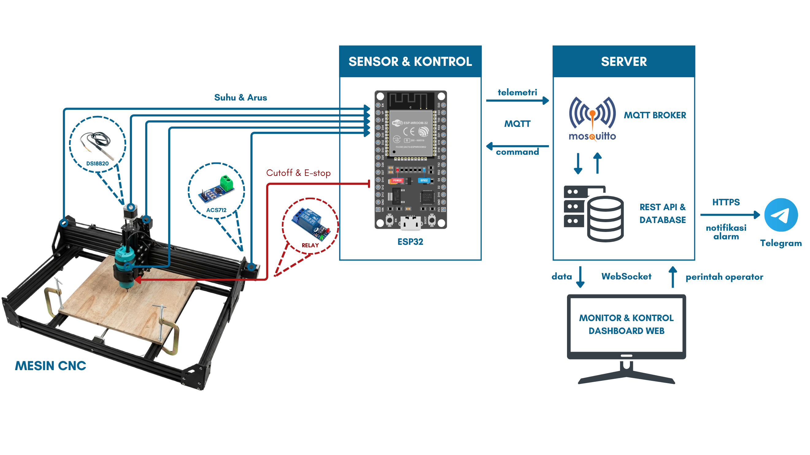{#fig:topologi-sistem width="4.58in"}

Sistem ini mengintegrasikan lima subsistem utama: Mesin CNC 3-Sumbu, *IoT Device* berbasis ESP32, *Server Backend* (Broker Mosquitto, Node.js, SQLite), *Dashboard Web* (React Vite), serta *Telegram Bot*. Operasi sistem diatur melalui dua tingkatan alur kerja, yaitu mekanisme proteksi keselamatan lokal (*local safety loop*) dan pemantauan jarak jauh (*remote supervisory loop*). Pada tingkatan lokal, ESP32 beroperasi secara mandiri membaca data 5 kanal arus dan 2 kanal suhu, sehingga saat terdeteksi beban berlebih (*overcurrent*) atau suhu abnormal (*overtemperature*), relay pemutus daya Spindle dan sinyal *Emergency Stop* (E-Stop) langsung diaktifkan secara otonom dalam hitungan detik tanpa tergantung jaringan internet maupun respons dari server. Sementara pada tingkatan pemantauan jarak jauh, data sensor dialirkan ke *Server Backend* via nirkabel untuk disimpan ke basis data dan disiarkan ke *Dashboard Web* secara *real-time*, disertai notifikasi otomatis ke Telegram operator saat terjadi alarm atau koneksi terputus, serta memberikan fasilitas bagi operator untuk mengirim perintah kendali daya dan kalibrasi sensor langsung dari dashboard.

## Detail Implementasi

### Hardware 

Rancangan perangkat keras yang dipaparkan secara teknis pada Bab 3 diwujudkan menjadi prototipe fisik pada bagian ini. Empat subbab berikut menguraikan implementasi perangkat keras sesuai dengan kelompok komponennya: rangkaian sensor arus, rangkaian sensor suhu, mekanisme pemutusan relay dan sinyal penghentian darurat, serta integrasi fisik dengan unit kontrol mesin CNC.

#### Rangkaian ESP32 dan Sensor Arus (ACS712 20A) 

ESP32 DevKit 30-pin berfungsi sebagai pusat pengolah data tunggal yang membaca seluruh sinyal sensor dan mengeksekusi logika proteksi *cutoff*. Modul ini dipilih karena memiliki delapan belas kanal *Analog-to-Digital Converter* (ADC) internal beresolusi 12-bit, yang mencukupi kebutuhan pembacaan lima kanal arus secara simultan [@espressifsystems2024]. Lima unit sensor ACS712 varian 20A terpasang pada lima titik ukur utama, yaitu Motor Stepper sumbu X, Y1, Y2, Z, dan motor Spindle NRT-Pro 3709 HD. Sensitivitas keluaran kelima modul sensor tersebut bernilai seragam sebesar 100 mV/A [@allegromicrosystems2024].

Kelima kanal sensor terhubung ke pin ADC ESP32 sesuai pemetaan GPIO yang telah ditetapkan pada [@tbl:pinout-esp32] Bab 3. Catu daya ESP32 dan rangkaian sensor menggunakan sumber adaptor terpisah dari catu daya relay. Pemisahan jalur daya ini mencegah lonjakan arus saat pemutusan relay agar tidak menyusup ke jalur suplai ADC ESP32. Hasil perakitan fisik rangkaian sensor arus ditampilkan pada [@fig:rangkaian-esp32-sensor-arus], yang memperlihatkan susunan lima modul ACS712 beserta jalur pengkabelan menuju pin ADC ESP32.

::: {#fig:rangkaian-esp32-sensor-arus}
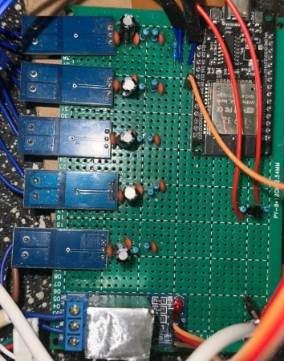{width="48%"}
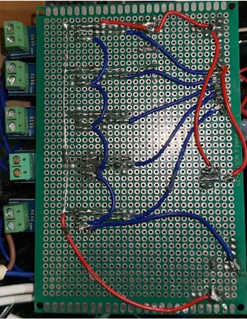{width="48%"}

Rangkaian ESP32 dan Sensor Arus ACS712 (Sumber: Dokumentasi Penulis, 2026)
:::

#### Rangkaian Sensor Suhu (DS18B20) 

Dua unit sensor DS18B20 digunakan untuk memantau suhu pada dua komponen yang paling rawan mengalami kenaikan panas (*overheating*), yaitu motor Spindle dan Motor Stepper sumbu Z. Kedua sensor terhubung pada satu jalur data bersama (*bus*) menuju GPIO 4 ESP32 menggunakan protokol 1-Wire [@analogdevices2019]. Protokol ini membedakan tiap unit sensor melalui alamat unik 64-bit yang tertanam permanen dari pabrikan, sehingga firmware dapat memisahkan data suhu Spindle dan Stepper Z secara presisi meskipun menggunakan satu kabel data.

Skema berbagi bus 1-Wire dipilih untuk menghemat penggunaan pin GPIO ESP32 yang telah terpakai untuk pembacaan lima kanal sensor arus. Satu resistor *pull-up* 4,7 kΩ terpasang pada jalur data bersama, sesuai spesifikasi protokol 1-Wire yang bersifat *open-drain* [@analogdevices2019]. Resistor *pull-up* ini menjaga tegangan jalur data tetap tinggi ketika tidak ada transmisi data dari sensor. Hasil pemasangan fisik kedua sensor suhu ditampilkan pada [@fig:sensor-suhu-ds18b20], yang memperlihatkan penempatan sensor DS18B20 pada bodi Spindle dan bodi Motor Stepper sumbu Z.

::: {#fig:sensor-suhu-ds18b20}
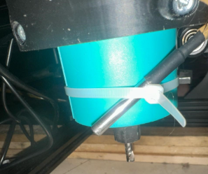{width="48%"}
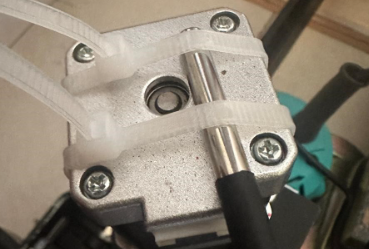{width="48%"}

Sensor Suhu DS18B20 pada Spindle (kiri) dan Stepper Z (kanan) (Sumber: Dokumentasi Penulis, 2026)
:::

#### Rangkaian Relay dan Mekanisme *Cutoff* 

Satu modul relay bertipe *normally closed* (NC) berfungsi memutus aliran daya AC 220V menuju Spindle ketika kondisi alarm terdeteksi. Pemicu relay terhubung ke GPIO 5 ESP32 dan bekerja dengan logika aktif rendah (*active low*). Saat GPIO 5 bernilai *LOW*, arus mengalir ke optocoupler relay sehingga kontak NC terbuka dan memutus listrik Spindle. Sebaliknya, saat mesin beroperasi normal, GPIO 5 diatur ke mode impedansi tinggi (*high impedance/input*), sehingga optocoupler tidak teraliri arus dan kontak relay kembali tertutup menghubungkan daya Spindle. Pengaturan impedansi tinggi dipilih karena logika tinggi 3,3 V dari ESP32 tidak selalu mampu mematikan optocoupler 5V secara sempurna.

Prinsip *fail-safe* relay NC ini konsisten dengan rasional desain yang telah dijelaskan pada Bab 3. Bersamaan dengan pemutusan relay, ESP32 mengirimkan sinyal *Emergency Stop* (E-Stop) dari GPIO 25 menuju pin E-Stop pada CNC Shield Arduino UNO. Sinyal E-Stop melewati saklar pembantu berupa transistor NPN BC547 dengan resistor basis 1 kΩ untuk menyelaraskan logika tegangan antara ESP32 (3,3 V) dan CNC Shield (5 V). Eksekusi E-Stop menghentikan pergerakan 3-sumbu stepper secara serempak bersamaan dengan matinya Spindle. Rangkaian fisik modul relay dan jalur pengkabelan E-Stop diperlihatkan pada [@fig:rangkaian-relay-estop].

::: {#fig:rangkaian-relay-estop}
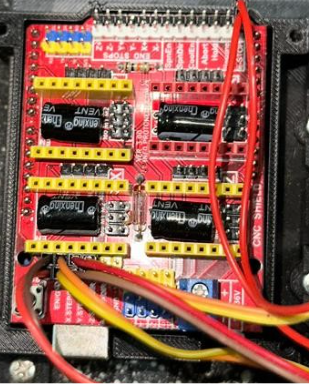{width="48%"}
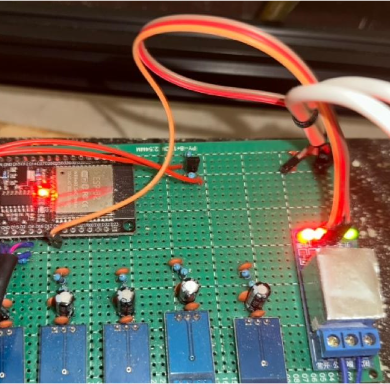{width="48%"}

Rangkaian Relay (kanan) dan Jalur Sinyal E-Stop (kiri) (Sumber: Dokumentasi Penulis, 2026)
:::

#### Integrasi dengan Mesin CNC (Arduino UNO, GRBL, CNC Shield, TB6600) 

Sistem pengawasan terintegrasi langsung dengan unit kendali gerak mesin CNC yang terdiri dari Arduino UNO berfirmware GRBL v1.1. GRBL bertindak sebagai pengolah kode G-code yang mengendalikan pergerakan 3-sumbu melalui CNC Shield V3 dan tiga unit driver stepper TB6600 [@grblcontributors]. Dua motor Stepper NEMA 23 menggerakkan sumbu X dan Y, sedangkan satu motor Stepper NEMA 17 menggerakkan sumbu Z. Motor Spindle NRT-Pro 3709 HD 530W ditenagai catu daya AC 220V terpisah dari sistem kendali.

Ketiga driver TB6600 memperoleh suplai tegangan 24 V DC dari *power supply* terpisah. Pemisahan catu daya 24 V driver motor, catu daya 5 V ESP32/sensor, dan catu daya Spindle AC 220V bertujuan mencegah induksi *electromagnetic interference* (EMI) dan lonjakan arus (*voltage spike*) dari motor menyusup ke sirkuit sensitif mikrokontroler. Integrasi fisik antara sistem pengawasan ESP32, CNC Shield, dan driver TB6600 pada sasis mesin CNC ditampilkan pada [@fig:integrasi-cnc].

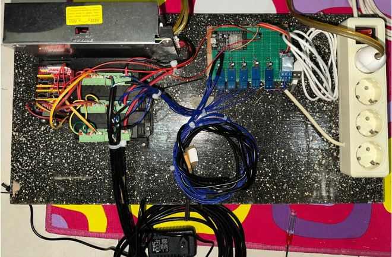{#fig:integrasi-cnc width="4.58in"}

### Software Firmware ESP32 

Seluruh perilaku *IoT Device* dibangun menggunakan kerangka pengembangan PlatformIO dengan Arduino framework berbasis bahasa C++. PlatformIO dipilih menggantikan Arduino IDE konvensional karena menyediakan struktur manajemen proyek yang profesional, kompilasi modular yang cepat, serta pengelolaan *library* *dependency* yang terisolasi melalui berkas `platformio.ini`. Dengan PlatformIO, kode program tidak ditumpuk dalam satu berkas tunggal yang rumit, melainkan diurai menjadi modul-modul kelas C++ independen. Lima belas subbab berikut menguraikan detail implementasi firmware mulai dari tata kelola arsitektur hingga penyimpanan riwayat kejadian ke memori flash.

#### Arsitektur dan Struktur Berkas Firmware 

Perancangan firmware ESP32 disusun secara modular berbasis pemrograman berorientasi objek (*Object-Oriented Programming* / OOP) dengan empat tujuan utama:

1. **Pemisahan Fungsi Modul (*Modular Class Design*)**: Setiap fungsi fisik (sensor arus, sensor suhu, aktuator relay, kalibrasi, komunikasi MQTT, dan pencatatan log) diisolasi ke dalam modul kelas C++ terpisah di direktori `lib/`. Pemisahan ini bertujuan agar tiap modul dapat diuji, dikalibrasi, dan diperbaiki secara independen tanpa mengganggu stabilitas modul lainnya.
2. **Isolasi Parameter Konfigurasi (*Configuration Isolation*)**: Seluruh parameter fisik seperti nomor pinout GPIO, nama titik ukur, ambang batas alarm, dan histeresis dipusatkan pada satu berkas header `SensorConfig.h`. Hal ini bertujuan agar penyesuaian perangkat keras di lapangan dapat dilakukan dengan cepat tanpa perlu mengubah logika utama program.
3. **Eksekusi Asinkron Tanpa Hambatan (*Non-Blocking Event Loop*)**: Menghindari penggunaan fungsi penungguan pasif (`delay()`) yang mengunci prosesor. Siklus utama memanfaatkan pewaktu `millis()` untuk mengendalikan interval pembacaan sensor 2000 ms, konversi suhu 1-Wire 800 ms, dan reset *watchdog timer*, sehingga ESP32 selalu siap menerima perintah remote dari server kapan saja.
4. **Keandalan dan Pemulihan Mandiri (*Self-Healing & Persistence*)**: Mengintegrasikan *Hardware Watchdog Timer* 30 detik untuk pemulihan otomatis jika terjadi kemacetan sistem, serta memanfaatkan *Non-Volatile Storage* (NVS) memori flash ESP32 untuk menyimpan parameter kalibrasi offset dan riwayat log kejadian secara permanen.

Struktur repositori dan organisasi berkas firmware ESP32 diuraikan secara lengkap pada pohon direktori berikut:

```text
firmware/
├── platformio.ini         # Konfigurasi board ESP32 DevKit, framework, & baud rate serial
├── include/
│   ├── credentials.h      # Kredensial jaringan WiFi & alamat IP broker MQTT
│   └── types.h            # Definisi struktur data global (CurrentReading, TempReading, EventEntry)
├── lib/                   # Modul-modul kelas C++ independen (OOP)
│   ├── ACS712/            # Modul pembacaan sensor arus ACS712 & konversi mV/A
│   ├── Calibration/       # Pengelola offset & sensitivitas NVS (autoOffset)
│   ├── DS18B20/           # Pengelola 2 titik sensor suhu 1-Wire non-blocking
│   ├── EmaFilter/         # Filter Exponential Moving Average sinyal arus
│   ├── EventLog/          # Pencatatan log kejadian NVS & ring-buffer RAM
│   ├── Logger/            # Format output log diagnostik ke Serial Monitor
│   ├── MqttClient/        # Klien MQTT & handler perintah (payload JSON QoS 0)
│   ├── RelayControl/      # Kendali relay NC & sinyal E-Stop (GPIO 5 & GPIO 25)
│   ├── SafetyLogic/       # Evaluasi ambang batas alarm & histeresis pemulihan
│   ├── SelfTest/          # Fasilitas trip-test & diagnostik self-test (injeksi 150%)
│   ├── SensorConfig/      # Sentralisasi pinout GPIO, ambang batas, & histeresis
│   └── SerialCLI/         # Parser perintah pengujian serial monitor lokal
└── src/
    └── main.cpp           # Titik masuk utama eksekusi program (setup & loop)
```

#### Inisialisasi Sistem: Watchdog Timer dan Sinkronisasi Waktu NTP 

Pada tahap inisialisasi awal (`setup()`), ESP32 mengonfigurasi *hardware watchdog timer* dan sinkronisasi waktu nirkabel *Network Time Protocol* (NTP) untuk menjamin kelangsungan operasi perangkat tanpa hambatan (*unattended operation*) serta akurasi cap waktu (*timestamp*) analisis forensik kejadian. Penggunaan *hardware watchdog timer* didasari oleh urgensi proteksi perangkat IoT di lingkungan industri yang rawan mengalami kemacetan program (*hang/freeze*) akibat induksi kebisingan elektromagnetik (*electromagnetic interference* / EMI) dari motor, fluktuasi catu daya, maupun *deadlock* pada *library* nirkabel. *Watchdog timer* dikonfigurasi dengan batas waktu (*timeout*) 30 detik menggunakan API `esp_task_wdt_init()`, di mana sistem memperbarui penghitung *watchdog* pada setiap awal iterasi fungsi utama (`loop()`) via `esp_task_wdt_reset()`. Mekanisme ini memberikan kemampuan pemulihan mandiri (*self-healing*) pada mikrokontroler, sehingga apabila fungsi `loop()` tidak dieksekusi lebih dari 30 detik, *watchdog* secara otonom mereset ESP32 untuk mencegah penghentian pemantauan secara permanen yang berisiko membahayakan keselamatan mesin CNC.

Sementara itu, pengintegrasian sinkronisasi waktu NTP bertujuan mengatasi ketiadaan modul *Real-Time Clock* (RTC) fisik pada mikrokontroler ESP32. Setelah koneksi WiFi terbangun, ESP32 mengontak server NTP untuk mengunduh cap waktu aktual (Unix *timestamp* zona WIB / UTC+7), menjamin konsistensi acuan waktu antara log telemetri MQTT, basis data SQLite server, dan notifikasi Telegram Bot. Untuk mengantisipasi kegagalan jaringan internet atau server NTP saat perangkat *booting*, firmware menerapkan batas waktu penungguan (*timeout*) 5 detik sebelum secara otomatis beralih menggunakan penghitung waktu internal (`millis()`). Penerapan mekanisme *fallback* ini mencegah kemacetan (*blocking*) pada proses inisialisasi awal, sehingga fungsi proteksi keselamatan lokal dan pembacaan sensor tetap beroperasi secara penuh meskipun perangkat berjalan tanpa koneksi internet. Alur lengkap tahap inisialisasi sistem, mulai dari konfigurasi *watchdog timer* hingga mekanisme *fallback* NTP, diilustrasikan pada [@fig:alur-inisialisasi].

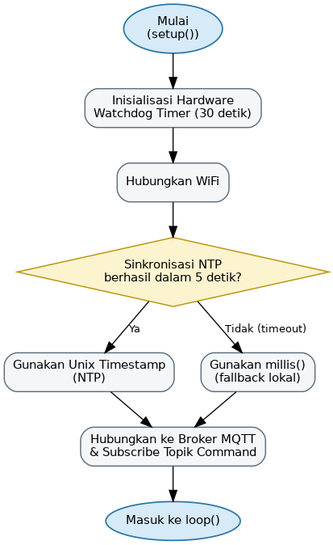{#fig:alur-inisialisasi width="4.2in"}

#### Konfigurasi Sensor dan Ambang Batas 

Seluruh konfigurasi pinout, identitas kanal, ambang batas alarm, dan histeresis dipusatkan dalam satu berkas konfigurasi `SensorConfig.h`. Sentralisasi ini memastikan konsistensi parameter operasional di seluruh modul firmware tanpa risiko ketidakcocokan nilai antar komponen. Dengan mengisolasi variabel konfigurasi pada berkas header ini, penyesuaian perangkat keras di lapangan dapat dilakukan secara efisien tanpa perlu mengubah logika program utama. Nilai ambang batas dan histeresis yang ditanamkan pada `SensorConfig.h` mengikuti persis spesifikasi perancangan pada [@tbl:ambang-histeresis] Bab 3, tanpa modifikasi nilai apa pun.

#### Pembacaan Sensor Arus ACS712 

Pembacaan lima kanal sensor arus dikelola oleh modul pembacaan arus `ACS712` secara terisolasi. Untuk memperoleh hasil pembacaan yang presisi dari ADC 12-bit ESP32, modul ini memanfaatkan fungsi kalibrasi tegangan internal mikrokontroler (`analogReadMilliVolts()`) yang mengoreksi karakteristik non-linier ADC berdasarkan tabel kalibrasi pabrikan (*esp_adc_cal*). Proses pengambilan sampel dilakukan dengan merata-ratakan 300 sampel tegangan terbaca untuk meredam fluktuasi sesaat (*noise*), sebelum nilai rata-rata tersebut dikonversi menjadi arus efektif ($I_{\text{rms}}$) menggunakan Persamaan [@eq:konversi-arus] Bab 3, dengan $V_{ADC}$ pada persamaan tersebut digantikan oleh tegangan rata-rata hasil 300 sampel ($V_{\text{avg}}$). Setiap hasil pembacaan dikemas ke dalam struktur data diagnostik internal yang memuat lima parameter utama: indeks kanal ($0..4$), nilai arus terhitung ($I_{\text{rms}}$), tegangan rata-rata ($V_{\text{avg}}$), tegangan offset ($V_{\text{mid}}$), serta status alarm biner (`0` atau `1`). Pengemasan parameter ini bertujuan mempercepat proses evaluasi keselamatan dan pengiriman data telemetri ke server.

#### Pembacaan Sensor Suhu DS18B20 

Pembacaan dua titik suhu dikelola oleh modul `DS18B20Manager` yang mengendalikan sensor DS18B20 pada bus komunikasi 1-Wire. Karena konversi suhu 12-bit DS18B20 membutuhkan waktu internal hingga 750 ms, firmware menerapkan mekanisme pembacaan dua tahap secara *non-blocking* via pengaturan `setWaitForConversion(false)`. Tahap pertama mengirimkan perintah konversi suhu ke bus 1-Wire, kemudian firmware melanjutkan eksekusi tugas lain tanpa melakukan penungguan pasif (*sleep*). Setelah jeda interval 800 ms berlalu, tahap kedua membaca hasil konversi tersebut dari sensor. Setiap hasil pembacaan suhu dikelompokkan ke dalam empat parameter diagnostik yang mencakup indeks sensor ($0..1$), nilai suhu terukur ($T$ dalam $^\circ\text{C}$), status alarm suhu biner, serta indikator kesalahan komunikasi jika pembacaan bernilai di bawah $-50{,0}\text{ }^\circ\text{C}$.

#### Kendali Relay dan Sinyal E-Stop 

Pengendalian aktuator pemutus daya dan sinyal penghentian gerak dikelola secara terpusat oleh kelas `RelayControl` menggunakan dua pin GPIO utama. GPIO 5 dikonfigurasi untuk mengendalikan relay pemutus daya AC 220V Spindle (*normally closed* / NC), sedangkan GPIO 25 digunakan untuk mengalirkan sinyal *Emergency Stop* (E-Stop) menuju CNC Shield Arduino UNO. Untuk mengaktifkan proteksi pemutusan daya (*relay trip*), fungsi `RelayControl::cut()` mengatur GPIO 5 ke mode `OUTPUT` dengan logika `LOW`. Pengaturan logika `LOW` mengalirkan arus pemicu ke optocoupler relay 5V, menyebabkan kontak NC terbuka dan memutus catu daya AC 220V Spindle secara seketika. Bersamaan dengan itu, GPIO 25 diatur bernilai `HIGH` ($3{,}3\text{ V}$) untuk menyalakan transistor NPN BC547 dengan resistor basis 1 kΩ, yang secara langsung menarik pin E-Stop CNC Shield ke *ground* ($0\text{ V}$) untuk menghentikan seluruh pergerakan 3-sumbu stepper secara serempak.

Untuk mengembalikan mesin ke kondisi operasi normal (*resume*), fungsi `RelayControl::resume()` mengubah konfigurasi GPIO 5 menjadi mode `INPUT` (mode impedansi tinggi / *high-impedance*). Pengaturan impedansi tinggi menghentikan aliran arus ke optocoupler relay 5V secara sempurna tanpa terkendala ambang batas tegangan $3{,}3\text{ V}$ ESP32, sehingga kontak relay secara otomatis kembali menutup (*NC*) dan menyambungkan daya Spindle. Bersamaan dengan itu, GPIO 25 diatur `LOW` untuk menonaktifkan sinyal E-Stop. Prinsip *fail-safe* ini konsisten dengan rasional desain relay NC dan logika aktif rendah yang telah dijelaskan pada bagian Rangkaian Relay dan Mekanisme *Cutoff*.

#### Peta Alur Keselamatan Firmware: dari Alarm hingga Resume

Tiga mekanisme keselamatan firmware, yaitu evaluasi ambang batas (`checkAlarms`), pemantauan koneksi (`checkHeartbeat`), dan penjagaan histeresis saat penyalaan ulang, saling berkaitan membentuk satu siklus keselamatan utuh. [@fig:peta-status-keselamatan] merangkum keterkaitan ketiga mekanisme tersebut dalam satu diagram status sebelum masing-masing dijabarkan secara terperinci pada tiga subbab berikut.

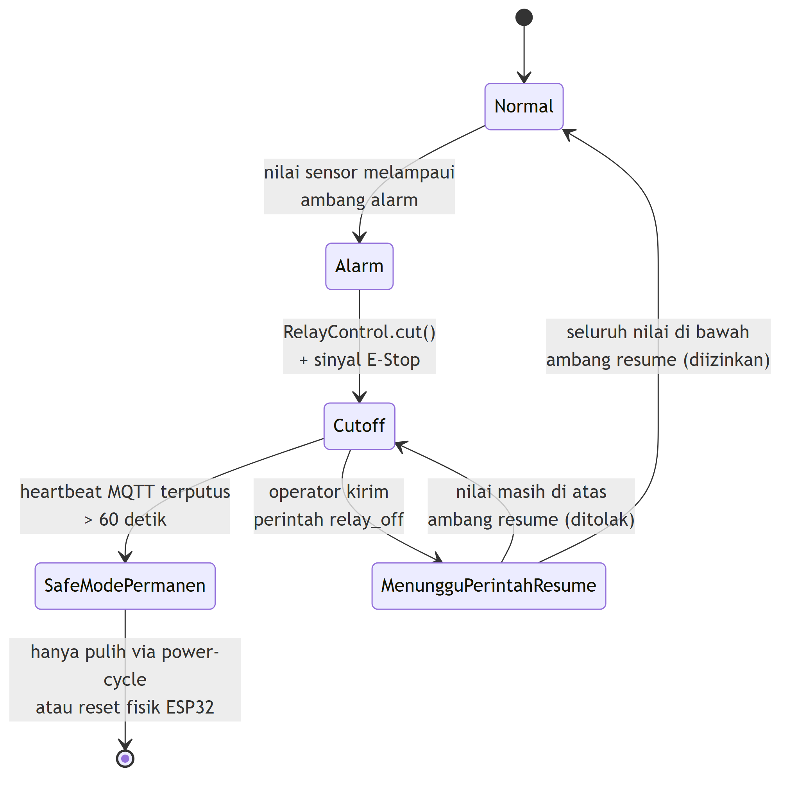{#fig:peta-status-keselamatan width="4.2in"}

Alur di atas menunjukkan bahwa begitu relay terputus, firmware memiliki dua kemungkinan jalan keluar: kembali ke kondisi Normal setelah operator meminta *resume* dan seluruh nilai sensor sudah turun di bawah ambang *resume* ([@eq:ambang-resume] Bab 3), atau terkunci permanen ke *Safe Mode* apabila komunikasi ke server terputus lebih dari 60 detik, yang hanya dapat dipulihkan melalui *power-cycle* fisik. Ketiga subbab berikut menjabarkan detail implementasi tiap transisi pada diagram ini.

#### Logika Pemutusan Otomatis Berbasis Ambang Batas 

Fungsi `checkAlarms()` dieksekusi pada setiap siklus pemantauan periodik (2000 ms) untuk mengevaluasi status kelima kanal arus dan kedua kanal suhu secara berurutan. Evaluasi dimulai dari kanal sensor arus, kemudian dilanjutkan ke sensor suhu karena kondisi arus berlebih (*overcurrent*) berpotensi menimbulkan kerusakan fisik pada komponen motor dalam hitungan milidetik, sedangkan kenaikan suhu (*overtemperature*) berlangsung dengan dinamika termal yang lebih lambat. Apabila salah satu sensor terdeteksi berada dalam kondisi alarm (`alarm == true`), fungsi `checkAlarms()` langsung memanggil `RelayControl::cut()` untuk memutus daya Spindle dan memicu E-Stop, lalu seketika menghentikan iterasi pemeriksaan pada siklus tersebut. Pendekatan pemutusan seketika ini meminimalkan latensi proteksi tanpa membuang waktu komputasi untuk mengevaluasi sisa kanal lainnya.

Untuk mencegah pencatatan berulang pada log kejadian saat kondisi alarm berlangsung lama, diterapkan logika deteksi transisi (*rising-edge detection*). Pencatatan kejadian ke `EventLog` hanya dipicu satu kali pada saat terjadi perubahan status sensor dari `0` (normal) menjadi `1` (alarm). Selama nilai sensor tetap berada di atas ambang batas pada iterasi berikutnya, sistem mempertahankan status pemutusan relay tanpa menambahkan entri log baru ke memori flash. Mekanisme ini secara efektif melindungi integritas memori flash ESP32 dari keausan akibat proses penulisan (*write cycle*) yang berlebihan. Logika evaluasi ambang batas dan pemutusan otomatis pada fungsi `checkAlarms()` diringkas pada [@fig:alur-check-alarms].

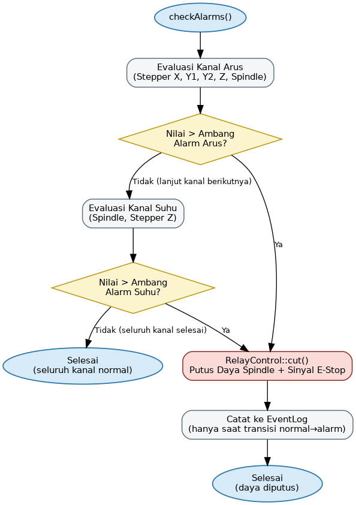{#fig:alur-check-alarms width="4.2in"}

#### Fail-Safe Heartbeat 

Mekanisme *fail-safe heartbeat* diimplementasikan pada fungsi `checkHeartbeat()` untuk memastikan mesin CNC tidak beroperasi tanpa pemantauan jaringan remote yang aktif. Firmware mencatat cap waktu publikasi MQTT terakhir yang berhasil terkirim ke broker (`lastSuccessfulPublish`) pada memori RAM. Pada setiap iterasi `loop()`, firmware menghitung selisih waktu antara waktu berjalan (`millis()`) dan waktu publikasi terakhir tersebut. Jika komunikasi MQTT terputus atau gagal terhubung ke server selama lebih dari 60 detik ($>60000\text{ ms}$), fungsi `checkHeartbeat()` mengaktifkan status *safe mode* permanen (*latching*) dan memanggil `RelayControl::cut()`.

Dalam kondisi *safe mode*, seluruh perintah pengaktifan kembali dari dashboard ditolak secara mutlak untuk mencegah pengoperasian mesin secara tidak terawasi. Sistem hanya dapat dipulihkan melalui proses *restart* fisik (*power cycle* atau tombol *reset* ESP32), sehingga memaksa operator memeriksa kondisi fisik jaringan dan area pemesinan sebelum mesin diizinkan kembali beroperasi. Penguncian permanen ini menjamin keselamatan kerja industri dengan mengeliminasi risiko pergerakan mesin liar saat koneksi komunikasi terputus. Alur evaluasi *fail-safe heartbeat* dan pengaktifan *safe mode* diilustrasikan pada [@fig:alur-heartbeat].

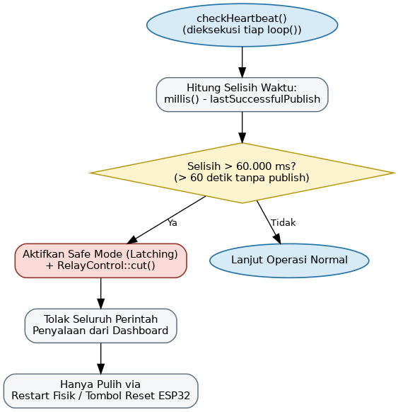{#fig:alur-heartbeat width="4.2in"}

#### Penerima Perintah dari Dashboard 

Fungsi `onCommand()` merupakan titik masuk utama bagi seluruh perintah yang diterima ESP32 dari server melalui protokol MQTT pada topik `cnc/esp32_cnc_01/command`. Setiap pesan yang masuk diproses secara langsung tanpa antrean (*queue*) untuk menjamin responsivitas instan terhadap instruksi operator. Sebelum mengeksekusi perintah penyalaan mesin (`relay_off`), fungsi `onCommand()` terlebih dahulu mengonfirmasi bahwa status *safe mode* tidak sedang aktif. Jika *safe mode* aktif akibat *heartbeat timeout* ($>60$ detik), perintah penyalaan ditolak secara absolut demi menjaga prinsip keselamatan kerja.

Sebaliknya, perintah penghentian manual (`relay_on`) selalu dieksekusi tanpa syarat demi menjamin keselamatan kerja fisik di area mesin jika operator mendeteksi bahaya visual. Perintah kalibrasi (`cal_offset`, `cal_save`, `cal_reset`) dan pengujian (`test_overcurrent`) diteruskan ke modul masing-masing setelah melalui validasi batas indeks kanal ($0..4$ untuk arus, $0..1$ untuk suhu). Pengesahan batas indeks ini mencegah kesalahan alokasi memori internal mikrokontroler saat mengeksekusi variabel yang dikirim dari antarmuka luar.

#### Penjagaan Histeresis saat Menyalakan Ulang Mesin 

Ketika perintah penyalaan kembali (`relay_off`) diterima, firmware tidak langsung memulihkan kondisi relay pemutus daya. Fungsi `onCommand()` melakukan evaluasi histeresis ketat terhadap seluruh kanal sensor arus dan suhu untuk memastikan area pemesinan telah benar-benar aman dari potensi bahaya berulang. Mesin hanya diizinkan menyala kembali apabila nilai aktual seluruh sensor telah turun di bawah ambang pemulihan (*resume threshold*) sesuai [@eq:ambang-resume] pada Bab 3.

Apabila terdapat satu saja kanal yang nilainya masih berada di atas ambang pemulihan (misalnya arus Stepper X masih $2{,}7\text{ A} > 2{,}5\text{ A}$ atau suhu Spindle $58\text{ }^\circ\text{C} > 55\text{ }^\circ\text{C}$), permintaan penyalaan ditolak secara otomatis dan firmware mencetak pesan kegagalan ke Serial Monitor yang memuat rincian kanal pemicu penolakan. Penjagaan histeresis ini mencegah pemicuan relay secara terus-menerus (*relay chattering*) akibat fluktuasi sinyal di sekitar batas ambang batas alarm. Alur pemeriksaan histeresis saat menerima perintah penyalaan ulang diilustrasikan pada [@fig:alur-resume-histeresis].

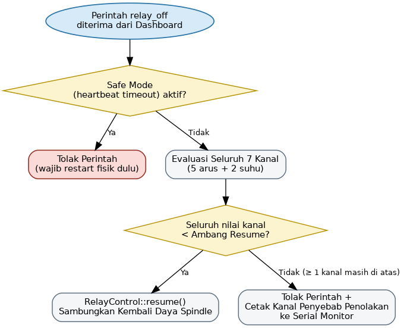{#fig:alur-resume-histeresis width="4.2in"}

#### Siklus Utama dan Penghalusan Data (EMA Filter) 

Fungsi `loop()` mengendalikan alur kerja periodik *non-blocking* dengan interval pembacaan 2000 ms yang dikendalikan oleh pewaktu `millis()`. Pembacaan awal sensor menggunakan nilai mentah (*raw value*) yang dievaluasi langsung oleh `checkAlarms()` demi memberikan respons proteksi seketika tanpa latensi filter. Sebelum data telemetri dikirimkan ke broker MQTT, nilai arus mentah disaring menggunakan filter *Exponential Moving Average* (EMA) dengan faktor pembobot $\alpha = 0{,}3$ sesuai Persamaan [@eq:ema-filter]:

+--------------------------------------------------------------------------+------------------------+
| $$S_t = \alpha \cdot Y_t + (1 - \alpha) \cdot S_{t-1}$$ {#eq:ema-filter} | [@eq:ema-filter]       |
+==========================================================================+========================+
| Keterangan:                                                              |                        |
|                                                                          |                        |
| - $S_t$ = hasil filter EMA pada iterasi ke-$t$                           |                        |
|                                                                          |                        |
| - $Y_t$ = pembacaan arus mentah terbaru pada iterasi ke-$t$              |                        |
|                                                                          |                        |
| - $\alpha$ = faktor pembobot filter, bernilai 0,3                        |                        |
|                                                                          |                        |
| - $S_{t-1}$ = hasil filter EMA pada iterasi sebelumnya                   |                        |
+--------------------------------------------------------------------------+------------------------+

di mana $Y_t$ adalah pembacaan arus mentah terbaru dan $S_{t-1}$ adalah hasil filter iterasi sebelumnya. Filter EMA diderivasi khusus untuk kanal arus guna meredam *spike noise* akibat induksi motor tanpa mengorbankan kecepatan respons proteksi. Sensor suhu tidak menggunakan filter EMA karena dinamika perubahan suhu berlangsung relatif lambat. Penghalusan sinyal arus ini menghasilkan data grafik telemetri yang stabil dan mudah dianalisis oleh operator pada layar dashboard. Keseluruhan alur kerja periodik fungsi `loop()`, mulai dari pembacaan sensor mentah hingga publikasi telemetri, dirangkum pada [@fig:alur-siklus-utama].

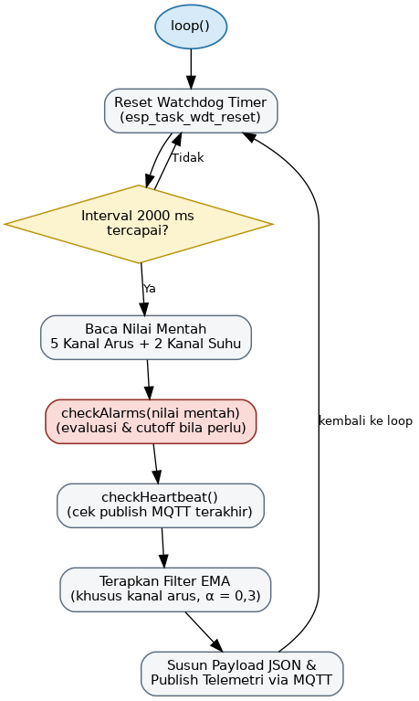{#fig:alur-siklus-utama width="4.2in"}

#### Pengiriman Telemetri melalui MQTT 

Fungsi `MqttClient::publish()` menyusun payload telemetri JSON secara manual menggunakan API `snprintf()` dalam *buffer* berkapasitas 512 byte (`MQTT_MAX_PACKET_SIZE`) tanpa menggunakan *library* JSON eksternal untuk menghemat alokasi memori *heap* mikrokontroler. Data dikirimkan ke broker MQTT dengan topik `cnc/esp32_cnc_01/telemetry` pada *Quality of Service* (QoS) 0. Cap waktu dikirimkan dalam format *Unix timestamp* jika sinkronisasi NTP aktif, atau dalam durasi *uptime* `millis()` jika NTP belum tersambung. Pengiriman QoS 0 dipilih karena transmisi dilakukan secara berkala setiap 2 detik, sehingga kehilangan satu paket data telemetri akibat fluktuasi sinyal nirkabel dapat ditoleransi tanpa membebani memori dengan mekanisme konfirmasi paket (*acknowledgement*) dan retrensmisi.

#### Kalibrasi Sensor Arus melalui Dashboard 

Modul `Calibration` mengelola parameter kalibrasi titik nol ($V_{\text{mid}}$ dalam mV) dan sensitivitas ($S$ dalam mV/A) untuk kelima kanal ACS712 pada *Non-Volatile Storage* (NVS) memori flash ESP32 di bawah *namespace* `"calibration"`. Proses kalibrasi titik nol dikendalikan melalui tiga perintah MQTT dari dashboard: `cal_offset <channel>` untuk mengeksekusi `autoOffset()` 2.000 sampel ADC tanpa beban, `cal_save` untuk menuliskan parameter dari RAM ke NVS memori flash secara permanen, dan `cal_reset` untuk mengembalikan parameter kalibrasi ke nilai standar pabrikan. Penulisan ke NVS dilakukan secara hati-hati hanya saat perintah `cal_save` dipanggil untuk mencegah keausan sel memori flash mikrokontroler. Alur lengkap proses kalibrasi dari sisi dashboard hingga penyimpanan permanen di firmware diilustrasikan pada [@fig:alur-kalibrasi].

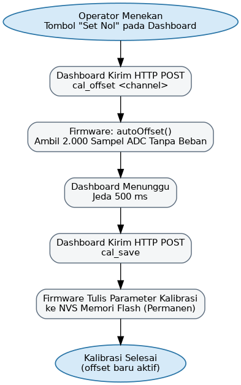{#fig:alur-kalibrasi width="4.2in"}

#### Uji Injeksi Arus Lebih 

Perintah `test_overcurrent <channel>` menyediakan fasilitas pengujian fungsi proteksi secara perangkat lunak tanpa harus memberikan beban fisik berlebih pada motor stepper maupun Spindle. Saat perintah diterima, firmware mengaktifkan bendera simulasi *one-shot*. Pada iterasi pembacaan berikutnya, nilai pembacaan sensor pada kanal yang dipilih digantikan secara buatan dengan nilai simulasi sebesar 150% dari ambang alarm ($1{,}5 \times I_{\text{alarm}}$). Nilai simulasi ini diprosikan melalui jalur `checkAlarms()` yang sama dengan kondisi riil, sehingga memicu pemutusan relay NC, pengiriman sinyal E-Stop, dan pencatatan log kejadian untuk memverifikasi keandalan sistem proteksi tanpa merusak komponen mesin.

#### Diagnostik Self-Test Sistem 

Berbeda dengan `test_overcurrent` yang menguji satu jalur proteksi secara spesifik, perintah `self_test` menjalankan rangkaian pemeriksaan sanitas menyeluruh terhadap kesiapan operasional seluruh subsistem firmware, bersifat tidak merusak (*non-destructive*) dan dijalankan tanpa mengganggu proses pemesinan yang sedang berlangsung. Modul `SelfTest` mengeksekusi pemeriksaan secara berurutan: validasi kewajaran nilai pembacaan sensor arus dan suhu, pengujian baca-tulis pada partisi memori kalibrasi NVS, serta pengujian akses baca terhadap struktur `EventLog`. Pengujian toggle relay, yaitu memutus dan menyambungkan kembali kontak relay Spindle secara singkat, hanya dijalankan apabila mesin dalam kondisi diam (tidak sedang menjalankan G-code), dan dilewati secara otomatis apabila mesin sedang beroperasi, untuk mencegah gangguan pada proses pemesinan yang berjalan. Tahap akhir memeriksa status koneksi ke broker MQTT dan validitas sinkronisasi waktu NTP.

Setiap butir pemeriksaan menghasilkan status lulus atau gagal secara independen. Status keseluruhan dinyatakan gagal apabila satu saja butir pemeriksaan tidak lulus, dan dinyatakan lulus hanya apabila seluruh butir terpenuhi. Hasil evaluasi ini disusun sebagai payload JSON yang memuat cap waktu pengujian, status keseluruhan, dan rincian hasil tiap kategori pemeriksaan, kemudian dipublikasikan ke topik MQTT `selftest_result` sesuai struktur pada [@tbl:topik-mqtt] Bab 3. Operator dapat memicu pengujian ini secara berkala dari dashboard untuk memverifikasi kesehatan sistem tanpa perlu menunggu terjadinya kondisi alarm sesungguhnya. Alur lengkap diagnostik self-test, mulai dari penerimaan perintah hingga publikasi hasil, diilustrasikan pada [@fig:alur-self-test].

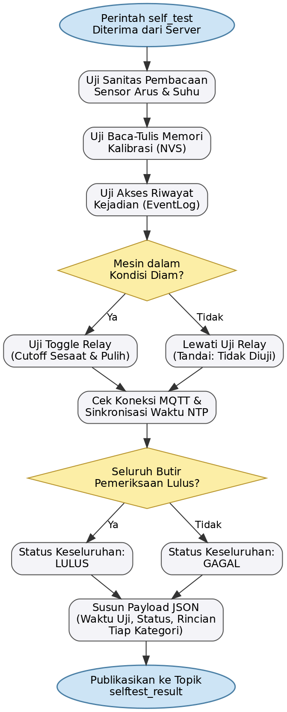{#fig:alur-self-test width="4.2in"}

#### Pencatatan Kejadian ke Memori Permanen (EventLog) 

Pencatatan riwayat alarm dikelola oleh modul `EventLog` berbasis struktur data *ring buffer* berkapasitas 10 entri terbaru yang tersimpan pada NVS memori flash ESP32. Setiap entri menyimpan lima parameter kejadian utama: cap waktu Unix atau *uptime* `millis()`, kode biner tipe sensor (0: Arus, 1: Suhu), indeks kanal titik ukur ($0..4$ untuk arus, $0..1$ untuk suhu), nilai fisik pengukuran saat alarm, dan kode biner penyebab *trip* (0: *Overcurrent*, 1: *Overtemperature*, 2: *Sensor Error*). Penyimpanan ke NVS dilakukan secara selektif (*index-based write*) hanya pada slot *ring buffer* yang mengalami perubahan. Mekanisme penulisan selektif ini secara signifikan menghemat siklus penulisan (*write cycle*) dan memperpanjang umur pakai memori flash ESP32.

### Software Server Backend 

Aplikasi server dibangun menggunakan lingkungan eksekusi Node.js dengan kerangka kerja Express untuk REST API dan *library* `ws` untuk komunikasi WebSocket. Server berjalan sebagai satu proses mandiri yang menjembatani komunikasi data nirkabel antara firmware ESP32, basis data lokal, antarmuka *Dashboard Web*, dan layanan notifikasi Telegram Bot API. Lima subbab berikut menguraikan arsitektur aplikasi server dari struktur berkas, jembatan komunikasi, engine notifikasi, skema basis data, hingga antarmuka REST API.

#### Arsitektur dan Struktur Berkas Server 

Perancangan aplikasi *Server Backend* mengadopsi pola arsitektur berlapis (*3-Tier Layered Architecture*) dan pemrograman berbasis event (*Event-Driven Architecture*). Pemisahan komponen server dilakukan dengan mengisolasi jalur masuk REST API pada direktori `routes/`, logika pengolahan data pada direktori `services/`, dan pengelolaan penyimpanan pada berkas `db.js`.

Pola arsitektur ini diterapkan dengan tiga tujuan utama:

1. **Pemisahan Tanggung Jawab (*Separation of Concerns*)**: Mengisolasikan fungsi penerima pesan MQTT (`mqttService.js`), logika pemantauan alarm (`alertEngine.js`), dan pengirim pesan HTTPS (`telegramService.js`) ke dalam berkas terpisah. Pemisahan ini memastikan kegagalan pada satu modul tidak menghentikan modul layanan lainnya.
2. **Eksekusi I/O Asinkron Non-Blocking (*Event-Driven I/O*)**: Memanfaatkan *event loop* Node.js untuk mengeksekusi penyiaran WebSocket ke dashboard dan pengiriman HTTP POST ke Telegram secara bersamaan. Pendekatan ini menjamin server dapat memproses ribuan pesan telemetri tanpa mengalami hambatan antrean komputasi (*blocking I/O*).
3. **Penyimpanan Berkinerja Tinggi (*High-Performance Local Persistence*)**: Mengintegrasikan basis data SQLite yang dikonfigurasi pada mode *Write-Ahead Logging* (WAL). Mode ini memungkinkan operasi penulisan telemetri baru dari MQTT dapat berlangsung secara paralel bersamaan dengan operasi pembacaan data riwayat oleh *Dashboard Web*.

Struktur repositori dan organisasi berkas aplikasi *Server Backend* diuraikan secara lengkap pada pohon direktori berikut:

```text
server/backend/
├── index.js             # Titik masuk utama server (inisialisasi Express HTTP & WebSocket)
├── db.js                # Pengelola basis data SQLite (better-sqlite3 dengan mode WAL)
├── .env                 # Variabel lingkungan (Port server, IP broker, Token Telegram Bot)
├── config/              # Konfigurasi konstanta & alamat broker MQTT
├── services/            # Layanan bisnis inti (Business Logic Layer)
│   ├── mqttService.js   # Jembatan langganan MQTT & siaran real-time WebSocket
│   ├── alertEngine.js   # Engine deteksi alarm, cooldown, & pemantau koneksi (offline watcher)
│   └── telegramService.js # Pengirim notifikasi HTTPS ke Telegram Bot API
└── routes/              # Pengendali endpoint REST API (API Controller)
    └── api.js           # Router endpoint data telemetri, perintah kendali, & kalibrasi
```

#### Jembatan MQTT ke WebSocket 

Modul `mqttService.js` bertugas mengelola siklus data nirkabel antara broker Mosquitto MQTT dan klien *Dashboard Web*. Modul ini berlangganan (*subscribe*) ke topik MQTT dengan format *wildcard* `cnc/+/telemetry`. Penggunaan pola *wildcard* ini memungkinkan server menerima data telemetri dari beberapa perangkat ESP32 secara fleksibel tanpa memerlukan perubahan kode program pada sisi server.

Ketika pesan telemetri masuk dari broker MQTT, modul `mqttService.js` melakukan ekstraksi *device ID* dan menguraikan *payload* JSON. Data hasil penguraian disimpan secara sementara ke dalam objek memori RAM server (`lastPayload`) menggunakan kunci *device ID*. Penyimpanan di memori RAM ini bertujuan agar permintaan data kondisi terkini (*latest state*) dari dashboard dapat dilayani secara instan tanpa perlu melakukan kueri pembacaan ke basis data SQLite.

Setelah data tersimpan di memori RAM, data telemetri yang sama diteruskan secara otomatis ke basis data SQLite untuk penyimpanan riwayat permanen. Selanjutnya, server menyusun bingkai pesan (*message frame*) WebSocket yang memuat identitas perangkat dan data telemetri terbaru untuk disiarkan (*broadcast*) ke seluruh klien dashboard yang terhubung. Pengiriman WebSocket diawali dengan pemeriksaan status koneksi klien (`client.readyState === WebSocket.OPEN`) untuk memastikan data hanya dikirimkan ke koneksi aktif, sehingga mencegah timbulnya *memory leak* akibat koneksi klien yang terputus.

Mekanisme rantai pemrosesan data ini menggaransi konsistensi informasi di seluruh lapisan sistem. Nilai parameter sensor yang diterima dari ESP32 disimpan ke memori RAM untuk kecepatan akses, ditulis ke basis data untuk riwayat, dan disiarkan ke WebSocket untuk visualisasi instan. Dengan demikian, data yang dilihat oleh operator pada layar dashboard selalu identik dengan data riwayat yang tersimpan di dalam basis data. Alur pemrosesan data telemetri dari broker MQTT hingga penyiaran ke klien dashboard diilustrasikan pada [@fig:alur-data-telemetri].

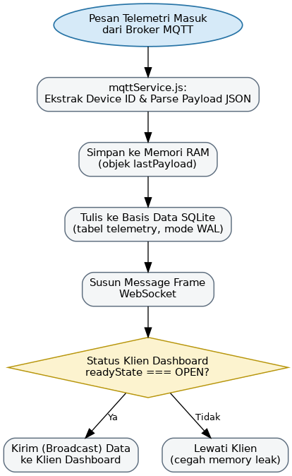{#fig:alur-data-telemetri width="4.2in"}

#### Engine Notifikasi Telegram dan Pemantau Koneksi 

Layanan pengiriman peringatan dini ke perangkat seluler operator dikelola oleh modul `alertEngine.js` dan `telegramService.js`. Modul `telegramService.js` bertugas mengeksekusi panggilan HTTPS POST ke API Telegram (`https://api.telegram.org/bot<TOKEN>/sendMessage`) menggunakan fungsi `fetch()` bawaan Node.js tanpa *library* pihak ketiga. Format pesan disusun menggunakan sintaks Markdown untuk memperjelas tampilan status alarm, nama sensor, dan nilai pengukuran pada layar telepon seluler operator.

Modul `alertEngine.js` menerapkan lima mekanisme cerdas untuk menjamin ketepatan notifikasi dan mencegah pengulangan pesan (*spam*):

1. **Deteksi Berbasis Transisi (*Edge-Triggered*)**: Notifikasi peringatan hanya dikirim satu kali saat status sensor berubah dari kondisi normal menjadi alarm. Ketika nilai sensor kembali berada pada batas aman, sistem secara otomatis mengirimkan satu pesan pemulihan (*recovery notification*).
2. **Pencegahan Notifikasi Berulang (*Cooldown*)**: Parameter `ALERT_COOLDOWN` membatasi interval waktu pengiriman notifikasi untuk jenis alarm yang sama. Mekanisme ini mencegah pengiriman puluhan pesan berantai ketika nilai sensor berosilasi di sekitar garis batas ambang.
3. **Pembedaan Sinyal Pemutusan Daya**: Server dapat membedakan peristiwa pemutusan daya Spindle akibat tindakan proteksi otomatis (*relay_trip*) dari tindakan penghentian manual oleh operator melalui tombol dashboard (*relay_manual*). Pembedaan ini memberikan kejelasan informasi bagi operator mengenai penyebab berhentinya mesin.
4. **Pemantau Koneksi Nirkabel (*Offline Watcher*)**: Fungsi `startOfflineWatcher()` mengeksekusi pemeriksaan berkala setiap 15 detik. Apabila ESP32 tidak mengirimkan data telemetri selama lebih dari 60 detik, server secara otomatis memicu notifikasi `DEVICE OFFLINE`, dan akan mengirimkan notifikasi `DEVICE ONLINE` saat komunikasi nirkabel kembali terhubung.
5. **Pencatatan Riwayat Notifikasi (`logAlert`)**: Setiap peringatan yang dikirimkan ke Telegram secara otomatis dicatat ke dalam basis data SQLite melalui fungsi `logAlert()`. Pencatatan ini memastikan seluruh riwayat gangguan teridentifikasi dengan jelas untuk kebutuhan audit operasional.

Kelima mekanisme di atas, mencakup jalur pengiriman notifikasi berbasis transisi dan jalur pemantauan koneksi (*offline watcher*), diilustrasikan pada [@fig:alur-notifikasi-telegram].

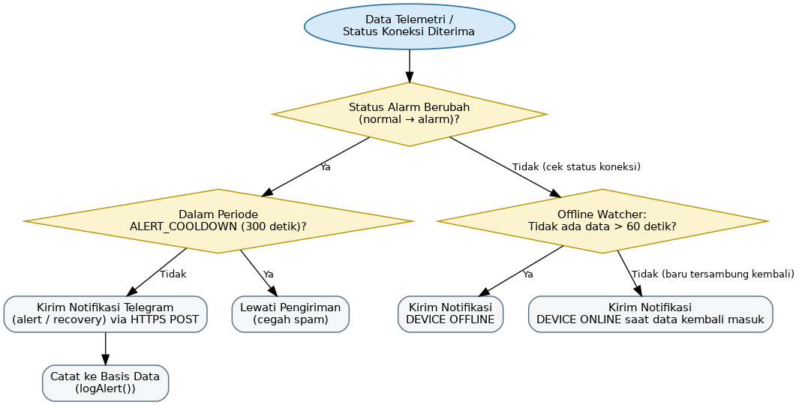{#fig:alur-notifikasi-telegram width="4.4in"}

#### Persistensi Data SQLite dengan Mode WAL 

Sistem penyimpanan permanen server dikelola oleh modul `db.js` yang memanfaatkan basis data SQLite melalui *library* `better-sqlite3`. Penggunaan SQLite dipilih karena menawarkan performa pembacaan yang sangat cepat, nol konfigurasi rumit (*zero-configuration*), serta seluruh data tersimpan dalam satu berkas tunggal yang memudahkan proses pencadangan (*backup*).

Untuk mengoptimalkan kinerja pada aplikasi *real-time*, basis data dikonfigurasi pada mode *Write-Ahead Logging* (WAL) via perintah `PRAGMA journal_mode = WAL`. Pada mode standar, setiap penulisan data akan mengunci seluruh berkas basis data (*exclusive lock*), yang berpotensi menyebabkan pembacaan dashboard menjadi terhambat. Mode WAL mengatasi kendala ini dengan mencatat perubahan data ke berkas log terpisah secara berurutan, sehingga operasi penulisan telemetri baru dan pembacaan riwayat oleh dashboard dapat berjalan secara simultan tanpa saling mengunci.

Basis data disusun atas dua tabel utama, yaitu `telemetry` dan `commands_log`, dengan skema kolom yang dirangkum pada [@tbl:skema-basis-data]. Tabel `telemetry` menyimpan riwayat pembacaan sensor, dengan *payload* diserialisasi dalam format string JSON untuk memberikan fleksibilitas skema data (*schema flexibility*), sehingga penambahan jenis sensor baru di masa depan dapat dilakukan tanpa perlu mengubah struktur kolom tabel. Tabel `commands_log` mencatat seluruh eksekusi perintah kendali yang dikirimkan oleh operator dari dashboard.

| **Tabel**      | **Kolom**     | **Tipe Data**              | **Keterangan**                                                        |
|:---------------|:--------------|:----------------------------|:------------------------------------------------------------------------|
| `telemetry`     | `id`          | INTEGER (*primary key*, *auto-increment*) | Kunci utama baris, bertambah otomatis                          |
| `telemetry`     | `device_id`   | TEXT                        | Identitas ESP32 pengirim data                                          |
| `telemetry`     | `payload`     | TEXT (JSON)                 | Seluruh objek telemetri (suhu, arus, status alarm) dalam format string JSON |
| `telemetry`     | `recorded_at` | DATETIME                    | Cap waktu penulisan baris (waktu lokal server)                         |
| `commands_log`  | `id`          | INTEGER (*primary key*, *auto-increment*) | Kunci utama baris, bertambah otomatis                          |
| `commands_log`  | `device_id`   | TEXT                        | Identitas ESP32 tujuan perintah                                        |
| `commands_log`  | `command`     | TEXT                        | Jenis perintah, misalnya `relay_on`, `relay_off`, `cal_offset`         |
| `commands_log`  | `sent_by`     | TEXT                        | Identitas pengirim perintah, bawaan `dashboard`                        |
| `commands_log`  | `sent_at`     | DATETIME                    | Cap waktu pengiriman perintah (waktu lokal server)                     |

Table: Skema Kolom Tabel `telemetry` dan `commands_log` (Sumber: Diolah oleh Penulis) {#tbl:skema-basis-data}

Untuk mempercepat kueri pencarian riwayat pada dashboard, dibuat indeks sekunder pada kolom `device_id` dan `recorded_at` pada tabel `telemetry`. Penggunaan indeks ini memangkas waktu pencarian data historis dari skala linear $\mathcal{O}(N)$ menjadi skala logaritmik $\mathcal{O}(\log N)$, menjaga kecepatan pemuatan grafik dashboard tetap stabil meskipun jumlah baris data telah mencapai ratusan ribu entri.

#### Endpoint REST API Telemetri, Perintah, dan Kalibrasi 

Modul `routes/api.js` menyediakan antarmuka REST API berbasis HTTP yang digunakan oleh *Dashboard Web* untuk mengambil data historis dan mengirimkan instruksi pengendalian. Seluruh *endpoint* REST API mengembalikan tanggapan dalam format standar JSON beserta kode status HTTP yang sesuai ($200\text{ OK}$, $400\text{ Bad Request}$, atau $500\text{ Internal Server Error}$).

Seluruh *endpoint* yang disediakan modul `routes/api.js` dirangkum pada [@tbl:endpoint-rest-api].

| **Method** | **Endpoint**                  | **Fungsi**                                                                                                    | **Parameter Kunci**                       |
|:-----------|:-------------------------------|:----------------------------------------------------------------------------------------------------------------|:-------------------------------------------|
| GET        | `/api/telemetry/latest`       | Mengembalikan data telemetri terkini dari memori RAM `lastPayload` untuk inisialisasi awal dashboard secara instan tanpa kueri basis data | -                                          |
| GET        | `/api/telemetry/history`      | Mengambil riwayat telemetri dari tabel `telemetry` basis data SQLite                                          | `limit` (bawaan 200 baris, maks. 1000 baris) |
| POST       | `/api/command`                | Menerima instruksi daya mesin, dipublikasikan ke topik MQTT `command` dan dicatat ke tabel `commands_log`     | `relay_on` / `relay_off`                  |
| POST       | `/api/calibration/offset`     | Memicu kalibrasi titik nol sensor arus (`cal_offset`) untuk kanal spesifik                                    | `channel` (0..4)                          |
| POST       | `/api/calibration/save`       | Menyimpan parameter kalibrasi dari RAM ke NVS flash ESP32 (`cal_save`)                                        | -                                          |
| POST       | `/api/calibration/reset`      | Mengembalikan parameter kalibrasi ke nilai standar pabrikan (`cal_reset`)                                      | -                                          |

Table: Endpoint REST API Server Backend (Sumber: Diolah oleh Penulis) {#tbl:endpoint-rest-api}

Seluruh *endpoint* pada grup perintah dan kalibrasi mengikuti alur pemrosesan yang seragam di sisi server. Permintaan yang masuk diperiksa lebih dahulu kelengkapan parameternya; permintaan dengan parameter tidak lengkap atau tidak valid langsung ditolak dengan balasan kode `400 Bad Request` tanpa diteruskan ke firmware. Permintaan yang lolos validasi disusun ulang menjadi perintah sesuai jenisnya, dipublikasikan ke topik MQTT `command` menuju ESP32, kemudian dicatat ke tabel `commands_log` sebelum server membalas `200 OK` ke dashboard. Pencatatan berlaku untuk setiap perintah yang berhasil diterbitkan, sehingga riwayat instruksi operator tetap tertelusuri secara audit. Alur penerimaan dan pemrosesan perintah ini diilustrasikan pada [@fig:alur-penerimaan-perintah].

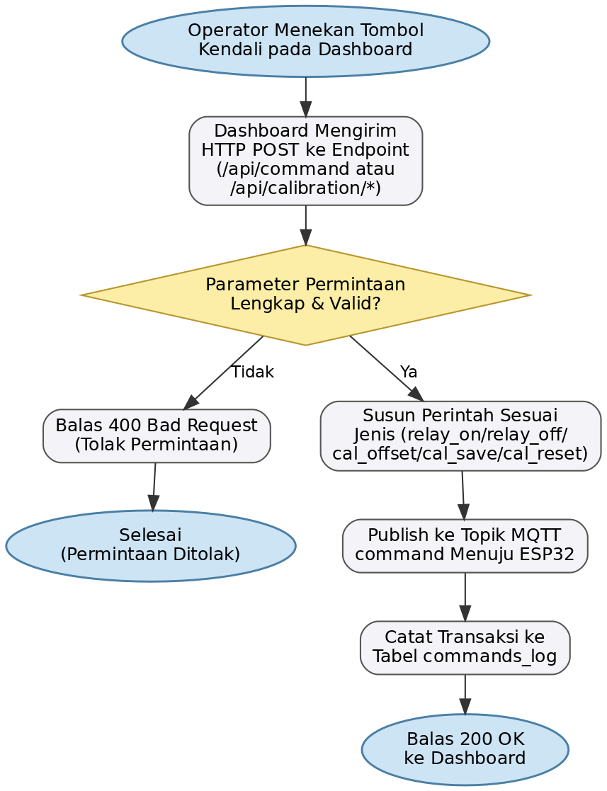{#fig:alur-penerimaan-perintah width="4.4in"}

Pemisahan jalur komunikasi antara penyiaran telemetri via WebSocket dan pengiriman perintah via REST API POST menjamin keamanan serta keandalan operasi. Jalur WebSocket difokuskan untuk alir data telemetri searah berkecepatan tinggi, sedangkan jalur REST API POST memastikan setiap perintah kendali terverifikasi kode balasan HTTP-nya dan tercatat permanen di dalam log audit basis data. Pengolahan status HTTP 200 OK secara eksplisit memberi kepastian bagi antarmuka dashboard bahwa perintah telah sukses dikirimkan ke perantara broker MQTT. Arsitektur REST API ini memberikan fondasi yang kokoh untuk pengembangan integrasi sistem supervisory skala industri di masa depan.

### Software Dashboard Web 

Antarmuka pemantauan dan pengendalian jarak jauh diwujudkan sebagai aplikasi *Single Page Application* (SPA) berbasis web. Dashboard ini dibangun menggunakan pustaka React dengan kerangka *build tool* Vite, serta memanfaatkan *library* Recharts untuk visualisasi grafik *real-time* dan Lucide React untuk simbol indikator visual. Sembilan subbab berikut menguraikan arsitektur antarmuka dari struktur berkas, manajemen koneksi WebSocket, tampilan sensor arus dan suhu, tombol kendali daya, grafik tren, panel pengujian, hingga log aktivitas operasional.

#### Arsitektur dan Struktur Berkas Dashboard 

Perancangan antarmuka *Dashboard Web* mengadopsi pola *Single Page Application* (SPA) yang berfokus pada kecepatan pembaruan tampilan dan efisiensi lalu lintas data nirkabel. Seluruh komponen antarmuka, manajemen *state* aplikasi, dan logika komunikasi WebSocket terintegrasi di dalam struktur berkas terorganisir di bawah direktori `server/dashboard/`.

Struktur repositori dan organisasi berkas aplikasi *Dashboard Web* diuraikan secara lengkap pada pohon direktori berikut:

```text
server/dashboard/
├── index.html           # Berkas HTML utama & titik jangkar render DOM (#root)
├── vite.config.js       # Konfigurasi bundler Vite & pengembangan port server
├── package.json         # Konfigurasi library React, Recharts, & Lucide React
├── .env                 # Variabel lingkungan (VITE_BACKEND_URL & VITE_WS_URL)
└── src/
    ├── main.jsx         # Titik masuk React (injeksi ReactDOM & index.css)
    ├── index.css        # Tata kelola CSS, tema warna industri, & gaya responsif
    └── App.jsx          # Komponen utama Single Page Application (State, WS, Components)
```

#### Koneksi WebSocket Real-Time dan Reconnect Otomatis 

Komponen utama dashboard menginisialisasi koneksi WebSocket menuju server backend saat halaman web pertama kali dibuka oleh peramban. Proses pembentukan koneksi dikelola oleh fungsi `connect()` yang bertanggung jawab untuk membuka *socket* baru, mendengarkan peristiwa masuk (`onmessage`), serta menangani pemutusan koneksi secara mendadak (`onclose`). Indikator status koneksi yang terletak pada pojok kanan atas antarmuka secara visual menginformasikan status keterhubungan (*Terhubung* berwarna hijau atau *Terputus* berwarna merah) kepada operator.

Untuk menjamin keberlanjutan pemantauan saat terjadi fluktuasi jaringan WiFi, dashboard menerapkan mekanisme penyambungan ulang otomatis (*auto-reconnect*). Apabila koneksi terputus akibat gangguan sinyal atau *restart* pada server, fungsi `connect()` secara otomatis dipanggil kembali setelah jeda *cooldown* 3 detik. Interval 3 detik ini dipilih untuk memberikan waktu pemulihan bagi socket jaringan tanpa membebani server backend dengan akumulasi permintaan koneksi berantai yang berlebihan.

Ketika pesan telemetri diterima melalui WebSocket, dashboard memverifikasi identitas perangkat (`deviceId`) dan tipe pesan (`telemetry`) sebelum memperbarui *state* aplikasi. Untuk mencegah konflik tampilan status relay akibat keterlambatan transmisi data (*race condition*), diimplementasikan mekanisme penahanan pembaruan status berbasis pewaktu `relayPendingRef` selama 4 detik. Penahanan ini mengabaikan data telemetri lama yang masih dalam perjalanan nirkabel sesaat setelah operator menekan tombol kendali daya, sehingga mencegah tombol berkedip (*flicker*) sebelum status baru dari ESP32 dikonfirmasi.

Mekanisme penahanan 4 detik ini disesuaikan dengan interval publikasi telemetri ESP32 sebesar 2 detik. Dengan memberikan toleransi selisih waktu 2 siklus telemetri, dashboard menjamin tampilan tombol daya tetap stabil dan mencerminkan keputusan operasional operator secara presisi. Alur pembentukan koneksi WebSocket beserta mekanisme *auto-reconnect* diilustrasikan pada [@fig:alur-websocket].

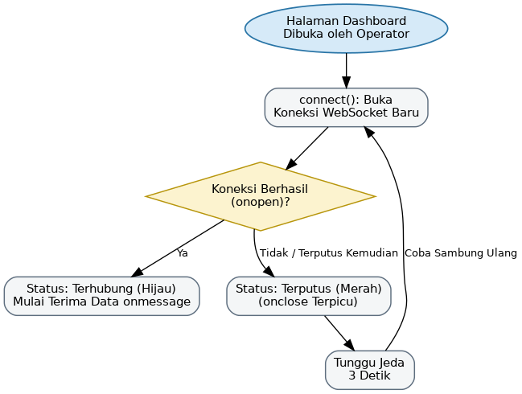{#fig:alur-websocket width="4.2in"}

#### Tampilan Pemantauan Arus per Sumbu (CurrentCard) 

Komponen `CurrentCard` menampilkan lima kartu indikator arus yang disusun secara paralel untuk memantau Motor Stepper sumbu X, Y1, Y2, Z, dan motor Spindle. Setiap kartu menyajikan nilai arus efektif ($I_{\text{rms}}$) dalam satuan Ampere, bilah kemajuan (*progress bar*) persentase terhadap ambang batas alarm, serta status kondisi biner (*Normal*, *Tinggi*, atau *Alarm*). Urutan tampilan kartu disesuaikan secara simetris dengan indeks kanal pada firmware ESP32 untuk memudahkan korelasionalitas visual bagi operator.

Bilah kemajuan persentase dihitung secara otomatis dengan membandingkan arus aktual terhadap ambang alarm yang terkonfigurasi ($3{,}0\text{ A}$ untuk Stepper X, Y1, Y2, Spindle dan $2{,}0\text{ A}$ untuk Stepper Z). Perubahan warna indikator diterapkan secara bertahap: warna hijau untuk kondisi normal ($<75\%$), warna oranye untuk kondisi batas peringatan ($75\%\text{--}99\%$), dan warna merah berkedip saat mencapai ambang alarm ($\ge 100\%$). Peringatan dini berbasis perubahan warna ini memberi kesempatan bagi operator untuk mengidentifikasi gejala kelebihan beban fisik sebelum pemutusan relay otomatis terjadi.

Setiap kartu `CurrentCard` juga dilengkapi tombol *Set Nol* yang berfungsi memicu proses kalibrasi offset arus secara independen. Tampilan visual kelima kartu pemantauan arus pada antarmuka dashboard diperlihatkan pada [@fig:kartu-arus].

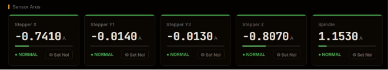{#fig:kartu-arus width="5.38in"}

#### Tampilan Pemantauan Suhu (TempCard) 

Komponen `TempCard` memantau kondisi termal pada dua titik ukur kritis, yaitu bodi motor Spindle dan bodi Motor Stepper sumbu Z. Tampilan kartu menyajikan nilai suhu aktual ($T$) dalam satuan derajat Celsius ($^\circ\text{C}$), bilah persentase terhadap ambang alarm ($60{,}0\text{ }^\circ\text{C}$ untuk Spindle dan $55{,}0\text{ }^\circ\text{C}$ untuk Stepper Z), serta indikator status kondisi. Peringatan warna oranye pada kartu suhu dikonfigurasi lebih awal, yaitu saat suhu melampaui $80\%$ dari ambang alarm.

Konfigurasi ambang peringatan dini yang lebih sensitif pada sensor suhu didasari oleh karakteristik perubahan termal yang berlangsung secara bertahap (*slow thermal dynamics*) dibandingkan fluktuasi arus listrik. Dengan peringatan awal pada $80\%$, operator memiliki waktu yang mencukupi untuk melakukan inspeksi sistem pendingin atau mengurangi kecepatan pemotongan (*feed rate*) sebelum batas alarm dicapai.

Selain memantau suhu berlebih, kartu `TempCard` secara terpisah mampu mendeteksi dan menampilkan kondisi *Sensor Error* jika bus 1-Wire DS18B20 mengalami kegagalan komunikasi ($T < -50\text{ }^\circ\text{C}$). Pembedaan ini membantu operator mengidentifikasi apakah bahaya disebabkan oleh akumulasi panas riil atau akibat kabel sensor yang terlepas secara fisik. Tampilan visual kedua kartu pemantauan suhu diperlihatkan pada [@fig:kartu-suhu].

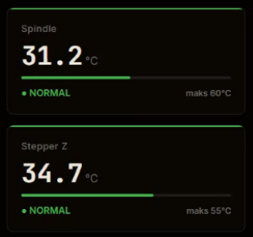{#fig:kartu-suhu width="3.2in"}

#### Kontrol Nyala/Mati Mesin (RelayCard) 

Komponen `RelayCard` menyediakan antarmuka kendali daya utama untuk menyalakan atau mematikan motor Spindle dan sinyal E-Stop secara jarak jauh. Karena modul relay fisik bertipe *Normally Closed* (NC) dengan logika aktif rendah (*active-low*), status biner relay dari firmware (`relayOn == true` berarti relay aktif memutus daya) memiliki arti yang berlawanan dengan status operasional mesin. Untuk mencegah kesalahan penafsiran oleh operator, komponen ini melakukan pembalikan logika (*logic inversion*) sehingga status "Menyala" diwakili warna hijau dan status "Mati" diwakili warna merah.

Saat operator menekan tombol kendali daya, dashboard mengeksekusi pembaruan tampilan secara optimistis (*optimistic UI update*) untuk memberikan respons visual instan. Secara bersamaan, dashboard mengirimkan permintaan HTTP POST ke *endpoint* `/api/command` dengan *payload* perintah yang sesuai (`relay_off` untuk menyalakan mesin atau `relay_on` untuk mematikan mesin). Penahanan pembaruan telemetri `relayPendingRef` selama 4 detik diaktifkan untuk mengunci status tombol dari efek penimpaan paket data lama.

Desain tombol kendali menggunakan warna kontras tinggi yang dilengkapi label teks yang jelas (*NYALAKAN MESIN* atau *MATIKAN MESIN*). Tampilan fisik tombol kendali daya dalam kondisi mesin menyala dan mati diperlihatkan pada [@fig:tombol-kontrol-mesin].

::: {#fig:tombol-kontrol-mesin}
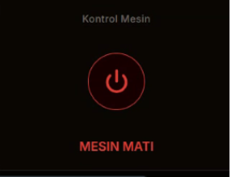{width="48%"}
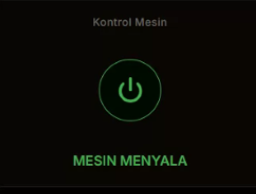{width="48%"}

Tampilan Tombol Kontrol Mesin (Kiri: Mesin Mati, Kanan: Mesin Menyala) (Sumber: Dokumentasi Penulis, 2026)
:::

#### Grafik Riwayat Data Real-Time (Recharts) 

Visualisasi tren pembacaan arus dan suhu secara berkala ditampilkan melalui dua komponen grafik garis (*line chart*) menggunakan *library* Recharts. Grafik arus memetakan tren kelima kanal arus ($I_{\text{rms}}$), sedangkan grafik suhu memetakan tren dua kanal suhu ($T$). Kedua grafik menyimpan hingga 90 titik data telemetri terbaru di memori *state* dashboard, yang mencakup riwayat pemantauan selama 3 menit terakhir berdasarkan interval pengiriman 2 detik.

Penyimpanan 90 titik data pada memori *state* antarmuka bertujuan menyediakan grafik tren yang dinamis tanpa membebani server backend dengan kueri pembacaan basis data secara berulang. Grafik diperbarui secara linier setiap kali pesan telemetri baru masuk dari koneksi WebSocket, menghasilkan pergerakan kurva yang halus (*smooth animation*).

Tampilan grafik disandingkan secara vertikal untuk memudahkan operator melakukan analisis korelasi antara lonjakan arus motor dengan kenaikan suhu komponen. Sebagai contoh, jika terjadi peningkatan arus berlebih pada Stepper Z, operator dapat langsung mengamati grafik suhu di bawahnya untuk mengonfirmasi efek pemanasan yang ditimbulkan. Tampilan kedua grafik tren *real-time* diperlihatkan pada [@fig:grafik-tren].

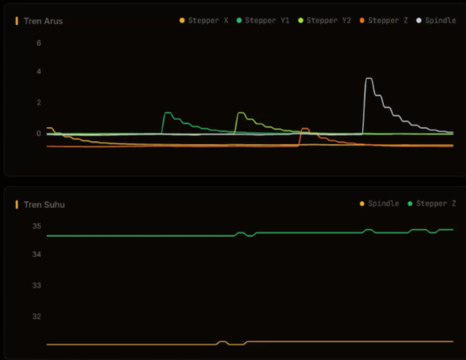{#fig:grafik-tren width="4.02in"}

#### Panel Uji Injeksi Arus Lebih (Trip Test) 

Komponen `TestPanel` menyediakan antarmuka pengujian fungsionalitas proteksi *cutoff* secara simulasi tanpa harus membebani komponen mesin CNC secara fisik. Operator dapat memilih kanal sensor yang akan diuji melalui menu *dropdown*, kemudian memicu pengujian dengan menekan tombol *Jalankan Test*.

Saat pengujian dipicu, dashboard mengirimkan permintaan HTTP POST ke *endpoint* `/api/command` dengan parameter `test_overcurrent <channel>`. Dashboard kemudian mengubah status pengujian menjadi *Running* dan mengaktifkan pewaktu hitung mundur (*timer*) selama 10 detik. Selama periode pengujian berlangsung, dashboard memantau sinyal telemetri masukan untuk mengonfirmasi terjadinya peristiwa pemutusan relay dan pengiriman E-Stop dari ESP32.

Apabila dalam rentang waktu 10 detik terdeteksi respons pemutusan relay dan alarm pada kanal yang diuji, status pengujian pada antarmuka berubah menjadi *PASS* dengan warna hijau. Sebaliknya, jika batas waktu berakhir tanpa adanya pemicuan proteksi, status pengujian berubah menjadi *FAIL* dengan warna merah. Hasil validasi otomatis ini memberikan kepastian bagi operator mengenai keandalan sistem proteksi keselamatan. Tampilan antarmuka panel pengujian diperlihatkan pada [@fig:panel-uji-injeksi].

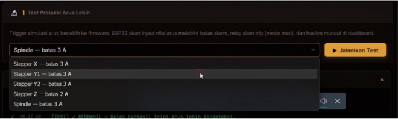{#fig:panel-uji-injeksi width="4.58in"}

#### Kalibrasi Sensor Arus melalui Dashboard 

Proses pengesetnolkan titik referensi sensor arus ACS712 diakomodasi melalui tombol *Set Nol* pada setiap kartu `CurrentCard`. Tindakan kalibrasi ini dikendalikan oleh fungsi 2-tahap yang menjamin ketepatan penetapan offset $V_{\text{mid}}$ pada firmware ESP32.

Ketika operator menekan tombol *Set Nol* pada salah satu kanal (misalnya Spindle), dashboard pertama kali mengirimkan perintah HTTP POST `cal_offset <channel>` ke server backend. Setelah memberikan jeda waktu 500 ms bagi ESP32 untuk mengeksekusi pengambilan 2.000 sampel ADC tanpa beban, dashboard secara otomatis mengirimkan perintah tahap kedua `cal_save` untuk mengunci nilai offset tersebut ke dalam NVS memori flash ESP32 secara permanen.

Pemberian jeda 500 ms antarperintah ini sangat krusial untuk mencegah kegagalan kalibrasi. Tanpa adanya jeda waktu, perintah penyimpanan `cal_save` dapat tiba di ESP32 sebelum proses akumulasi 2.000 sampel ADC selesai dieksekusi, yang berpotensi menyimpan nilai offset lama yang belum terbarui.

#### Log Aktivitas dan Riwayat Perintah 

Komponen log aktivitas berfungsi mencatat seluruh kronologi transaksi perintah kendali, pemicuan kalibrasi, dan pengujian sistem yang dilakukan oleh operator. Log menampilkan informasi cap waktu (*timestamp*), jenis tindakan, kanal sasaran, serta indikator status keberhasilan (*PENDING*, *SUCCESS*, atau *FAILED*) dengan pembedaan warna visual.

Panel log menyimpan hingga 80 entri transaksi terbaru pada memori *state* antarmuka dengan mekanisme penghapusan otomatis entri tertua (*First-In First-Out* / FIFO). Keberadaan log aktivitas ini memudahkan operator memverifikasi status eksekusi perintah serta melacak riwayat tindakan yang pernah diambil selama sesi pemantauan berlangsung. Tampilan panel log aktivitas operasional diperlihatkan pada [@fig:panel-log-dashboard].

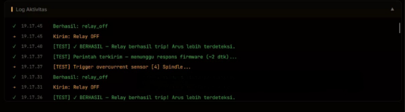{#fig:panel-log-dashboard width="4.58in"}

## Prosedur Pengoperasian Solusi

Subbab ini menguraikan tata cara dan langkah-langkah operasional untuk menyiapkan, menginstalasi, menjalankan, serta mengoperasikan seluruh komponen sistem pengawasan mesin CNC secara runtut.

### Menyiapkan dan Menanam Firmware ESP32

Proses penyiapan firmware ESP32 dilakukan satu kali pada tahap instalasi awal menggunakan kerangka pengembangan PlatformIO berbasis Visual Studio Code. Penanaman ulang firmware hanya diperlukan apabila terjadi pembaruan parameter batas alarm atau penambahan fitur pada kode program C++. Operator wajib mengonfigurasi kredensial jaringan nirkabel dan alamat IP server sebelum proses kompilasi dilakukan.

Tahapan penyiapan dan penanaman firmware ESP32 dilaksanakan melalui langkah-langkah berikut:

1. Instal aplikasi Visual Studio Code beserta ekstensi PlatformIO IDE melalui menu *Extensions* sebagaimana diperlihatkan pada [@fig:ekstensi-platformio].

   {#fig:ekstensi-platformio width="4.58in"}

2. Buka direktori proyek `firmware/` melalui PlatformIO IDE untuk memuat struktur berkas `platformio.ini`, lalu salin berkas `include/credentials.example.h` menjadi `include/credentials.h` serta sesuaikan nilai konstanta `WIFI_SSID`, `WIFI_PASS`, dan alamat IP komputer server pada `MQTT_HOST` ([@fig:konfigurasi-credentials]).

   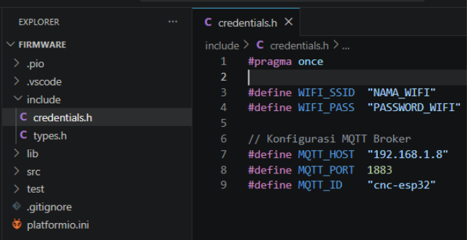{#fig:konfigurasi-credentials width="4.58in"}

3. Hubungkan modul ESP32 DevKit ke port USB komputer menggunakan kabel data mikro-USB berkecepatan tinggi.

4. Jalankan proses kompilasi (*build*) dan penanaman (*upload*) firmware dengan menekan tombol *PlatformIO: Upload* pada bilah status bawah ([@fig:build-upload-firmware]).

   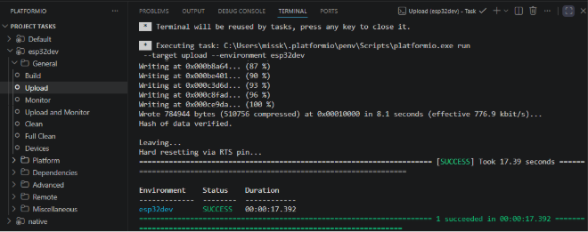{#fig:build-upload-firmware width="4.58in"}

5. Buka jendela *Serial Monitor* pada kecepatan transmisi (*baud rate*) 115200 bps untuk mengonfirmasi keberhasilan koneksi WiFi, sinkronisasi waktu NTP, dan pengkoneksian ke broker MQTT ([@fig:konfirmasi-koneksi]).

   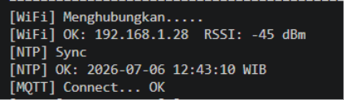{#fig:konfirmasi-koneksi width="4.58in"}

Konfirmasi keberhasilan inisialisasi pada Serial Monitor ditandai dengan munculnya tiga baris pesan log berurutan yang mengonfirmasi penetapan alamat IP lokal, penerimaan cap waktu Unix dari server NTP, serta keberhasilan langganan topik MQTT. Apabila salah satu pesan indikator tersebut tidak muncul, operator wajib memeriksa kembali kredensial WiFi pada `credentials.h` atau memastikan status keaktifan broker MQTT sebelum melanjutkan ke tahap berikutnya.

### Menjalankan Server Backend, Database, dan Telegram Bot

Aplikasi server bertindak sebagai pusat pengolahan data yang mengintegrasikan broker pesan Eclipse Mosquitto MQTT, runtime Node.js Express, basis data SQLite, server pengembang antarmuka Vite, dan layanan notifikasi Telegram Bot API. Komputer server wajib dikonfigurasi pada jaringan lokal (*Local Area Network* / LAN) yang sama dengan ESP32 agar transmisi data telemetri nirkabel tidak terhambat. Komputer server harus beroperasi secara konsisten selama pemesinan CNC berlangsung untuk menjamin ketersediaan layanan *real-time*, penyimpanan riwayat, dan pengiriman notifikasi bahaya. Spesifikasi komputer server yang digunakan dirangkum pada [@tbl:spesifikasi-server].

  ------------------------------------------------------------------------------------
  **Komponen**         **Spesifikasi**
  -------------------- ---------------------------------------------------------------
  Sistem Operasi       Windows 11 Home 64-bit

  Prosesor             Intel Core i7-10870H @ 2,20 GHz (16 CPUs)

  Memori RAM           16 GB DDR4

  Lingkungan Runtime   Node.js v26.3.0

  Message Broker       Eclipse Mosquitto MQTT v2.0.18

  Basis Data           SQLite v3 (via *library* better-sqlite3)

  Bot Layanan          Telegram Bot API (HTTPS POST)

  Mode Jaringan        Jaringan Lokal (LAN / WiFi 2,4 GHz)
  ------------------------------------------------------------------------------------

  : Spesifikasi Komputer Server (Sumber: Diolah oleh Penulis) {#tbl:spesifikasi-server}

Penyiapan dan pengaktifan broker MQTT Eclipse Mosquitto dilakukan melalui tahapan berikut:

1. Unduh dan jalankan berkas penginstal resmi Mosquitto dari situs `mosquitto.org`.
2. Buka berkas konfigurasi `mosquitto.conf` pada direktori instalasi, lalu tambahkan baris `listener 1883 0.0.0.0` dan `allow_anonymous true` untuk mengizinkan akses nirkabel dari perangkat lokal.
3. Buka *Command Prompt* dengan hak akses Administrator, lalu eksekusi aturan *firewall* via perintah `netsh advfirewall firewall add rule name="Mosquitto MQTT" dir=in action=allow protocol=TCP localport=1883`.
4. Jalankan ulang layanan Mosquitto menggunakan perintah `net stop mosquitto` disusul `net start mosquitto` untuk menerapkan konfigurasi baru.

Penyiapan kredensial Telegram Bot untuk pengiriman notifikasi darurat dilakukan melalui tahapan berikut:

1. Buat bot baru pada aplikasi Telegram dengan menghubungi akun resmi `@BotFather`, lalu catat kode akses unik `TELEGRAM_BOT_TOKEN`.
2. Dapatkan identitas obrolan (*chat ID*) akun Telegram operator melalui bantuan akun `@userinfobot`, lalu simpan nilai `TELEGRAM_CHAT_ID`.
3. Buka berkas `.env` pada direktori `server/backend/`, kemudian masukkan kedua variabel tersebut (`TELEGRAM_BOT_TOKEN=<TOKEN>` dan `TELEGRAM_CHAT_ID=<CHAT_ID>`).

Setelah broker MQTT dan kredensial Telegram terkonfigurasi, aplikasi server backend dan antarmuka dashboard dijalankan melalui tahapan berikut:

1. Buka terminal pada direktori utama proyek, lalu eksekusi perintah `npm run install:all` untuk memasang seluruh *library* *dependency* Node.js.

2. Pastikan berkas `.env` pada direktori `server/backend/` memuat konfigurasi port HTTP (`HTTP_PORT=3001`), port WebSocket (`WS_PORT=3002`), serta token Telegram, dan buat berkas `.env` pada direktori `server/dashboard/` yang memuat alamat URL backend `VITE_BACKEND_URL=http://localhost:3001` dan `VITE_WS_URL=ws://localhost:3002` ([@fig:konfigurasi-env]).

   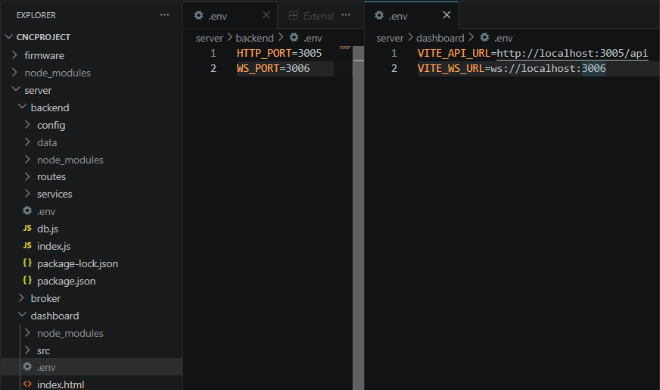{#fig:konfigurasi-env width="4.58in"}

3. Jalankan perintah `npm start` pada direktori utama proyek untuk mengaktifkan proses backend Node.js dan server pengembang Vite secara bersamaan ([@fig:server-dijalankan]).

   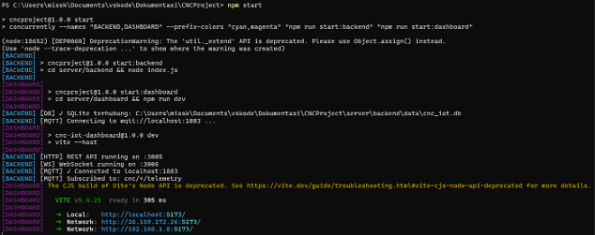{#fig:server-dijalankan width="4.58in"}

Saat server backend pertama kali dijalankan, berkas basis data SQLite `cnc_iot.db` secara otomatis dibuat pada direktori `server/backend/data/`. Penggunaan *library* `better-sqlite3` mengeliminasi kebutuhan instalasi basis data terpisah, karena berkas basis data beserta skema tabel `telemetry` dan `commands_log` diinisialisasi secara otomatis saat aplikasi dimulai.

### Pengoperasian Pemantauan via Dashboard Web dan Telegram Bot

Antarmuka *Dashboard Web* dan layanan notifikasi Telegram Bot diakses oleh operator sebagai pusat pemantauan serta pengendalian jarak jauh mesin CNC. Antarmuka dashboard diakses melalui peramban web (seperti Google Chrome atau Mozilla Firefox) dengan memuat alamat IP komputer server pada port 5173 (misalnya `http://192.168.1.50:5173`). Sebelum dan selama proses pemesinan CNC berlangsung, operator dianjurkan mengikuti urutan prosedur pengoperasian dan pemantauan standar berikut:

1. Buka antarmuka dashboard pada peramban web dan pastikan indikator status koneksi pada pojok kanan atas menunjukkan label *Terhubung* berwarna hijau ([@fig:dashboard-terhubung]).

   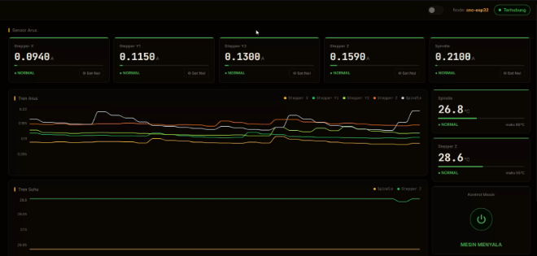{#fig:dashboard-terhubung width="4.58in"}

2. Sebelum menyalakan mesin CNC, lakukan pengesetnolkan sensor dengan menekan tombol *Set Nol* pada setiap kartu `CurrentCard` saat kondisi motor tanpa beban untuk mengunci offset $V_{\text{mid}}$ ([@fig:kalibrasi-setnol]).

   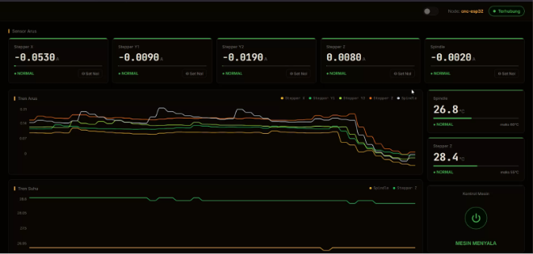{#fig:kalibrasi-setnol width="4.58in"}

3. Tekan tombol kendali daya pada `RelayCard` untuk menyalakan catu daya Spindle dan mengaktifkan siap-kerja pergerakan mesin CNC.

4. Lakukan pemantauan indikator kartu arus dan suhu secara berkala selama pemesinan berlangsung. Perubahan warna indikator menjadi oranye mengindikasikan batas beban awal, sedangkan warna merah menandakan pemicuan *cutoff* otomatis.

5. Jalankan pengujian fungsionalitas proteksi secara berkala via panel `TestPanel` dengan memilih kanal arus dan menekan tombol *Jalankan Test* untuk memverifikasi kesiapan pemutusan relay dan E-Stop ([@fig:uji-proteksi-sebelum] dan [@fig:uji-proteksi-hasil]).

   {#fig:uji-proteksi-sebelum width="4.58in"}

   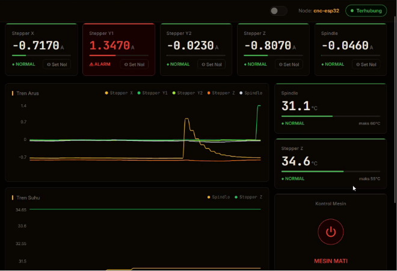{#fig:uji-proteksi-hasil width="4.58in"}

6. Buka panel *Log Aktivitas* untuk meninjau riwayat kronologis eksekusi perintah dan memastikan seluruh transaksi tercatat dengan status *SUCCESS* ([@fig:log-aktivitas-transaksi]).

   {#fig:log-aktivitas-transaksi width="4.58in"}

7. Pantau notifikasi alarm pada aplikasi Telegram seluler operator ketika berada di luar area pemesinan fisik ([@fig:notifikasi-telegram]).

   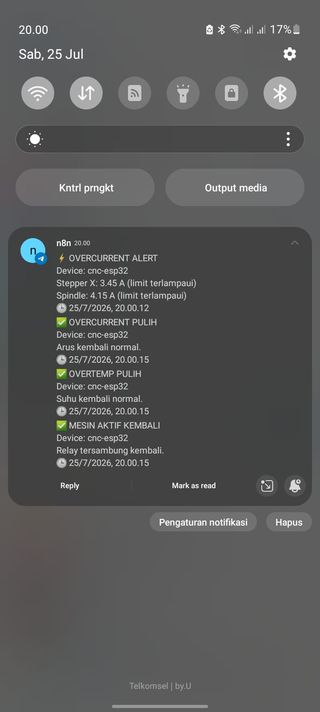{#fig:notifikasi-telegram width="2.6in"}

Ketika terjadi pemicuan proteksi pemutusan daya (*relay trip*) akibat kondisi arus berlebih (*overcurrent*) atau suhu berlebih (*overtemperature*), server backend secara otomatis mengeksekusi modul `alertEngine.js` dan `telegramService.js` untuk mengirimkan notifikasi alarm instan ke aplikasi Telegram operator. Notifikasi tersebut memuat rincian nama perangkat, jenis gangguan (misalnya `OVERCURRENT` pada Spindle atau `OVERTEMP` pada Stepper Z), nilai fisik terukur, serta tindakan proteksi yang diambil oleh sistem. Selain pesan alarm darurat, Telegram Bot secara otomatis mengirimkan notifikasi pemulihan (*recovery notification*) saat kondisi sensor kembali aman, serta notifikasi status koneksi (`DEVICE OFFLINE` atau `DEVICE ONLINE`).

Apabila mesin mengalami pemutusan otomatis (*trip*), tombol kendali daya pada dashboard tidak dapat langsung menyalakan mesin kembali sebelum nilai aktual seluruh sensor berada di bawah ambang histeresis pemulihan ([@eq:ambang-resume], Bab 3). Operator wajib memeriksa penyebab fisik kelebihan beban atau menunggu pendinginan suhu motor sebelum perintah penyalaan ulang diizinkan oleh sistem. Integrasi pemantauan ganda via antarmuka dashboard dan notifikasi seluler Telegram ini menggaransi keselamatan kerja operasional mesin CNC secara responsif, berkelanjutan, dan handal.
