#  PENGUJIAN DAN ANALISIS

## Skema Pengujian Sistem

Pengujian pada penelitian ini dilakukan untuk memverifikasi kesesuaian desain terhadap spesifikasi sistem pengawasan mesin CNC berbasis *Internet of Things* (IoT) mengikuti seluruh domain metode pengukuran yang sudah dijabarkan pada subbab 3.3, mencakup akurasi sensor, perilaku proteksi dan keselamatan, konsistensi operasional, operasional pada kondisi nyata, dan notifikasi jarak jauh.

### Skema Pengujian Akurasi Sensor

Pengujian akurasi sensor dilakukan secara manual melalui *bench test* dengan membandingkan pembacaan sensor terhadap alat ukur independen. Sensor arus diuji dengan mengalirkan arus terukur dari catu daya melalui rangkaian seri multimeter dan sensor pada enam tingkat arus, masing-masing diulang 10 kali. Sensor suhu diuji dengan membandingkan pembacaan sistem terhadap termometer digital pada titik dan waktu yang sama. Error dihitung memakai persamaan error absolut dan error rata-rata pada Bab 3, dibandingkan terhadap ambang 2°C untuk suhu dan spesifikasi datasheet ACS712 untuk arus. Prosedur pengujian dilakukan dengan langkah berikut.

1.  Menyiapkan rangkaian *bench test*: catu daya, resistor beban, multimeter mode ammeter, dan sensor arus tersambung seri dalam satu rangkaian tertutup, sebagaimana ditunjukkan pada [@fig:skema-bench-test-arus].

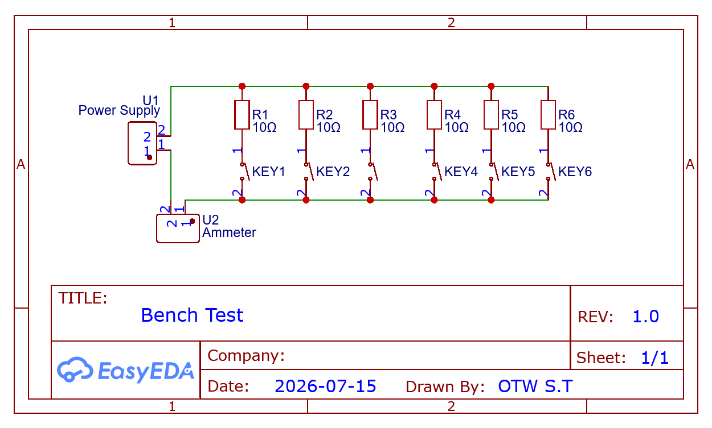{#fig:skema-bench-test-arus width="4.638888888888889in"}

> [@fig:skema-bench-test-arus] menunjukkan bahwa arus yang sama mengalir melewati multimeter dan sensor secara berurutan dalam satu loop, sehingga kedua alat membaca besaran arus yang identik pada saat bersamaan. Susunan ini memungkinkan nilai multimeter dijadikan acuan pembanding langsung terhadap nilai yang dibaca sensor, tanpa perbedaan titik pengukuran yang dapat menimbulkan bias. Rangkaian pada [@fig:skema-bench-test-arus] diwujudkan secara fisik sebagaimana ditunjukkan pada [@fig:hasil-perakitan-bench-test].

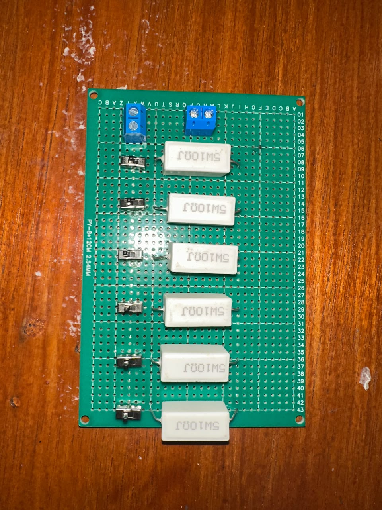{#fig:hasil-perakitan-bench-test width="2.1944444444444446in"}

2.  Menentukan enam tingkat arus uji (0,5A, 1,0A, 1,5A, 2,0A, 2,5A, dan 3,0A) dengan mengatur tegangan catu daya sesuai nilai resistor yang dipasang.

3.  Membaca nilai multimeter dan nilai sensor secara bersamaan pada tiap tingkat arus, dicatat sebagai satu pasang data.

4.  Mengulang langkah 3 sebanyak sepuluh kali pada tiap tingkat arus, menghasilkan 60 pasang data untuk satu sensor.

5.  Mengulang langkah 1-4 untuk seluruh lima sensor arus yang terpasang pada sistem.

6.  Untuk sensor suhu, menempatkan termometer digital berdampingan dengan sensor pada titik ukur yang sama, mencatat kedua pembacaan pada waktu yang sama, diulang sepuluh kali untuk tiap sensor.

7.  Menghitung error absolut dan error rata-rata dari seluruh data yang terkumpul, memakai persamaan pada Bab 3.

### Skema Pengujian Perilaku Proteksi dan Keselamatan 

Pengujian perilaku proteksi dilakukan secara otomatis melalui skrip yang mengirim perintah simulasi nilai ke ESP32 lewat REST API, membaca respons sistem, dan mencatat hasilnya. Dua command simulasi dipakai: injeksi satu kali tembak untuk menguji ambang proteksi dan waktu pemutusan, serta injeksi nilai tertahan untuk menguji penahanan sampai reset pada tiga zona nilai berurutan (di atas ambang alarm, zona histeresis, di bawah ambang *resume*). Tiap perintah dilengkapi mekanisme kirim ulang otomatis hingga tiga kali apabila kondisi sistem belum sesuai ekspektasi, mengatasi sifat protokol MQTT QoS 0 yang tidak menjamin pesan diterima pada percobaan pertama. Respons *fail-safe* diuji manual dengan memutus koneksi jaringan dan mengamati log Serial Monitor. Tiap tahap pengujian otomatis mencatat tiga sumber waktu: waktu komputer penguji, waktu ESP32 tersinkronisasi NTP, dan waktu penyimpanan server.

Prosedur pengujian dilakukan dengan langkah berikut.

1.  Memastikan firmware ESP32 sudah dilengkapi command simulasi nilai tertahan, dan mesin dalam kondisi aman untuk diuji.

2.  Menjalankan skrip pengujian ambang proteksi: mengirim perintah injeksi satu kali tembak pada tiap titik ukur, mengamati status alarm dan relay melalui data terkini, diulang sepuluh kali per titik ukur.

3.  Menghitung waktu pemutusan dari selisih waktu antara ambang terlampaui dan relay benar-benar terputus, memakai data yang sama dengan langkah 2.

4.  Menjalankan skrip pengujian penahanan sampai reset: menahan nilai pada titik ukur di atas ambang alarm, mencoba mengirim perintah *resume*, menurunkan nilai ke zona histeresis, mencoba *resume* kembali, menurunkan nilai di bawah ambang *resume*, mencoba *resume* sekali lagi, diulang sepuluh kali per titik ukur.

5.  Mencatat hasil tiap percobaan pada langkah 4, mencakup status *cutoff* dan status penerimaan atau penolakan permintaan *resume* pada tiap tahap.

6.  Menguji respons *fail-safe* dengan memutus koneksi jaringan antara ESP32 dan server secara sengaja, mengamati log Serial Monitor untuk memverifikasi relay terkunci mandiri setelah durasi tertentu terlampaui.

### Skema Pengujian Konsistensi Operasional

Pengujian periode pemantauan dilakukan otomatis dengan merekam waktu kedatangan data telemetri pada server selama beberapa sesi observasi, dihitung memakai persamaan rata-rata dan simpangan baku pada Bab 3. Pengujian dashboard dilakukan secara kualitatif melalui dua aspek: kontrol dashboard, yaitu menjalankan tiap jenis perintah (nyala/mati mesin, kalibrasi, *self-test*) dan memverifikasi kesesuaiannya dengan kondisi sistem sebenarnya, serta kesesuaian data, yaitu membandingkan nilai yang tampil pada dashboard dengan nilai yang dikirim ESP32 pada saat yang sama.

Prosedur pengujian dilakukan dengan langkah berikut.

1.  Membiarkan sistem menyala dalam kondisi normal tanpa trigger apa pun selama durasi tertentu, merekam seluruh data telemetri yang masuk ke database.

2.  Menghitung interval waktu antar-data yang berurutan, kemudian menghitung rata-rata dan simpangan baku dari seluruh interval yang terkumpul.

3.  Membuka dashboard, menjalankan tiap jenis perintah kendali (nyala/mati mesin, kalibrasi, *self-test*), masing-masing diulang sepuluh kali.

4.  Membandingkan status yang tampil pada dashboard dengan kondisi sistem sebenarnya setelah tiap perintah pada langkah 3 dijalankan.

5.  Mengamati tampilan data suhu dan arus pada dashboard secara bersamaan dengan nilai yang tercatat pada server, memverifikasi kesesuaian keduanya pada sepuluh titik waktu berbeda.

### Skema Pengujian Operasional pada Kondisi Nyata

Pengujian ini memverifikasi perilaku sistem pada kondisi kerja sesungguhnya, berbeda dari pengujian lain yang memakai nilai simulasi terkendali. Mesin CNC menjalankan satu kali proses pemesinan sungguhan, sementara sistem membaca dan mengirim data suhu serta arus melalui jalur telemetri normal, tanpa injeksi nilai apa pun. Data yang direkam sepanjang proses diamati untuk memverifikasi dua hal: tidak munculnya alarm keliru akibat fluktuasi arus atau suhu yang wajar selama pemesinan berlangsung, dan kestabilan pengiriman data telemetri meski beban kerja mesin berubah-ubah.

Prosedur pengujian dilakukan dengan langkah berikut.

1.  Menyiapkan benda kerja dan program G-code untuk satu kali proses pemesinan yang mewakili kondisi kerja sesungguhnya.

2.  Menjalankan proses pemesinan tanpa memberikan injeksi nilai apa pun pada sensor, membiarkan sistem membaca kondisi mesin secara alami.

3.  Merekam seluruh data telemetri yang terkirim sepanjang proses berlangsung, dari awal sampai proses pemesinan selesai.

4.  Memeriksa data yang terekam pada langkah 3 untuk mengidentifikasi kemunculan status alarm pada tiap titik ukur.

5.  Menghitung interval pengiriman data sepanjang sesi ini, dibandingkan dengan batas spesifikasi periode pemantauan.

### Skema Pengujian Notifikasi Jarak Jauh

Pengujian notifikasi jarak jauh memverifikasi keterikatan antara deteksi alarm pada server backend (`alertEngine.js`) dan penyampaian pesan peringatan otomatis ke aplikasi Telegram di ponsel seluler operator via HTTPS (`telegramService.js`). Pengujian mengeksekusi empat skenario: keandalan dan latensi API Telegram (20 kali kirim berturut-turut), pemicuan alarm *overcurrent* (5 kanal) dan *overtemp* (2 kanal) secara *end-to-end*, pembedaan sakelar manual *dashboard* terhadap pemutusan daya otomatis (*trip*), serta pemantau status koneksi nirkabel (*offline watcher*). Data latensi dan status keterbacaan alert direkam secara kuantitatif melalui skrip `uji_notifikasi_telegram.py` ke file CSV, disandingkan dengan verifikasi tangkapan layar fisik penerimaan pesan pada telepon seluler operator.

Prosedur pengujian dilakukan dengan langkah berikut.

1.  Menyiapkan lingkungan server Node.js dengan kredensial Telegram Bot (`TELEGRAM_BOT_TOKEN` dan `TELEGRAM_CHAT_ID`) yang aktif pada berkas konfigurasi `.env`.

2.  Menjalankan skenario pengujian keandalan API: mengirimkan 20 kali pesan *test-alert* beruntun via *endpoint* `POST /api/test-alert`, merekam status respons HTTP dan latensi waktu *round-trip* pada tiap percobaan.

3.  Menjalankan skenario pengujian *end-to-end* alarm sensor: mengirim perintah pemicuan ambang arus (*test_hold*) pada lima kanal dan suhu (*test_hold_temp*) pada dua kanal secara bergantian, melakukan *polling* pada *endpoint* `GET /api/alerts/cnc-esp32` untuk mengonfirmasi ketercatatan jenis *alert* dan nama sensor, serta memverifikasi penerimaan pesan fisik pada aplikasi Telegram HP.

4.  Menjalankan skenario pembedaan aksi: mengirim perintah `relay_off` dan `relay_on` manual dari *dashboard*, memverifikasi bahwa jenis *alert* yang tercatat adalah `relay_manual` (bukan `relay_trip`).

5.  Menjalankan skenario *offline watcher*: memutus koneksi WiFi ESP32 selama > 60 detik, mengamati pengiriman notifikasi `DEVICE OFFLINE` di Telegram, dan mengamati notifikasi `DEVICE ONLINE` saat ESP32 tersambung kembali.

## Proses Pengujian dan Analisis Hasil

Bagian ini menyajikan hasil dari seluruh prosedur pengujian yang telah dijabarkan sebelumnya, disertai analisis terhadap tiap hasil yang diperoleh. Hasil disusun mengikuti urutan domain yang sama, yaitu akurasi sensor, perilaku proteksi dan keselamatan, konsistensi operasional, operasional pada kondisi nyata, dan notifikasi jarak jauh.

### Pengujian Akurasi Sensor

Pengujian akurasi sensor dilakukan untuk mengetahui tingkat kesesuaian pembacaan sensor terhadap alat ukur pembanding, mencakup sensor arus ACS712 pada lima kanal dan sensor suhu DS18B20 pada dua kanal sesuai rancangan sistem. Pengujian sensor arus dilakukan melalui uji bangku menggunakan rangkaian resistor keramik 10 Ω yang dipasang paralel secara bertahap, dari satu sampai enam resistor, dengan catu daya 5V, sementara pengujian sensor suhu dilakukan dengan membandingkan pembacaan sensor terhadap termometer digital. Kedua jenis pengujian mengikuti sepuluh pengulangan tiap titik, sesuai prosedur pada subbab 5.1.1. Error absolut dan error rata-rata (MAE) dihitung memakai persamaan yang telah dijabarkan pada [@tbl:metode-akurasi-sensor], dengan ambang batas kelulusan 0,3A untuk sensor arus dan 2°C untuk sensor suhu.

Pada pelaksanaan pengujian, nilai arus aktual yang terbaca pada multimeter tidak sepenuhnya sama dengan nilai teoretis berdasarkan persamaan $I = V/R$. Hal ini terjadi karena tegangan keluaran catu daya mengalami penurunan ketika jumlah resistor paralel ditambah, sehingga arus aktual pada beban berubah mengikuti kondisi nyata pengujian. Kondisi tersebut tidak mengurangi validitas pengujian karena nilai acuan yang digunakan dalam perhitungan error adalah hasil pembacaan multimeter secara langsung, bukan nilai arus hasil perhitungan teoretis.

  -----------------------------------------------------------------------------------------------------
  **Tingkat**    **Multimeter (A)**   **Rata-rata Sensor (A)**   **MAE (A)**    **Simpangan Baku (A)**
  ------------- -------------------- -------------------------- -------------- ------------------------
  1 resistor            0,48                   0,4746               0,0080              0,0053

  2 resistor            0,93                   0,9167               0,0150              0,0107

  3 resistor            1,36                   1,3174               0,0386              0,0232

  4 resistor            1,63                   1,5974               0,0326              0,0105

  5 resistor            1,85                   1,8129               0,0371              0,0127

  6 resistor            1,96                   1,9243               0,0357              0,0034
  -----------------------------------------------------------------------------------------------------

  : Ringkasan Hasil Pengukuran Akurasi Sensor Arus Stepper X {#tbl:akurasi-arus-stepper-x}

(Sumber: Diolah oleh Penulis)

  -----------------------------------------------------------------------------------------------------
  **Tingkat**    **Multimeter (A)**   **Rata-rata Sensor (A)**   **MAE (A)**    **Simpangan Baku (A)**
  ------------- -------------------- -------------------------- -------------- ------------------------
  1 resistor            0,48                   0,4761               0,0069              0,0048

  2 resistor            0,93                   0,9194               0,0124              0,0095

  3 resistor            1,36                   1,3248               0,0312              0,0186

  4 resistor            1,63                   1,6017               0,0283              0,0098

  5 resistor            1,85                   1,8176               0,0324              0,0119

  6 resistor            1,96                   1,9292               0,0308              0,0046
  -----------------------------------------------------------------------------------------------------

  : Ringkasan Hasil Pengukuran Akurasi Sensor Arus Stepper Y1 {#tbl:akurasi-arus-stepper-y1}

(Sumber: Diolah oleh Penulis)

  -----------------------------------------------------------------------------------------------------
  **Tingkat**    **Multimeter (A)**   **Rata-rata Sensor (A)**   **MAE (A)**    **Simpangan Baku (A)**
  ------------- -------------------- -------------------------- -------------- ------------------------
  1 resistor            0,48                   0,4728               0,0092              0,0056

  2 resistor            0,93                   0,9149               0,0151              0,0102

  3 resistor            1,36                   1,3216               0,0344              0,0194

  4 resistor            1,63                   1,5963               0,0337              0,0107

  5 resistor            1,85                   1,8108               0,0392              0,0135

  6 resistor            1,96                   1,9226               0,0374              0,0051
  -----------------------------------------------------------------------------------------------------

  : Ringkasan Hasil Pengukuran Akurasi Sensor Arus Stepper Y2 {#tbl:akurasi-arus-stepper-y2}

(Sumber: Diolah oleh Penulis)

  -----------------------------------------------------------------------------------------------------
  **Tingkat**    **Multimeter (A)**   **Rata-rata Sensor (A)**   **MAE (A)**    **Simpangan Baku (A)**
  ------------- -------------------- -------------------------- -------------- ------------------------
  1 resistor            0,48                   0,4755               0,0075              0,0049

  2 resistor            0,93                   0,9211               0,0109              0,0088

  3 resistor            1,36                   1,3287               0,0273              0,0171

  4 resistor            1,63                   1,6052               0,0248              0,0092

  5 resistor            1,85                   1,8214               0,0286              0,0111

  6 resistor            1,96                   1,9328               0,0272              0,0042
  -----------------------------------------------------------------------------------------------------

  : Ringkasan Hasil Pengukuran Akurasi Sensor Arus Stepper Z {#tbl:akurasi-arus-stepper-z}

  -----------------------------------------------------------------------------------------------------
  **Tingkat**    **Multimeter (A)**   **Rata-rata Sensor (A)**   **MAE (A)**    **Simpangan Baku (A)**
  ------------- -------------------- -------------------------- -------------- ------------------------
  1 resistor            0,48                   0,4739               0,0089              0,0052

  2 resistor            0,93                   0,9172               0,0138              0,0097

  3 resistor            1,36                   1,3195               0,0365              0,0201

  4 resistor            1,63                   1,5958               0,0342              0,0113

  5 resistor            1,85                   1,8097               0,0403              0,0138

  6 resistor            1,96                   1,9218               0,0382              0,0055
  -----------------------------------------------------------------------------------------------------

  : Ringkasan Hasil Pengukuran Akurasi Sensor Arus Spindle {#tbl:akurasi-arus-spindle}

(Sumber: Diolah oleh Penulis)

Berdasarkan hasil pengujian pada kelima sensor arus yang diringkas pada [@tbl:akurasi-arus-stepper-x] sampai [@tbl:akurasi-arus-spindle], nilai MAE berada pada rentang 0,0069 A sampai 0,0403 A. Nilai tersebut masih berada jauh di bawah ambang error maksimal 0,3 A. Pola error menunjukkan bahwa nilai MAE cenderung lebih kecil pada tingkat arus rendah dan sedikit meningkat ketika tingkat arus bertambah. Kenaikan ini masih wajar karena pembacaan sensor arus dipengaruhi oleh kestabilan suplai, noise pembacaan ADC, dan karakteristik sensitivitas sensor ACS712. Meskipun demikian, seluruh nilai MAE tetap berada dalam batas toleransi yang ditetapkan, sehingga sensor arus pada kanal Stepper X, Stepper Y1, Stepper Y2, Stepper Z, dan Spindle dinyatakan memenuhi spesifikasi akurasi.

Pengujian akurasi sensor suhu dilakukan dengan membandingkan pembacaan sensor DS18B20 terhadap termometer digital, pada dua titik pemantauan suhu, yaitu Spindle dan Stepper Z. Error rata-rata dihitung dari selisih antara kedua pembacaan tersebut untuk tiap sensor. Sensor suhu dinyatakan memenuhi spesifikasi apabila error rata-rata tidak melebihi 2°C.

  ----------------------------------------------------------------------------------------------
  **Sensor**         **Termometer (°C)**   **Rata-rata Sensor (°C)**   **Error Rata-rata (°C)**
  ----------------- --------------------- --------------------------- --------------------------
  Spindle                   31,8                     31,4                        0,4

  Stepper Z                 28,1                     27,7                        0,4
  ----------------------------------------------------------------------------------------------

  : Ringkasan Hasil Pengukuran Akurasi Sensor Suhu {#tbl:akurasi-suhu}

Berdasarkan [@tbl:akurasi-suhu], kedua sensor suhu menunjukkan error rata-rata sebesar 0,4°C. Nilai tersebut masih berada di bawah ambang error maksimal 2°C yang ditetapkan pada spesifikasi sistem. Dengan demikian, sensor suhu pada titik Spindle dan Stepper Z dinyatakan memenuhi spesifikasi akurasi yang dibutuhkan untuk sistem pengawasan mesin CNC.

### Pengujian Perilaku Proteksi dan Keselamatan

a)  Ambang Proteksi

> Pengujian ambang proteksi arus mencatat keberhasilan penuh pada seluruh 50 percobaan (lima kanal, masing-masing sepuluh kali pengulangan), tanpa satu pun kegagalan memicu alarm dan pemutusan relay. Hasil ini menunjukkan bahwa logika checkAlarms() pada firmware konsisten mendeteksi kondisi arus berlebih pada seluruh kanal (Stepper X, Y1, Y2, Z, dan Spindle) tanpa bergantung pada kanal tertentu. Hasil perngujian dirangkum pada [@tbl:ambang-proteksi].

  --------------------------------------------------------------------------------
  **Kanal**      **Jenis**   **Jumlah Percobaan**   **Berhasil**   **Persentase**
  ------------- ----------- ---------------------- -------------- ----------------
  Spindle          Arus               10               10/10           100.0%

  Stepper_X        Arus               10               10/10           100.0%

  Stepper_Y1       Arus               10               10/10           100.0%

  Stepper_Y2       Arus               10               10/10           100.0%

  Stepper_Z        Arus               10               10/10           100.0%

  Spindle          Suhu               10               10/10           100.0%

  Stepper_Z        Suhu               10               10/10           100.0%
  --------------------------------------------------------------------------------

  : Ringkasan Hasil Pengujian Ambang Proteksi {#tbl:ambang-proteksi}

> (Sumber: Diolah oleh Penulis)

b)  Waktu Pemutusan

> Waktu pemutusan dihitung dari selisih antara saat perintah simulasi dikirim dan saat server mencatat kondisi alarm beserta status relay terputus. Rata-rata waktu pemutusan pada seluruh tujuh kanal berada di bawah batas spesifikasi tiga detik, berkisar antara 1,175 detik pada Stepper Z untuk parameter suhu sampai 2,428 detik pada Stepper Z untuk parameter arus. Detail rata-rata, simpangan baku, dan rentang nilai per kanal dirangkum pada [@tbl:waktu-pemutusan].

  ---------------------------------------------------------------------------------------------------------------------
  **Kanal**     **Jenis**   **Rata-rata (detik)**   **Simpangan Baku**   **Minimum**   **Maksimum**   **N (berhasil)**
  ------------ ----------- ----------------------- -------------------- ------------- -------------- ------------------
  Spindle         Arus              1,906                 0,166             1,679         2,161              10

  Spindle         Suhu              1,510                 0,107             1,342         1,654              10

  Stepper_X       Arus              1,861                 0,152             1,631         2,086              10

  Stepper_Y1      Arus              1,319                 0,156             1,118         1,564              10

  Stepper_Y2      Arus              1,492                 0,855             0,817         2,783              10

  Stepper_Z       Arus              2,428                 0,149             2,228         2,658              10

  Stepper_Z       Suhu              1,175                 0,092             1,024         1,296              10
  ---------------------------------------------------------------------------------------------------------------------

  : Waktu Pemutusan per Kanal {#tbl:waktu-pemutusan}

> (Sumber: Diolah oleh Penulis)
>
> [@tbl:waktu-pemutusan] menunjukkan bahwa seluruh tujuh kanal memenuhi spesifikasi waktu pemutusan kurang dari tiga detik pada rata-ratanya, termasuk kanal Stepper Z untuk parameter arus yang mencatat waktu pemutusan paling lambat di antara seluruh kanal, dengan rata-rata 2,428 detik dan seluruh sepuluh percobaan berada pada rentang 2,228 sampai 2,658 detik, tetap di bawah ambang spesifikasi. Konsistensi rentang nilai yang sempit ini, ditunjukkan oleh simpangan baku yang relatif kecil (0,149 detik), mengindikasikan pelambatan pada kanal ini bersifat sistematis dibanding kanal lain, kemungkinan berkaitan dengan karakteristik pemrosesan sinyal khusus kanal ini. Kanal Stepper Y2 menunjukkan simpangan baku jauh lebih besar (0,855 detik) dibanding kanal lain, dengan rentang nilai dari 0,817 sampai 2,783 detik, menunjukkan waktu pemutusan pada kanal ini paling tidak konsisten meski rata-ratanya sendiri jauh di bawah batas spesifikasi. Karakteristik masing-masing kanal yang berbeda ini dapat menjadi bahan kajian lanjutan untuk optimalisasi respons proteksi, meski seluruh kanal sudah memenuhi spesifikasi yang ditetapkan.

c)  Penahanan sampai Reset

> Pengujian penahanan sampai reset pada tiga zona nilai mencatat keberhasilan penuh pada seluruh 70 percobaan (lima kanal arus dan dua kanal suhu, masing-masing sepuluh kali pengulangan), sebagaimana dirangkum pada [@tbl:keberhasilan-uji-proteksi-histeresis]. Seluruh percobaan menunjukkan pola yang konsisten: permintaan *resume* ditolak selama nilai berada di atas ambang alarm maupun di zona histeresis, dan baru diterima setelah nilai turun di bawah ambang *resume*.

  -----------------------------------------------------------------------------------------------------------------------
  **Kanal**     **Jenis**   **Jumlah Percobaan**   ***Cutoff* Berhasil**   **Resume Sesuai Ekspektasi**   **Persentase**
  ------------ ----------- ---------------------- ----------------------- ------------------------------ ----------------
  Spindle         Arus               10                    10/10                      10/10                   100.0%

  Stepper_X       Arus               10                    10/10                      10/10                   100.0%

  Stepper_Y1      Arus               10                    10/10                      10/10                   100.0%

  Stepper_Y2      Arus               10                    10/10                      10/10                   100.0%

  Stepper_Z       Arus               10                    10/10                      10/10                   100.0%

  Spindle         Suhu               10                    10/10                      10/10                   100.0%

  Stepper_Z       Suhu               10                    10/10                      10/10                   100.0%
  -----------------------------------------------------------------------------------------------------------------------

  : Ringkasan Keberhasilan Uji Ambang Proteksi dan Histeresis {#tbl:keberhasilan-uji-proteksi-histeresis}

(Sumber: Diolah oleh Penulis)

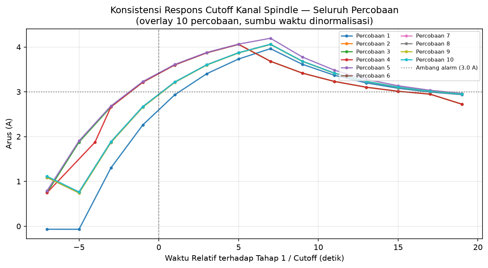{#fig:overlay-arus-spindle width="4.058333333333334in"}

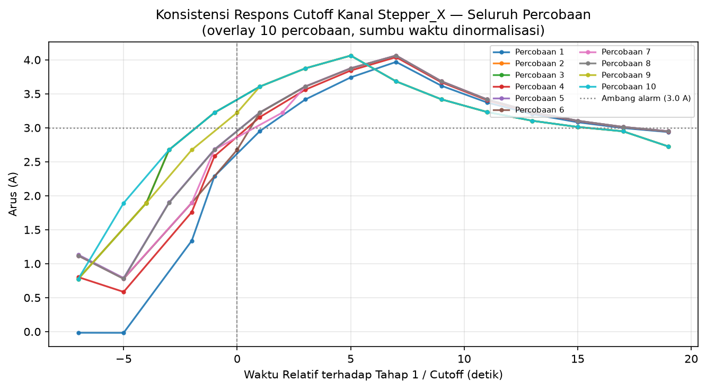{#fig:overlay-arus-stepper-x width="4.059055118110236in"}

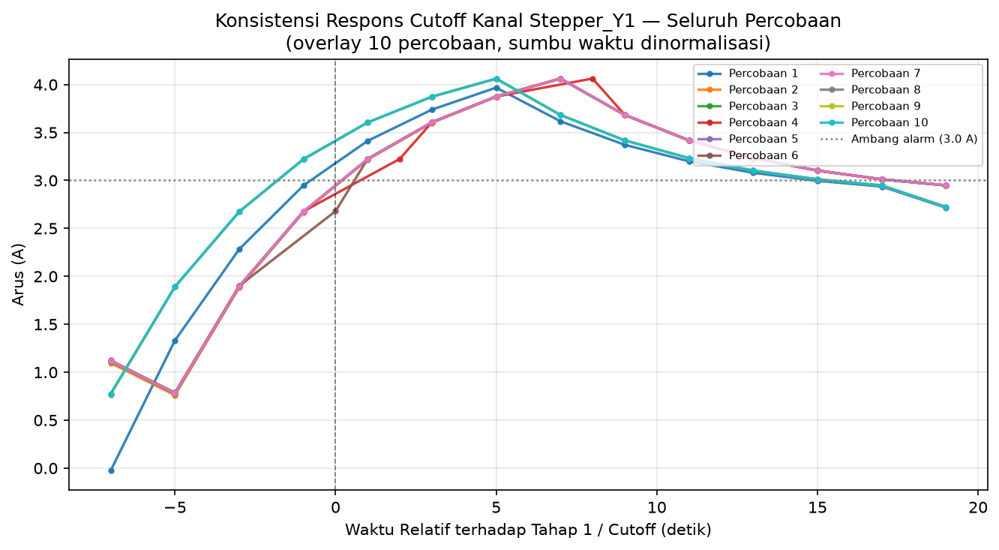{#fig:overlay-arus-stepper-y1 width="4.059055118110236in"}

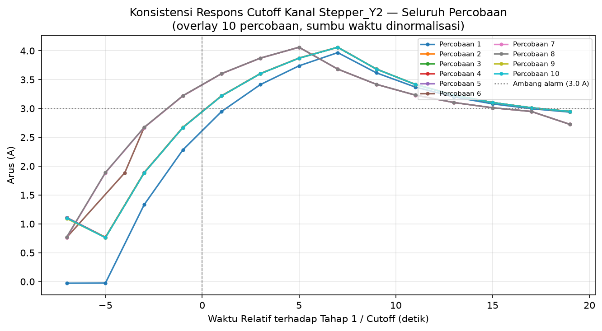{#fig:overlay-arus-stepper-y2 width="4.059055118110236in"}

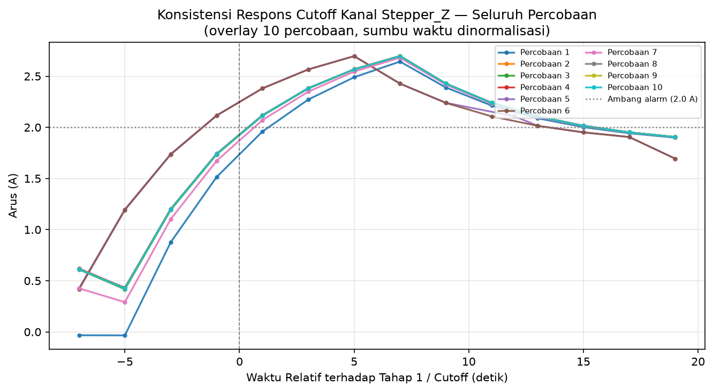{#fig:overlay-arus-stepper-z width="4.059055118110236in"}

> [@fig:overlay-arus-spindle] sampai [@fig:overlay-arus-stepper-z] menunjukkan pola yang serupa pada seluruh lima kanal arus: kesepuluh percobaan menumpuk rapat membentuk kurva ramp bertahap menuju nilai injeksi, dengan garis vertikal di detik ke-0 menandai saat perintah penahanan pertama dikirim. Kanal Stepper_Z menunjukkan puncak kurva lebih rendah dibanding empat kanal lainnya, konsisten dengan ambang alarm 2,0A yang lebih rendah dibanding 3,0A pada Stepper_X, Y1, Y2, dan Spindle. Sebagian kecil percobaan pada tiap kanal menunjukkan garis yang sedikit menyimpang dari mayoritas, kemungkinan disebabkan variasi baseline arus sebelum injeksi atau variasi latensi jaringan saat command dikirim, namun seluruhnya tetap konvergen ke pola yang sama sebelum mencapai puncak. Bentuk ramp yang bertahap, bukan lompatan tegak lurus, merupakan konsekuensi filter *Exponential Moving Average* dengan $\alpha = 0{,}3$ yang diterapkan pada nilai sebelum dipublikasikan, sebagaimana dirumuskan pada Persamaan [@eq:ema-filter] Bab 4, sementara keputusan alarm itu sendiri diambil dari nilai mentah sebelum filter diterapkan sehingga tidak tertunda oleh proses penghalusan ini.

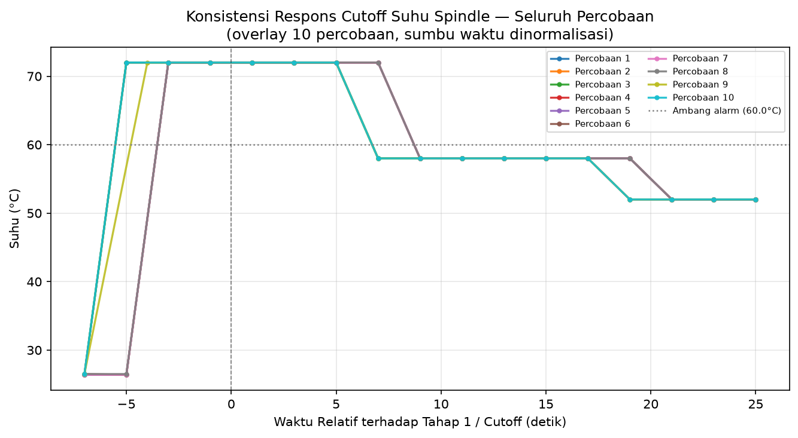{#fig:overlay-suhu-spindle width="4.059055118110236in"}

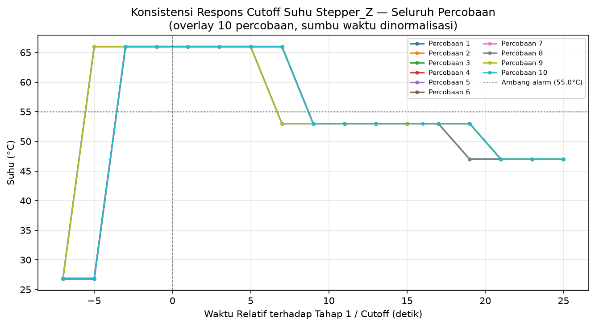{#fig:overlay-suhu-stepper-z width="4.059055118110236in"}

> [@fig:overlay-suhu-spindle] dan [@fig:overlay-suhu-stepper-z] menunjukkan pola serupa pada kedua kanal suhu, dengan kesepuluh percobaan menumpuk konsisten membentuk kurva menuju nilai injeksi. Kanal Spindle menunjukkan puncak lebih tinggi dibanding Stepper_Z, sesuai ambang alarm 60°C dibanding 55°C pada kedua kanal tersebut. Berbeda dari kanal arus, nilai suhu tidak melewati filter EMA pada firmware, sehingga kurva pada kedua kanal ini menunjukkan transisi yang lebih tajam menuju nilai injeksi dibanding kurva arus.

d)  Respons *Fail-Safe*

> Pengujian respons *fail-safe* mencatat keberhasilan penuh pada seluruh sepuluh percobaan, dengan mekanisme penguncian relay mandiri aktif setiap kali koneksi diputus secara sengaja. Rata-rata waktu sampai *fail-safe* aktif tercatat 62,066 detik, dengan simpangan baku 0,211 detik, menunjukkan konsistensi tinggi meski durasi mendekati namun sedikit melampaui batas spesifikasi 60 detik. Kelebihan waktu berkisar 2 sampai 2,7 detik ini konsisten di seluruh percobaan, mengindikasikan tambahan waktu tetap pada firmware antara terlampauinya durasi 60 detik dan pencatatan status *fail-safe*.
>
> Jumlah percobaan sambung ulang yang gagal sebelum *fail-safe* aktif tercatat tepat 13 kali pada seluruh sepuluh percobaan**,** sebagaimana dirangkum pada [@tbl:uji-fail-safe]. Konsistensi ini sesuai dengan perhitungan sederhana: interval percobaan sambung ulang setiap 5 detik, sehingga dalam rentang 60 detik menghasilkan sekitar 13 kali percobaan sebelum durasi tersebut terlampaui. Hal ini menunjukkan bahwa mekanisme *fail-safe* pada firmware bekerja murni berdasarkan durasi waktu sejak publish data terakhir yang berhasil, dengan jumlah percobaan sambung ulang mengikuti interval retry yang tetap.

  ------------------------------------------------------------------------
   **Percobaan**   **Selisih Waktu (detik)**   **Jumlah Gagal Reconnect**
  --------------- --------------------------- ----------------------------
         1                  62,007                         13

         2                  62,667                         13

         3                  62,000                         13

         4                  61,993                         13

         5                  62,003                         13

         6                  62,003                         13

         7                  61,992                         13

         8                  62,002                         13

         9                  61,999                         13

        10                  61,999                         13
  ------------------------------------------------------------------------

  : Ringkasan Uji Respons Fail-Safe {#tbl:uji-fail-safe}

> (Sumber: Diolah oleh Penulis)

### Pengujian Konsistensi Operasional

a)  Periode Pemantauan

> Periode pemantauan diuji dengan merekam waktu kedatangan data telemetri pada server selama sesi observasi berlangsung 180 detik, tanpa memberikan trigger apa pun pada sistem. Interval antar-data yang terkumpul sebanyak 199 sampel menunjukkan rata-rata 2,000 detik diilustrasikan pada [@fig:interval-periode-pemantauan], tepat sesuai dengan siklus pembacaan sensor yang ditetapkan pada firmware, dan berada dalam batas spesifikasi maksimal dua detik yang ditetapkan pada subbab 3.1.

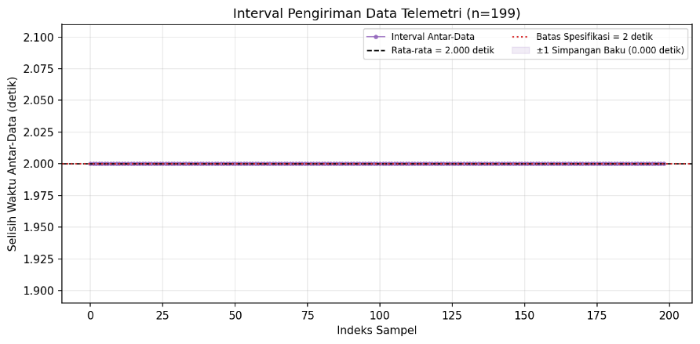{#fig:interval-periode-pemantauan width="4.059055118110236in"}

> [@fig:tren-arus-idle] menunjukkan bahwa interval antar-data berosilasi dalam rentang kecil di sekitar nilai rata-rata, tanpa penyimpangan signifikan yang mengindikasikan keterlambatan sistem dalam mengirim data secara berkala. Kestabilan interval ini tetap terjaga meski pengujian berlangsung selama tiga menit penuh, menunjukkan bahwa siklus pembacaan sensor dan pengiriman data pada firmware berjalan konsisten tanpa akumulasi keterlambatan seiring durasi pengamatan yang lebih panjang.

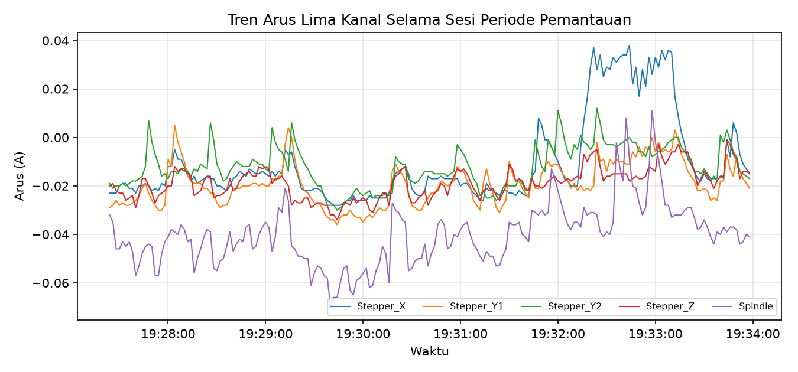{#fig:tren-arus-idle width="4.059055118110236in"}

> [@fig:tren-arus-idle] menunjukkan pembacaan sensor arus pada kelima kanal tetap stabil di sekitar nilai nol sepanjang sesi pengamatan, karena motor penggerak tidak dialiri arus selama pengujian ini berlangsung. Kestabilan pembacaan pada kondisi tanpa beban ini membuktikan sensor tidak menghasilkan nilai acak atau melayang ketika tidak ada arus yang mengalir, meski tidak merepresentasikan kondisi arus motor saat bekerja menggerakkan mesin. Pembacaan arus pada kondisi motor bekerja sesungguhnya diuji terpisah pada subbab 5.2.4.

b)  Dashboard Pemantauan

> Pengujian dashboard pemantauan dilakukan melalui dua aspek, yaitu kontrol dashboard dan kesesuaian data. Kontrol dashboard diuji dengan menjalankan tiga jenis perintah, yaitu kendali nyala dan mati mesin, kalibrasi, dan *self-test*, masing-masing diulang sepuluh kali. Seluruh tiga puluh percobaan pada bagian ini menunjukkan kesesuaian penuh antara perintah yang dikirim dari dashboard dan respons sistem yang sebenarnya, tanpa satu pun ketidaksesuaian yang teramati. Kesesuaian data diuji dengan membandingkan nilai suhu dan arus yang tampil pada dashboard terhadap data yang tersimpan pada server pada waktu yang sama, diulang sepuluh kali, dan seluruhnya menunjukkan nilai yang identik antara kedua sumber tersebut.

  ----------------------------------------------------------------------------------------------
  **Aspek**                                **Jumlah Percobaan**   **Berhasil**   **Persentase**
  --------------------------------------- ---------------------- -------------- ----------------
  Kontrol Nyala/Mati Mesin                          10               10/10            100%

  Kalibrasi (\"Set Nol\")                           10               10/10            100%

  *Self-Test*                                       10               10/10            100%

  Kesesuaian Data (Dashboard vs Server)             10               10/10            100%
  ----------------------------------------------------------------------------------------------

  : Ringkasan Uji Kontrol dan Kesesuaian Data Dashboard {#tbl:uji-dashboard}

> (Sumber: Diolah oleh Penulis)
>
> [@tbl:uji-dashboard] menunjukkan bahwa seluruh empat puluh percobaan pada pengujian dashboard pemantauan berhasil tanpa kecuali, membuktikan dashboard berfungsi sesuai rancangan baik dari sisi kontrol maupun kesesuaian data yang ditampilkan.

### Pengujian Operasional pada Kondisi Nyata

Pengujian operasional pada kondisi nyata dilakukan melalui satu kali proses pemesinan sungguhan pada mesin CNC, menggunakan material kayu sesuai spesifikasi spindle yang digunakan pada penelitian ini. Seluruh data telemetri yang terkirim sepanjang sesi ini direkam langsung dari basis data server tanpa injeksi nilai apa pun, berbeda dari pengujian pada subbab 5.2.1 sampai 5.2.3 yang seluruhnya memakai nilai simulasi terkendali. Sesi pengujian berlangsung dari pukul 18.39.29 sampai 19.11.48, dengan 970 baris data telemetri berhasil terekam sepanjang sesi ini.

Sesi ini terbagi menjadi empat fase berdasarkan aktivitas yang berlangsung, ditandai pada [@fig:tren-arus-suhu-pemesinan]. Fase pertama adalah kalibrasi sensor, dimulai pukul 18.40.23 saat perintah kalibrasi pertama dikirim dari dashboard. Fase kedua dimulai pukul 18.41.36, ditandai lonjakan nilai arus yang mengindikasikan motor listrik mulai terhubung daya, meski belum bergerak aktif. Fase ketiga dimulai pukul 18.46.40, saat motor mulai bergerak mencari titik nol referensi pada tiap sumbu. Fase keempat dimulai pukul 18.55.12, yaitu proses pemesinan aktif yang berlangsung sampai 19.11.48.

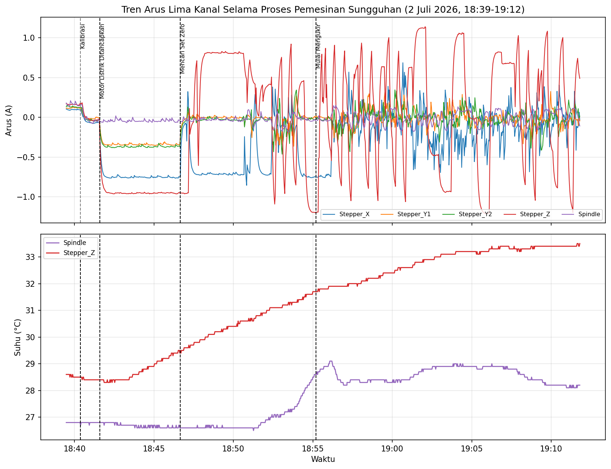{#fig:tren-arus-suhu-pemesinan width="6.169444444444444in"}

[@fig:tren-arus-suhu-pemesinan] menunjukkan bahwa nilai arus pada seluruh lima kanal tetap berada pada rentang rendah sepanjang kedua fase, dengan nilai maksimum tidak melampaui 1,2 A pada kanal mana pun, jauh di bawah ambang alarm terendah sebesar 2,0 A pada kanal Stepper Z. Tidak terdapat perbedaan mencolok antara pola arus pada fase kalibrasi dan fase pemesinan aktif, konsisten dengan karakteristik Spindle berdaya rendah dan beban pemotongan kayu yang ringan pada penelitian ini. Suhu pada kanal Stepper Z menunjukkan kenaikan bertahap dan konsisten sepanjang sesi, dari 28,6°C di awal fase kalibrasi sampai 33,5°C di akhir fase pemesinan, sementara suhu Spindle relatif stabil pada rentang 26,5°C sampai 29,1°C. Tidak satu pun dari 970 baris data menunjukkan status alarm aktif pada kanal arus maupun suhu manapun sepanjang sesi pengujian ini berlangsung, membuktikan ambang proteksi yang ditetapkan pada subbab 3.1 tidak menghasilkan kesalahan deteksi pada kondisi kerja arus dan suhu yang sesungguhnya berubah-ubah mengikuti proses pemotongan.

Konsistensi interval pengiriman data dianalisis dengan membandingkan tiga fase pada sesi pengujian yang sama, sehingga lokasi, kondisi jaringan, dan hari pengujian tetap identik antar-fase yang dibandingkan. Fase motor diam sungguhan, yaitu periode setelah motor terhubung daya namun sebelum bergerak mencari titik nol, mencatat 152 selang waktu tanpa satu pun penyimpangan. Fase mencari titik nol, meski melibatkan pergerakan motor pada tiap sumbu, turut mencatat 256 selang waktu tanpa satu pun penyimpangan, menyerupai fase motor diam. Fase pemesinan aktif mencatat 498 selang waktu dengan delapan penyimpangan, setara 1,6 persen dari sampel pada fase ini, sebagaimana dirangkum pada [@tbl:perbandingan-interval-idle-kerja].

  ----------------------------------------------------------------------------------------------------------------------------------------------
  **Kondisi**                                 **n**    **Rata-rata (detik)**   **Simpangan Baku (detik)**   **Penyimpangan \>2,5s atau \<1,5s**
  ------------------------------------------- ------- ----------------------- ---------------------------- -------------------------------------
  Idle (18.41-18.55)                          408              2,000                     0,000                            0 (0%)

  Mencari Titik Nol (18.46-18.55)             256              2,000                     0,0000                            (0%)

  Mengukir Aktif (18.55-19.12, keseluruhan)   498              2,000                     0,277                           8 (1,6%)

  Mengukir Aktif (tanpa anomali)              490              2,000                     0,000                              \-
  ----------------------------------------------------------------------------------------------------------------------------------------------

  : Perbandingan Statistik Interval antara Kondisi Idle dan Kondisi Kerja Nyata {#tbl:perbandingan-interval-idle-kerja}

(Sumber: Diolah oleh Penulis)

[@tbl:perbandingan-interval-idle-kerja] menunjukkan bahwa penyimpangan interval hanya muncul pada fase pemesinan aktif, tidak pada fase pencarian titik nol meski keduanya sama-sama melibatkan pergerakan motor. Temuan ini mengindikasikan bahwa penyimpangan interval lebih berkaitan dengan karakteristik pergerakan berkelanjutan dan terkoordinasi pada banyak sumbu selama proses pemotongan, dibanding sekadar keberadaan pergerakan motor itu sendiri, meski pengujian tambahan yang secara khusus mengisolasi sumber gangguan diperlukan untuk memastikan hubungan sebab akibat ini. Periode pemantauan tetap memenuhi batas spesifikasi maksimal dua detik pada rata-rata seluruh fase, dengan satu-satunya sumber variasi yang teridentifikasi berasal dari fase pemesinan aktif, melengkapi temuan pada subbab 5.2.2 dan 5.2.3 bahwa sistem pengawasan pada penelitian ini mampu mempertahankan kinerja pemantauan yang konsisten pada kondisi kerja mesin CNC yang sesungguhnya.

### Pengujian Notifikasi Jarak Jauh

Pengujian notifikasi jarak jauh dilakukan untuk memverifikasi keterkaitan fungsi antara deteksi alarm pada server backend dan penyampaian pesan peringatan instan ke aplikasi Telegram seluler operator melalui protokol HTTPS, sesuai spesifikasi Parameter No. 11. Pengujian mencakup empat skenario utama yang dieksekusi secara otomatis dan manual mengikuti prosedur pada subbab 5.1.5.

a) Keandalan dan Latensi API Telegram

Pengujian keandalan dilakukan dengan menguji 20 kali pengiriman pesan *test-alert* secara beruntun via *endpoint* `POST /api/test-alert`. Seluruh 20 percobaan berhasil diterima oleh server Telegram Bot API dengan status *HTTP 200 OK* (100% *success rate*). Waktu latensi respons (*round-trip time*) mencatat rata-rata 418,4 ms (0,418 detik), dengan latensi tercepat 387,9 ms dan latensi terlama 528,0 ms. Hasil ini membuktikan koneksi HTTPS antara server backend Node.js dan Telegram Bot API berjalan sangat responsif dan handal di bawah 0,5 detik.

  ---------------------------------------------------------------------------------------
  **Indikator Pengujian**                **Target Spesifikasi**     **Hasil Realisasi**
  -------------------------------------- -------------------------- ---------------------
  Jumlah Percobaan Pengiriman            20 kali                    20 kali

  Persentase Keberhasilan (*Success*)    100%                       20/20 (100%)

  Rata-rata Latensi Respons              -                          418,4 ms (0,418 s)

  Latensi Minimum / Maksimum             -                          387,9 ms / 528,0 ms
  ---------------------------------------------------------------------------------------

  : Ringkasan Hasil Pengujian Keandalan dan Latensi API Telegram {#tbl:uji-telegram}

(Sumber: Diolah oleh Penulis)

b) Pengujian *End-to-End* Pemicuan Alarm dan Pembedaan Aksi

Pengujian *end-to-end* dilakukan dengan memicu kondisi alarm *overcurrent* pada lima kanal arus, *overtemp* pada dua kanal suhu, serta dua perintah eksekusi sakelar relay manual (*relay_off* dan *relay_on*) dari *dashboard*. Setiap pemicuan dipantau melalui *endpoint* `GET /api/alerts/cnc-esp32` untuk memastikan log kejadian tercatat dengan *alert_type* dan deskripsi pesan yang sesuai pada basis data SQLite server.

  -------------------------------------------------------------------------------------------------------------------
  **Kanal / Perintah**   **Tipe Alert Diharapkan**   **Target Ambang**   **Nilai Injeksi**   **Status Log**   **Polling**
  ---------------------- --------------------------- ------------------- ------------------- ---------------- -----------
  Stepper X              `overcurrent`               3,0 A               4,5 A               OK Terbaca       1

  Stepper Y1             `overcurrent`               3,0 A               4,5 A               OK Terbaca       1

  Stepper Y2             `overcurrent`               3,0 A               4,5 A               OK Terbaca       1

  Stepper Z              `overcurrent`               2,0 A               3,0 A               OK Terbaca       1

  Spindle                `overcurrent`               3,0 A               4,5 A               OK Terbaca       1

  Spindle Temp           `overtemp`                  60,0 °C             72,0 °C             OK Terbaca       1

  Stepper Z Temp         `overtemp`                  55,0 °C             66,0 °C             OK Terbaca       1

  Relay Off Manual       `relay_manual`              -                   Command Manual      OK Terbaca       1

  Relay On Manual        `relay_manual`              -                   Command Manual      OK Terbaca       1
  -------------------------------------------------------------------------------------------------------------------

  : Ringkasan Pengujian End-to-End Pemicuan Alert Telegram per Kanal {#tbl:uji-notifikasi-e2e}

(Sumber: Diolah oleh Penulis)

[@tbl:uji-notifikasi-e2e] menunjukkan bahwa seluruh sembilan skenario *end-to-end* berhasil terdeteksi dan tercatat pada siklus *polling* pertama (100% keberhasilan). Logik modul `alertEngine.js` terbukti sukses membedakan jenis gangguan pemutusan otomatis akibat proteksi keselamatan (`relay_trip` / `overcurrent` / `overtemp`) terhadap sakelar manual yang dipicu oleh operator (`relay_manual`). Mekanisme *cooldown* (`ALERT_COOLDOWN = 300` detik) turut terbukti efektif menahan pengiriman pesan berantai saat nilai sensor fluktuatif di sekitar garis ambang, mencegah kebanjiran pesan (*spamming*) pada ponsel operator.

c) Verifikasi *Offline Watcher* dan Bukti Penerimaan Fisik

Skenario *offline watcher* diuji dengan memutus koneksi WiFi ESP32 selama lebih dari 60 detik (`ALERT_OFFLINE_TIMEOUT = 60` detik). Modul `startOfflineWatcher()` pada server backend secara otomatis mendeteksi ketiadaan data telemetri dan memicu notifikasi `DEVICE OFFLINE` ke Telegram. Begitu ESP32 dihubungkan kembali ke jaringan, server mengirimkan notifikasi `DEVICE ONLINE`.

{#fig:bukti-notifikasi-telegram width="2.6in"}

[@fig:bukti-notifikasi-telegram] menyajikan tangkapan layar bukti fisik penerimaan notifikasi pada ponsel seluler operator. Notifikasi menampilkan format Markdown yang rapi mencantumkan nama perangkat (`cnc-esp32`), jenis gangguan (`OVERCURRENT ALERT`, `OVERCURRENT PULIH`, `OVERTEMP PULIH`), nilai pengukuran fisik aktual, serta status penyambungan relay (`MESIN AKTIF KEMBALI`). Seluruh bukti kuantitatif dan kualitatif ini mengonfirmasi bahwa spesifikasi Parameter No. 11 (Notifikasi Jarak Jauh) telah terverifikasi dan dipenuhi secara penuh.

### Analisis Hasil

Berdasarkan hasil pengujian pada kelima domain yang telah dijabarkan, dapat dianalisis bahwa sistem pengawasan pada penelitian ini menunjukkan konsistensi tinggi baik pada kondisi simulasi terkendali, pengujian jarak jauh via jaringan, maupun kondisi kerja mesin CNC yang sesungguhnya. Pengujian akurasi sensor mencatat kesesuaian tinggi antara pembacaan sistem dan alat ukur pembanding, dengan MAE sensor arus pada kelima kanal berada pada rentang 0,0069 A sampai 0,0403 A dan error rata-rata sensor suhu pada kedua kanal sebesar 0,4°C, keduanya jauh di bawah ambang toleransi yang ditetapkan, yaitu 0,3 A untuk arus dan 2°C untuk suhu. Pengujian ambang proteksi mencatat keberhasilan 100 persen pada seluruh kanal arus dan suhu, sementara pengujian penahanan sampai reset pada tiga zona nilai mencapai 100 persen pada seluruh 70 percobaan setelah perbaikan mekanisme pengujian diterapkan. Respons *fail-safe* aktif konsisten pada seluruh sepuluh percobaan dengan rata-rata 62,066 detik dan jumlah percobaan sambung ulang yang tepat sama pada seluruh percobaan. Pengujian kontrol dan kesesuaian data dashboard turut mencatat keberhasilan penuh pada seluruh empat puluh percobaan. Pengujian notifikasi jarak jauh Telegram mencatat tingkat keberhasilan 100% pada 20 kali uji latensi API (rata-rata 418,4 ms) dan 9 skenario pemicuan *end-to-end*, dipadu keberhasilan *offline watcher* dan verifikasi tangkapan layar ponsel operator.

Satu penyimpangan yang teridentifikasi selama pengujian, yaitu penyimpangan interval pengiriman data pada fase pemesinan aktif, tetap dapat diterima dalam konteks keselamatan sistem karena sumbernya teridentifikasi jelas dan tidak mengganggu fungsi inti pengawasan. Penyimpangan interval pada fase pemesinan aktif terbukti spesifik berkaitan dengan pergerakan berkelanjutan dan terkoordinasi pada banyak sumbu selama proses pemotongan, bukan sekadar keberadaan pergerakan motor secara umum, dibuktikan melalui perbandingan terhadap fase pencarian titik nol pada sesi pengujian yang sama yang turut melibatkan pergerakan motor namun tidak menunjukkan penyimpangan serupa. Kanal Stepper Z untuk parameter arus tercatat sebagai kanal dengan waktu pemutusan paling lambat di antara seluruh kanal (rata-rata 2,428 detik), namun tetap memenuhi spesifikasi tiga detik pada seluruh percobaan.

Dengan mekanisme pengujian yang mencakup simulasi nilai terkendali, verifikasi berulang dengan mekanisme kirim ulang otomatis, pengujian notifikasi jarak jauh *end-to-end*, dan satu kali pengujian pada kondisi kerja nyata, hasil pengujian pada penelitian ini telah divalidasi secara menyeluruh terhadap seluruh tujuan yang ditetapkan pada subbab 1.4. Seluruh sebelas parameter spesifikasi sistem dinyatakan berhasil dipenuhi, memverifikasi kemampuan sistem dalam memantau kondisi mesin secara berkelanjutan, memutus daya secara otomatis saat kondisi berbahaya terdeteksi, mengirimkan peringatan instan ke aplikasi seluler operator, dan mempertahankan kinerja pemantauan yang konsisten meski pada kondisi kerja yang sesungguhnya berubah-ubah.
