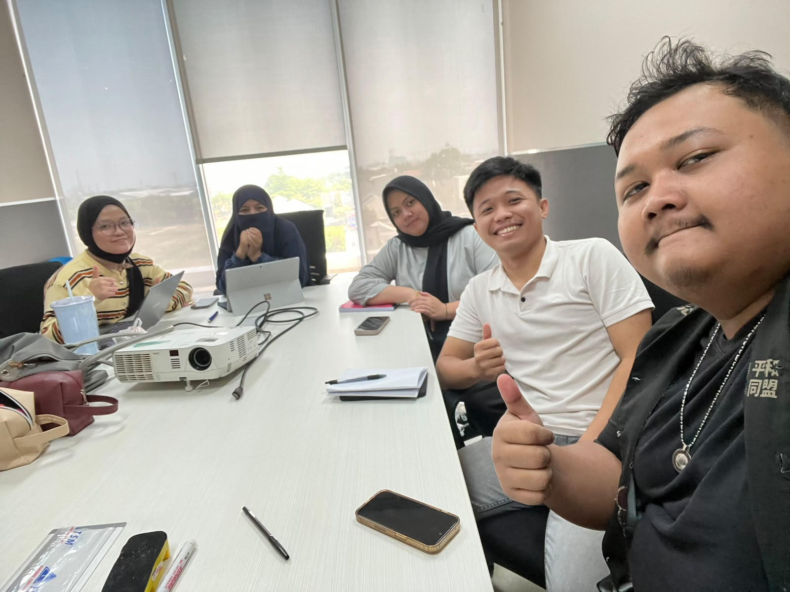

# LAMPIRAN {#lampiran .Style-1}

**Lampiran A Source Code Sistem Pengawasan Mesin CNC Berbasis IoT**

Seluruh kode program, konfigurasi, dan data mentah hasil pengujian yang digunakan dalam Tugas Akhir ini dapat diakses melalui repositori publik berikut.

<https://github.com/panjiwijaya-a/pengawasan-cnc-esp32>

**Lampiran B Dokumentasi Kegiatan**

{width="4.260353237095363in"}
